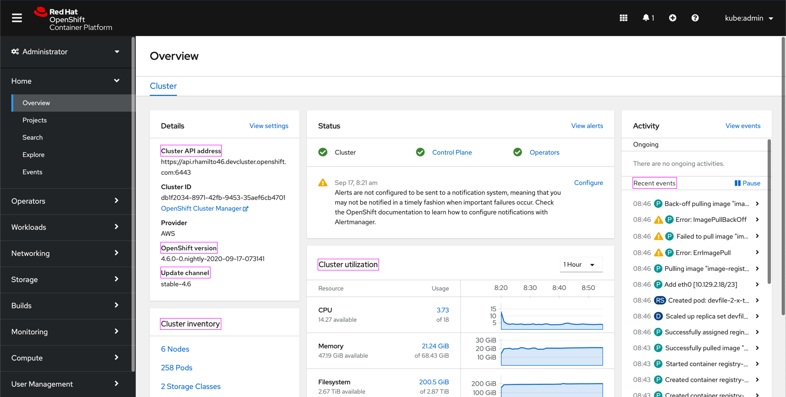
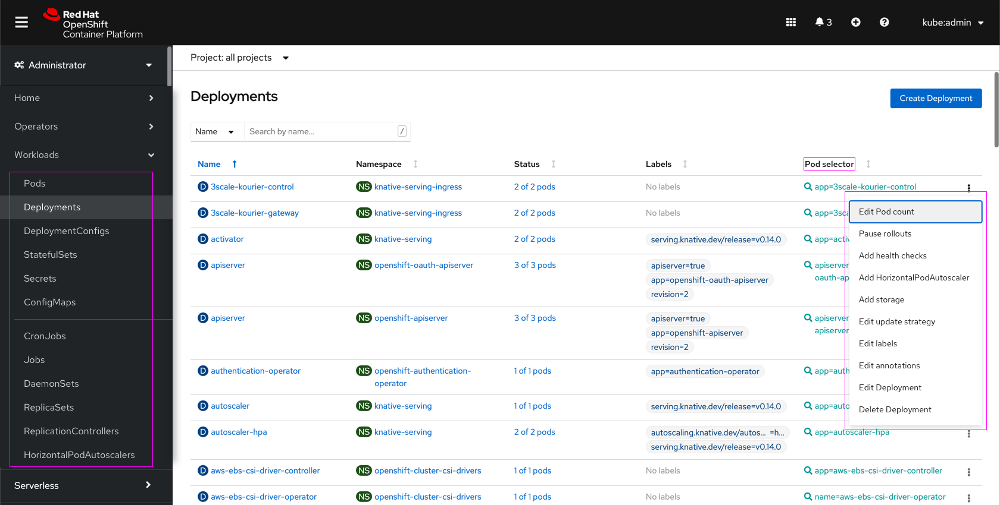
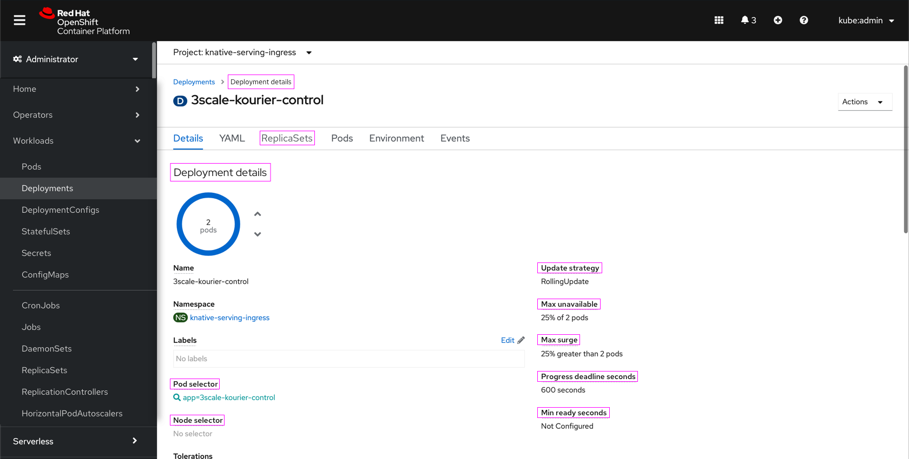

# Capitalization

This convention covers capitalization guidelines for the OpenShift console.

## Types of capitalization

The following guidelines will document when to use **sentence case** and when to use **title case** in the OpenShift console UI. To read more about the difference between them, refer to the [PatternFly capitalization documentation](https://www.patternfly.org/v4/design-guidelines/content/capitalization).

## Guidelines

### Sentence case
Sentence case should be the default capitalization used in the console. For example, use **sentence case** for:
* Breadcrumbs
* Buttons
* Card titles
* Column headers
* Definition list items
* Empty states
* Form field labels
* Menu items
* Tabs

### Title case
The following exceptions use **title case**:
* Proper nouns (including Kubernetes terminology – see below for more info)
* Navigation items
* Page titles (to match navigation)
  * An exception to this rule is when a page title is a resource name. The resource capitalization should not be altered even when it is a page title. For example, `(D) 3scale-kourier-control` is an acceptable page title.
* Breadcrumbs (only when needed to match navigation)

## Proper nouns and Kubernetes terminology

There are a number of proper nouns included in OpenShift’s terminology, including standard Kubernetes resource names. The following resources help to detail which terms are considered proper nouns:
* [Red Hat CCS's style guide](https://redhat-documentation.github.io/supplementary-style-guide/#glossary-terms-conventions)
* [Glossary of Terms and Conventions](http://ccs-jenkins.gsslab.brq.redhat.com:8080/job/glossary-of-terms-and-conventions-for-product-documentation-branch-master/lastSuccessfulBuild/artifact/index.html#red_hat_openshift)
* [OpenShift glossary](https://github.com/openshift/openshift-docs/blob/master/contributing_to_docs/term_glossary.adoc)
* [API object formatting](https://github.com/openshift/openshift-docs/blob/master/contributing_to_docs/doc_guidelines.adoc#api-object-formatting)

Note that some resources are considered proper nouns and are capitalized, such as `Pod`, while others are not, such as `node`.

## Examples
Below are screenshots with the new capitalization rules applied. The areas highlighted in pink are places where a capitalization change was made.

