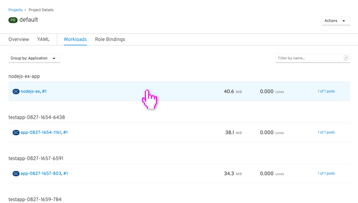
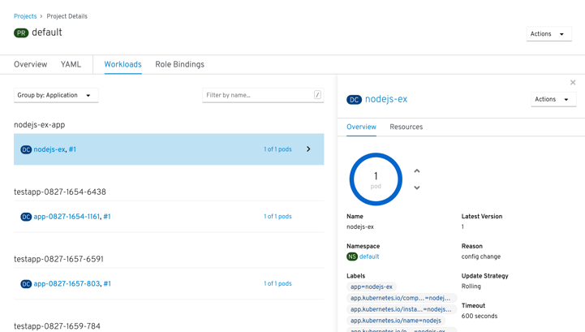
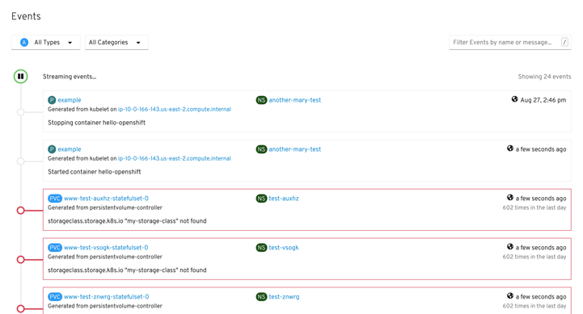
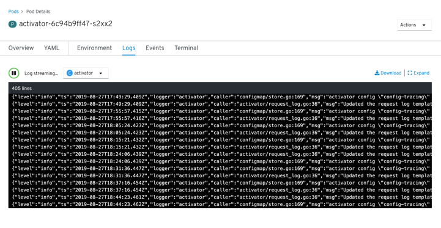

# Lists

To view lists in the [OpenShift Sketch Library](https://sketch.cloud/s/mwdww) visit the lists design [here](https://sketch.cloud/s/mwdww/a/xaVaP5).

## Tables

> Note: there will be a replacement design for the filter bar soon

Display information in tables with up to six columns (and actions/functionality where applicable). Depending on the page type, there may be a project selector at the top level (for objects that are contained within projects). In responsive states, columns drop from the right first.

+ **Row menu actions**: right aligned kebab menu that shows actions that are also on the resource details page
+ **Filter bar (will be replaced soon)**: selecting each title of filter turns (blue) displays the content, and clicking again for gray filters the content out of the list. If there are no items in a filter category it will be disabled
+ **Sorting**: columns are sortable by clicking the title, and clicking the title of the sorted column will toggle the sort direction
+ **Item count**: shows the number of the items displayed in the list (shows how many are shown as a result of filtering) and the total number of objects in the list
+ **Primary actions**: for resource lists there will be an action button to create a resource above the list
+ **Navigation**: clicking on blue links takes you to the resource details page
+ Favoriting (in progress)
+ “Fuzzy” filters (in progress)
+ Bulk selection & actions (in progress)
+ Faceted filters & filter chips (in progress)

---

## Lists

+ **Items in list**: rows are selectable with peripheral information shown alongside the main object in the list. There are no table headers to sort or identify the information in the rows.
+ **Details panel**: slides in from the right and squeezes the list responsively and hides the peripheral information
+ **Group by resources**: in the list can be grouped in various ways via a faceted filter
+ **List groupings**: resources are split into sub-lists with the titles above each sub-list
+ **Navigation**: clicking on the primary object in the row (either via the link of the primary resource name, or by selecting whitespace on the row) will reveal the details panel, while clicking any secondary object (object on the same row after the primary object for the row, separated by a comma) will take you to the resource details page). Users can also use the keyboard up and down arrows to switch object selection in the list.

---

## Streams

**Events** are specifically Kubernetes events that transcribe a stream of what is happening to resources within the system, like changing of resource statuses, ongoing processes, errors/failures, and other activity. “Events” exists as a top-level page that shows events across the cluster (or can be filtered to projects), or can exist under a tab on resource pages. **Logs** are system-wide logged events including more than Kubernetes Events (also including). Because of technical challenges with aggregating logs across the system, Logs currently do not exist as an aggregate across the system, but are included on certain resources where possible. Logs are often used when troubleshooting (for example: SREs digging into the causes of alerts).

+ **Faceted filters**: allow events to be filtered by resource type and status
+ **Pause**: allows users to pause the events list in order to browse through the list without it jumping around
+ **Items in list**: events lists are ordered in a timeline with the most recent at the top. Logs lists are ordered with most recent at the bottom.
+ **Errors**: (events only) highlighted in the list with a red outline
+ **End of stream**: shows the end of the list and the time that the oldest events started to stream
