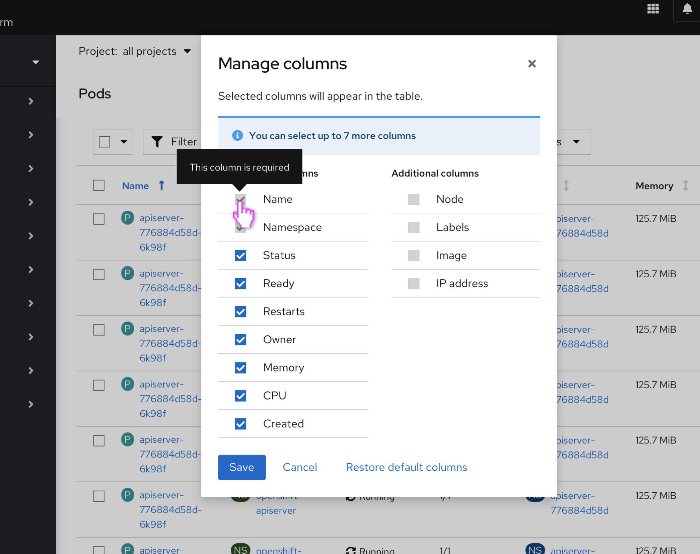
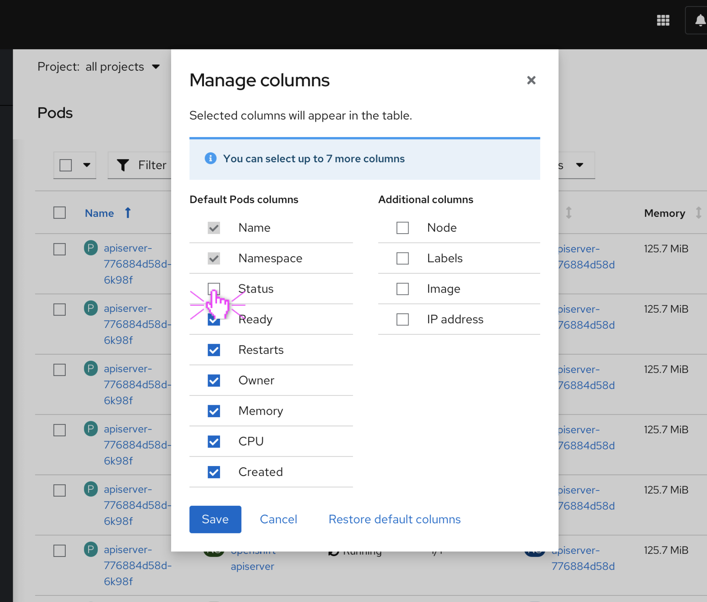
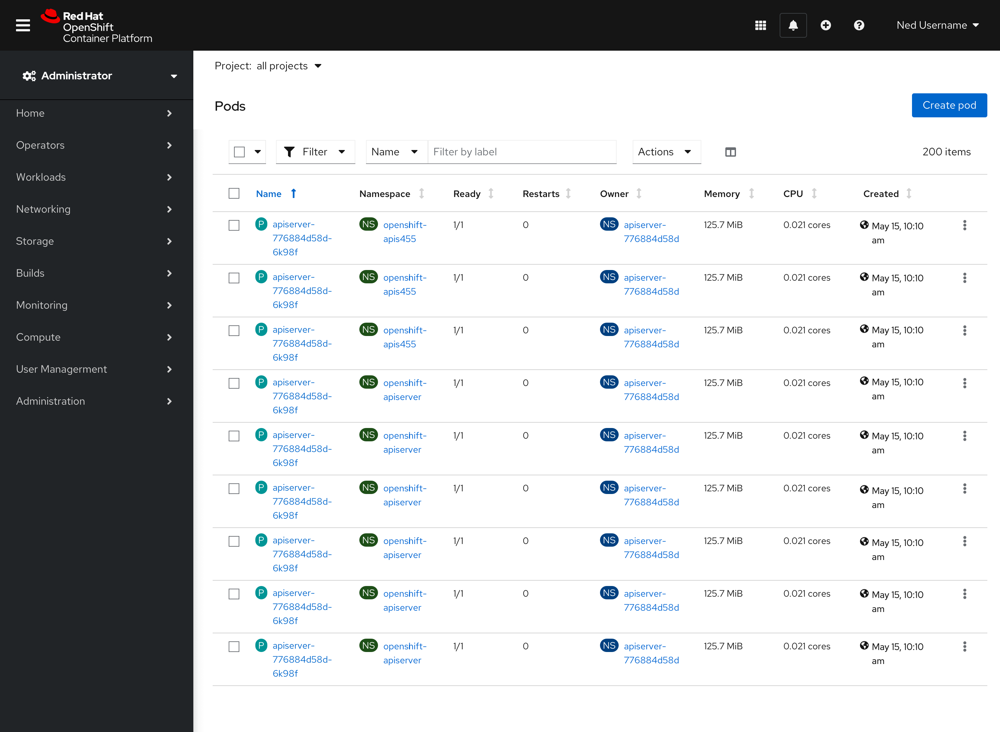
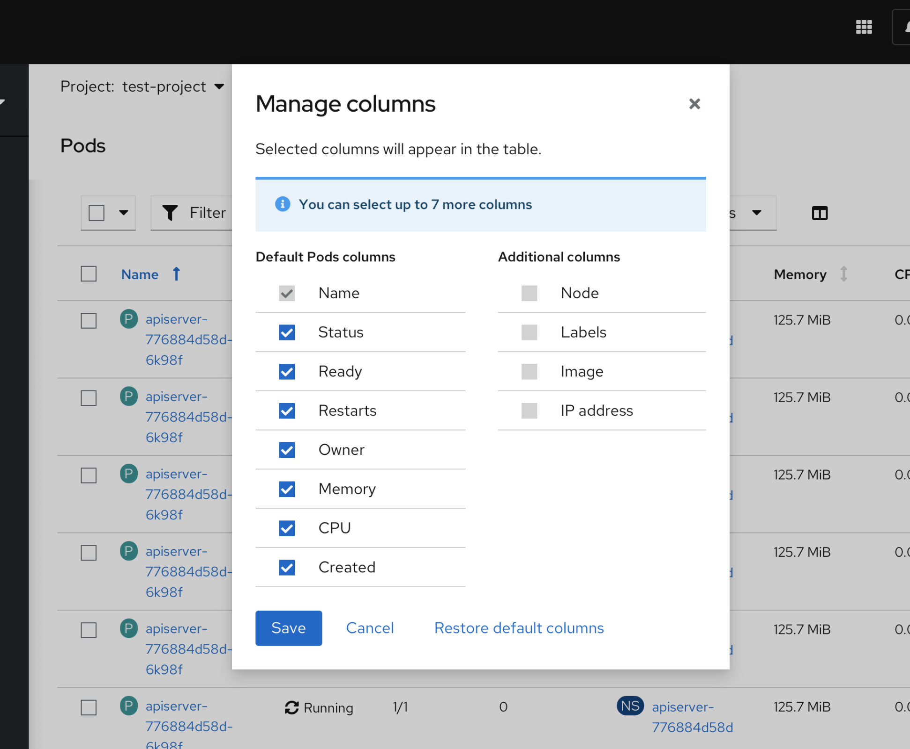
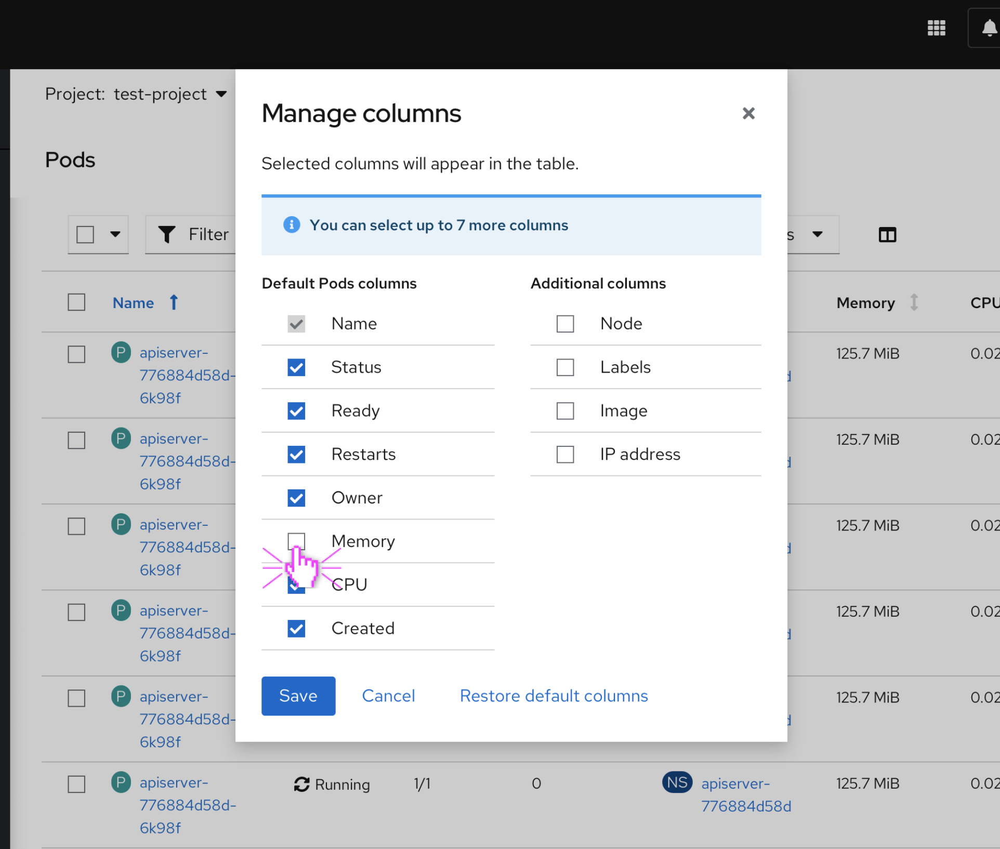
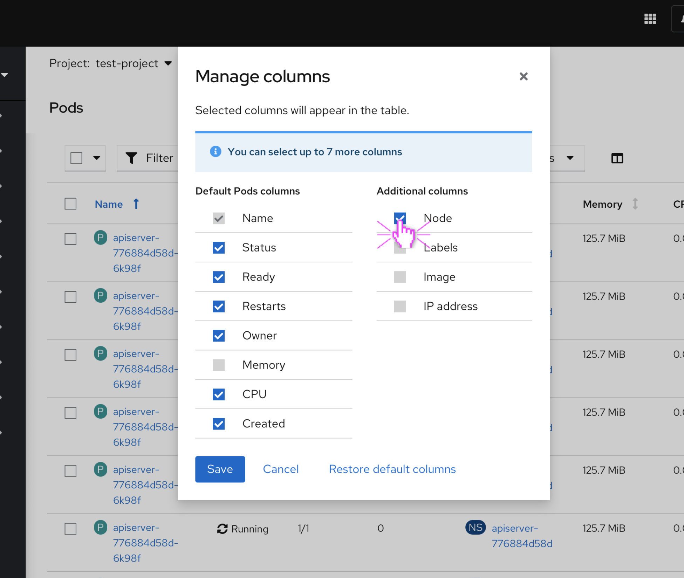

# Column Management

## Behavior
Column management will live in the toolbar as a column icon on the relevant resources pages on desktop. It will be hidden on mobile. Hover on the icon will bring up a tooltip stating "Manage columns". Clicking on the icon will open a modal that lists all column names with checkboxes.

If the user is looking at “all projects”, then the checkbox next to “name” as well as “namespace”  in the modal will be shown as checked and disabled. Hovering over either the checkbox or text will bring up a tooltip that explains that the columns are required.

The modal will have an informational alert by default that reads “You can select up to 7 columns”. If 7 columns have already been selected, then all checkboxes will be disabled. Once the user deselects a checkbox, the other checkboxes will return to default state (rather than disabled). 

Deselecting a checkbox will remove that column from the table view. Selecting a checkbox will add that column to the table view. Clicking “Save” will save the changes that the user has made in the modal. Clicking “Restore default columns” will restore the default settings of the columns in the resource table.

If the page **does not** include a project selector **or** the project selector is set to anything other than “all projects”, then the “namespace” column will be hidden.

In this case, the modal shows that 7 columns have already been selected, so all checkboxes are disabled. The user must deselect one of the selected checkboxes in order to add a separate column.

The user has deselected “Memory”, removing it from the table.

The user has selected “Node”, adding it to the table.

## Relevant Resources
We want the above behavior to be available on the following resource table views:
- Pods
- Nodes
- Projects
- Namespaces
- Virtual Machines
- Virtual Machine Templates
- Pipelines
- Pipeline Runs
- Pipeline Resources
- Helm Releases
- Helm Releases Resources
- Helm Releases Revision History
- Installed Operators
- Deployments
- Deployment Configs
- Stateful Sets
- Cron Jobs
- Replica Sets
- Services
- Secret
- Config Maps
- Persistent Volumes
- Persistent Volume Claims

## Future Enhancements
In the future, we will explore adding column management to other resource pages, such as Custom Resource Definitions and Explore API Resources. We will also explore adding additional features to column management that would allow the user to reorder the columns using a drag and drop behavior.