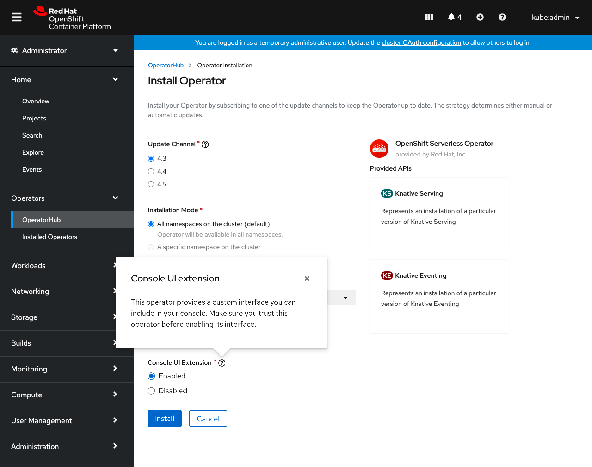
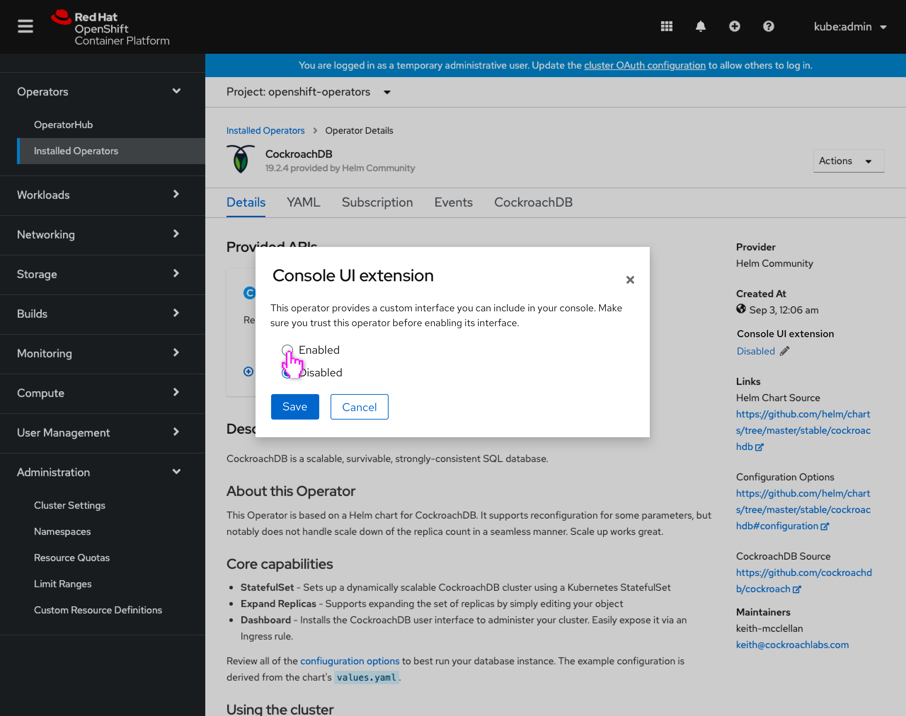
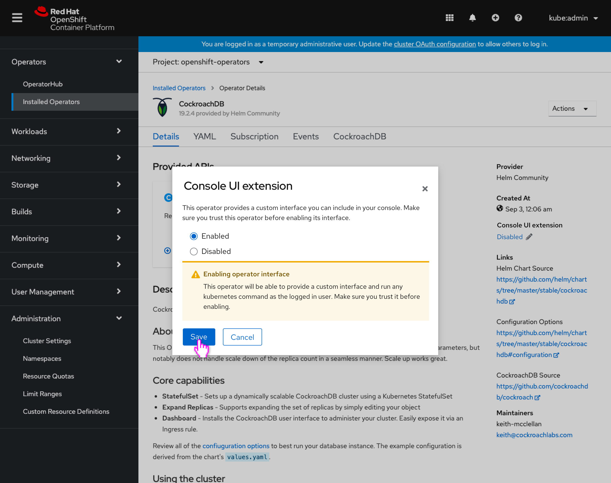
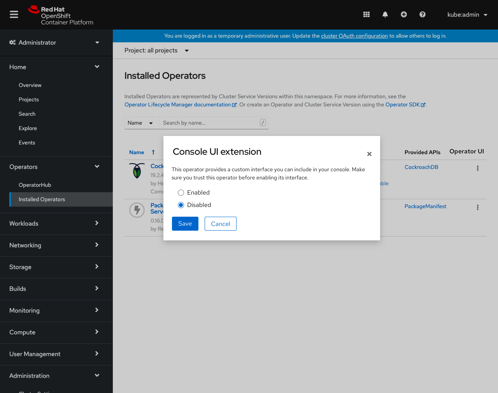

# Enabling and disabling dynamic plugin UIs

OpenShift console currently has static plugins that allow teams to contribute features to the UI such as OpenShift Virtualization and OpenShift Container Storage. These plugins live inside console code which means they can only be updated at the same cadence as the console. Newly developed ‘dynamic plugins’ will allow operators to contribute their included UIs at runtime, meaning that operators can update their UIs on their own cadence and more frequently.

Admins installing operators which include dynamic plugins will need to opt-in to having their UIs included in the console UI, which can happen as the operator is being configured for install. Trusted operators could perhaps have this option included by default, whereas other not-explicitly-trusted operators would need to have the user explicitly opt in, as there could be a security risk.

Once the operator with dynamic plugin UI is installed, the user can also turn the dynamic plugin UI on and off in the operator details. The operator list view would also convey any operators with not enabled dynamic UIs.

## Enabling dynamic plugin UI on operator install

### Trusted operator install

- A new radio option would appear for operators that include dynamic plugin UIs.
- Trusted operators would have their dynamic UIs enabled by default.
- A note on “trusted”: Disconnected environments need all operator sources manually added so they all (even Red Hat & certified operators) may appear as “untrusted.”

- An info popover would further describe implications of enabling an operator’s UI.

### Untrusted operator install

- Untrusted operators would have dynamic UIs disabled by default.

- Enabling the UI for the untrusted operator shows an inline alert conveying implications.

## Enabling/disabling dynamic plugin UIs in operator details

- Operators with dynamic plugin UIs would now include a setting in their details that conveys if their dynamic UI is enabled or disabled.

- Using the existing editing paradigm, this setting would be launched in a modal.
- The content of the modal would be the same as the Operator Install page popover and setting.

- The modal would include the same inline alert when enabling UIs for untrusted operators.

- The setting is updated to convey the dynamic plugin UI is enabled.

## Enabling/disabling dynamic plugin UIs in operator details

- An operator that supports dynamic UIs but does not have them enabled would have an additional status on the Installed Operators page.
- This status would only appear for users that have ‘read’ access on the operator config and would also be the only users able to update this setting as well.
- Operators that have dynamic UIs and are enabled, or operators that do not have dynamic UIs would not have any additional status.

- Clicking the status would open the same Console UI extension enablement dialog, and allow the user to enable the dynamic UI.