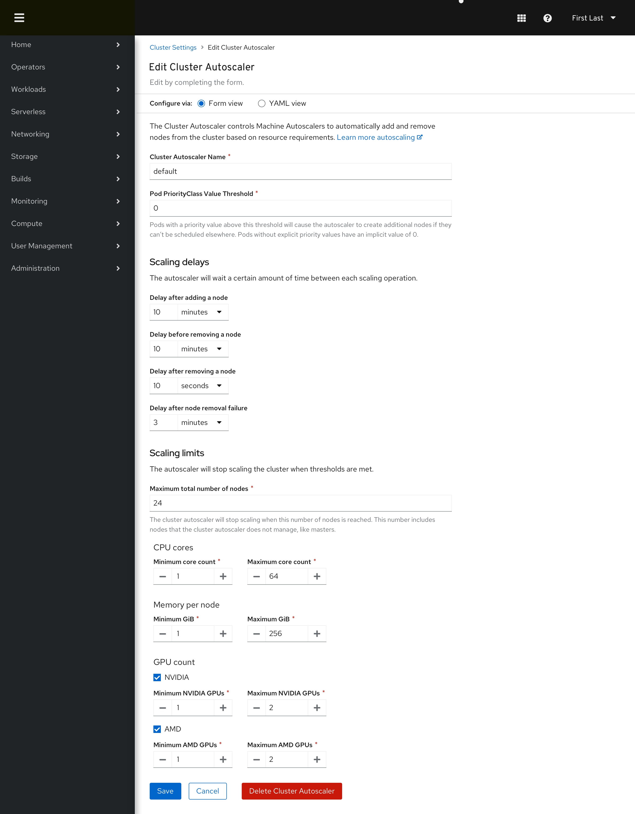
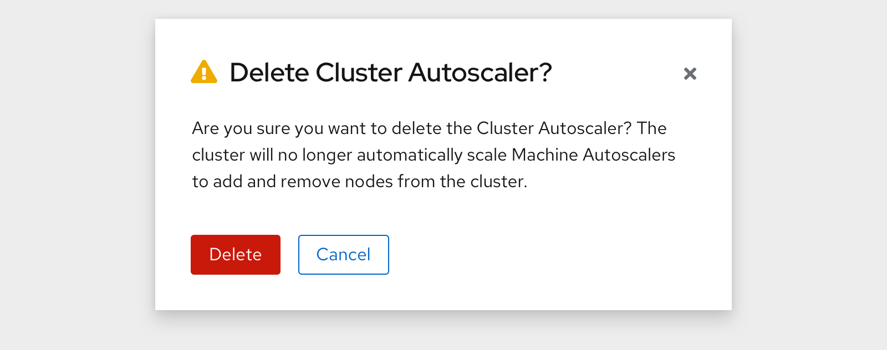
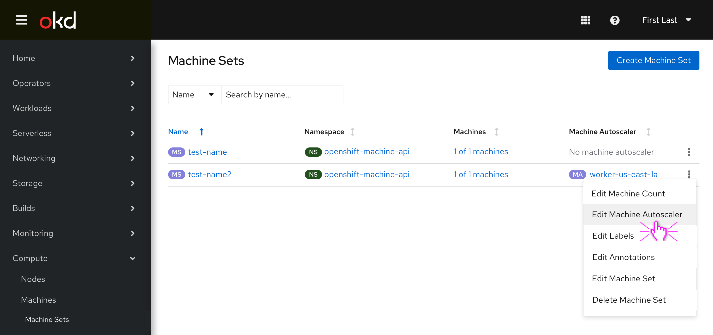
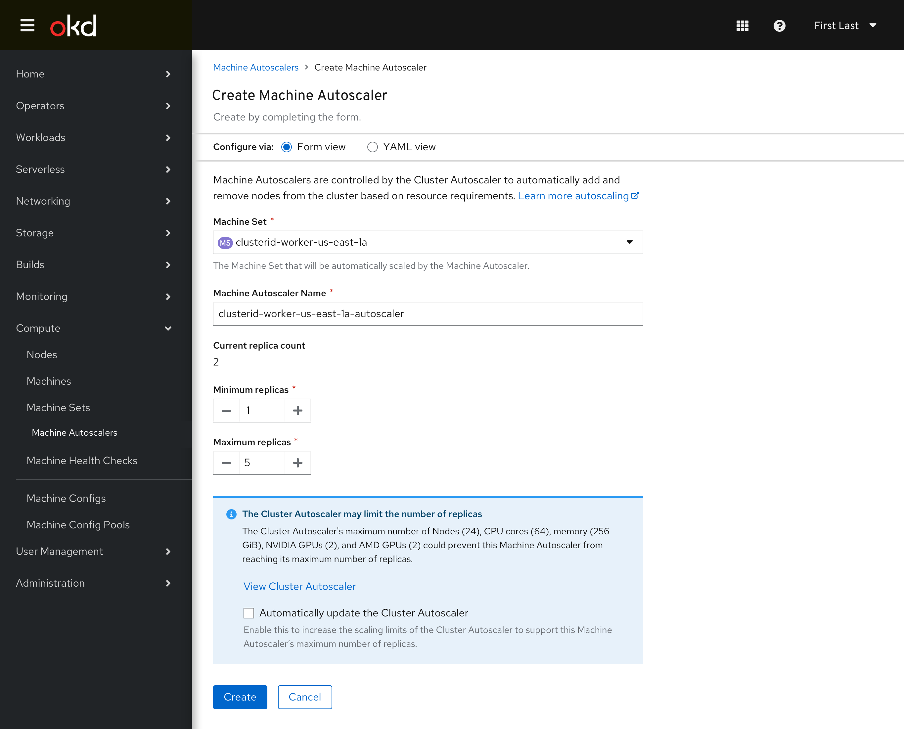
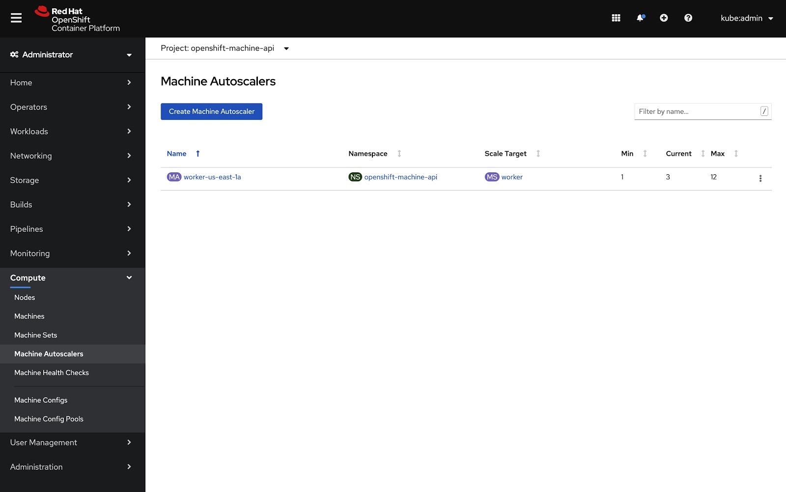

# Machine and Cluster Autoscaler guidance

The flow below helps users out by pointing them toward configuring the Cluster Autoscaler if they haven’t already done so by the time they try to create a Machine Autoscaler. It also shows a user whether a MachineSet has a Machine Autoscaler related to it in the MachineSet list.

## Creating and Editing Cluster Autoscaler

Users will likely first encounter OpenShift’s autoscaling feature from within the Machine Autoscalers nav item.

The user clicks “Create Machine Autoscaler” and is directed to the screen below, if a Cluster Autoscaler has not already been configured:

A brief description of what autoscaling is and how Machine Autoscalers are related to the Cluster Autoscaler is included at the top of the creation form, with a link to the current documentation for users who’d like that.

If the user hasn’t already configured the Cluster Autoscaler (which is likely), then an inline info alert prominently suggests that they do so first before continuing.

The user clicks “Create Cluster Autoscaler.” and is directed to the following form

The Cluster Autoscaler creation form is largely filled out with defaults aside from the GPU count section, which are unchecked by default. The Maximum number of nodes should be the current number of nodes at the time that this page is loaded.

The maximum thresholds of the “Scaling limits” section are based on the total CPU core and Memory counts of all of the non-master nodes in the cluster at the time that the creation page is loaded.

The user clicks “Create”

The user is taken to the Cluster Settings page. Clicking “Edit Autoscaler” would bring them back to the same creation form, but labeled “Edit” instead. When a cluster autoscaler has been created, it is shown as Enabled within the Cluster Settings page.

The user can edit the Cluster Autoscaler from here, or delete the Cluster Autoscaler using the destructive button at the bottom.

The user navigates back to the Machine Autoscalers area and clicks “Create Machine Autoscaler”

The inline info alert is gone.

## Viewing associated Machine Autoscaler in Machine Sets list
A Machine Autoscaler column is added to the Machine Sets page. The user opens the kebab menu of a MachineSet that isn’t currently associated with any Machine Autoscaler. 

Kebab options when a Machine Autoscaler is already created, change to “Edit Machine Autoscaler”:

Additional option for when popovers are added to table headers:

## Machine Autoscaler Creation
When Create Machine Autoscaler is selected a new fields appear for Name and minimum/maximum replica count. The name of the autoscaler is automatically generated based on the MachineSet’s name, the maximum replica count is set to the MachineSet’s current number of replicas by default, and the user can click “Create” when finished to see it in the List page.

If the user sets a Maximum replica count that could bump up against any of the cluster autoscaler’s scaling limits an inline info alert is shown that lists each one.

The user can click the checkbox to “Automatically update the cluster autoscaler” to adjust its scaling limits to ensure that the machine autoscaler will have enough headroom to scale fully.

The user clicks “Create”.

The List page includes all Machine Autoscalers, their Machine Set target, and the min/current/max replica count.

If the user tries to create a new Machine Autoscaler when all Machine Sets are already associated with existing Machine Autoscalers, an inline info alert suggests that they create a new Machine Set first.
