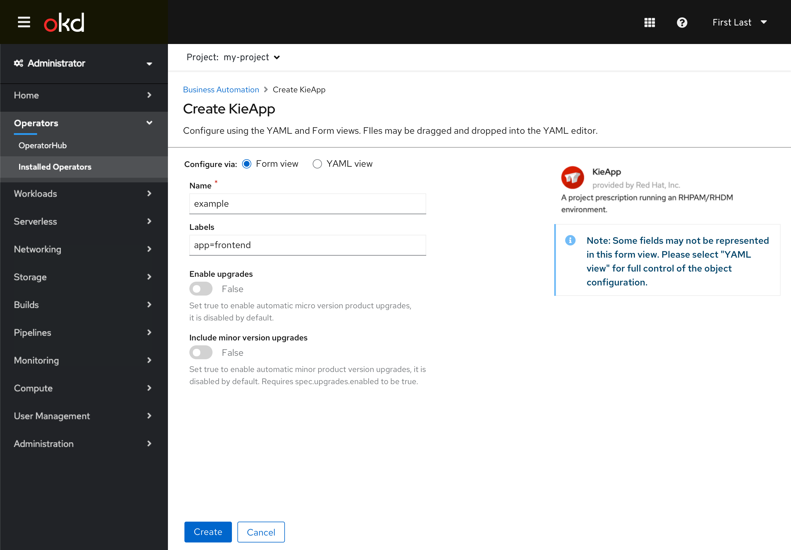
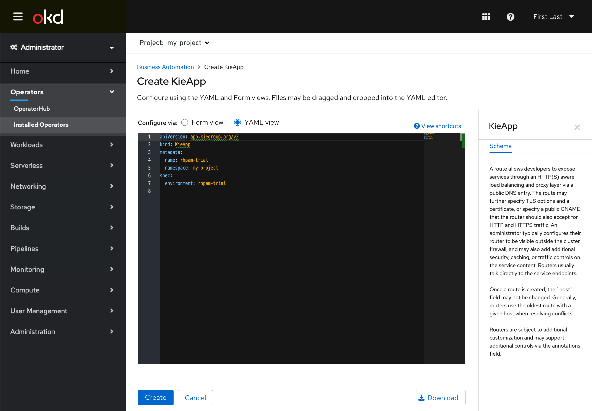

# Operand (Custom Resource) Creation and Editing using Form/YAML Switching Interaction

The existing **Edit Form** and **Edit YAML** links that have been used when creating a resource to switch between views have been changed to a radio control to better convey that the user can freely switch between the two without losing changes between them. The controls are located immediately above the editors to aid discovery, and the use of radios with a label improves accessibility. This interaction is now also available when editing resources as well in their **YAML** tab. These new interactions can be seen in the [Creating Resource Conventions](http://openshift.github.io/openshift-origin-design/conventions/documentation/create.html) and the [Editing Resource Conventions](http://openshift.github.io/openshift-origin-design/conventions/documentation/edit.html).

## Creating Operands

- Creating an operand now includes a radio button switching interaction that replaces the previous **Edit** links.
- The form view is defaulted to when the user is creating an operand, with the option to switch to the YAML.
- The inline alert conveying that all fields may not be represented in the form view still is present.

- Users can switch to the YAML view. Any data that was entered in the form would be reflected in the YAML view, as well as any data entered in the YAML would be reflected in the form if it is switched back to (as its fields support.)

- The **View sidebar** interaction is still supported in the YAML view.

## Editing Operands

- The **YAML** tab for operands now also includes the radio button switching interaction.
- The YAML view is defaulted to when the user edits an operand, with the option to switch to the form. This allows the user to still quickly reference the more complete YAML view for read-only tasks like status checking, and retains the expected current interaction.

- Users can switch to the form view. Any existing data and data that was entered in the YAML would be reflected in the form view (as its fields support,) as well as any data entered in the form would be reflected in the YAML if it is switched back to.
- The existing **Save**, **Reload**, and **Cancel** buttons still behave the same, regardless of view.
- The inline alert conveying that all fields may not be represented in the form view still is present.