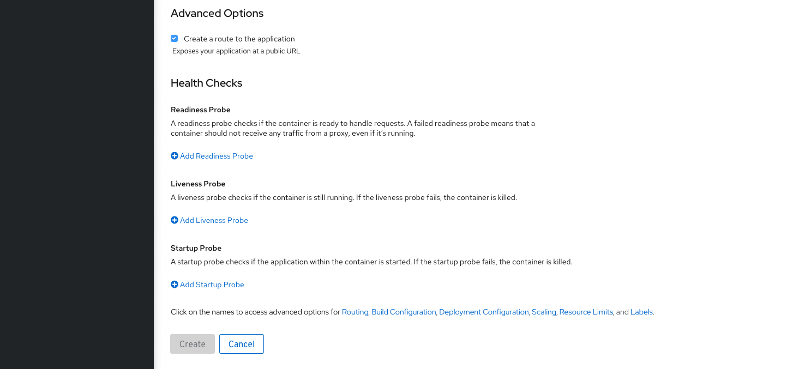
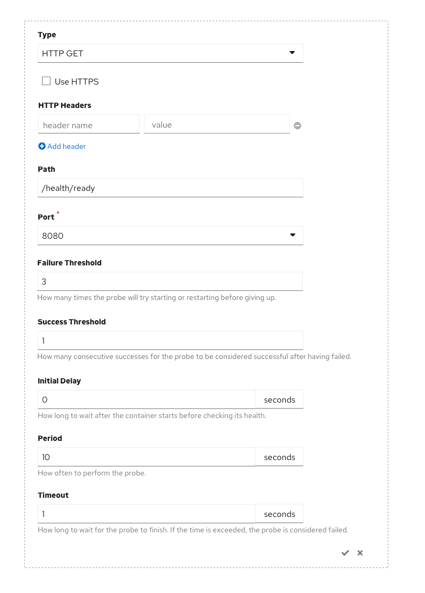
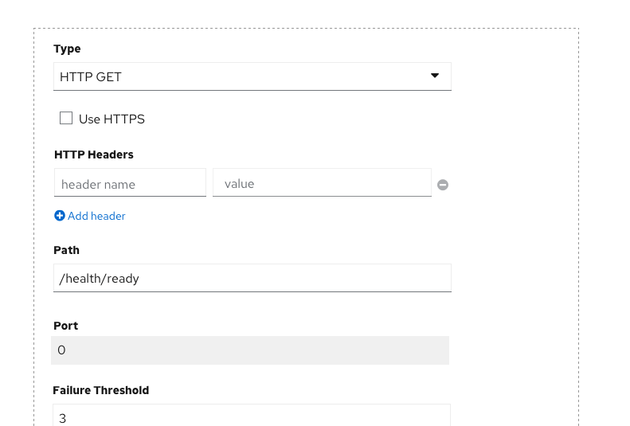
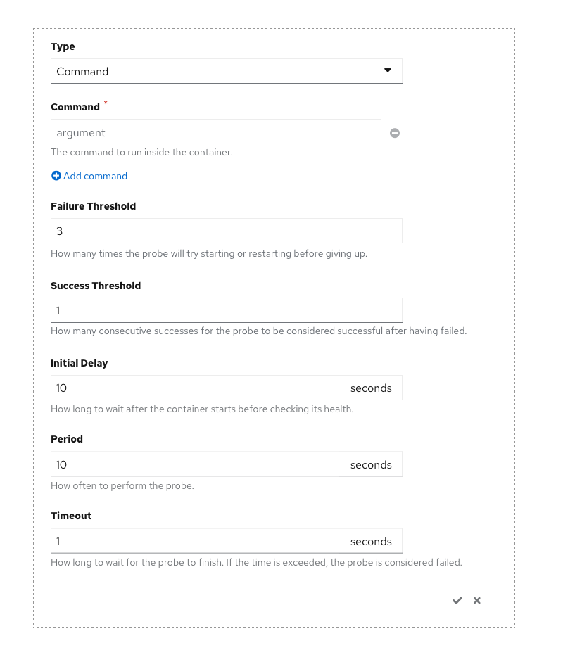
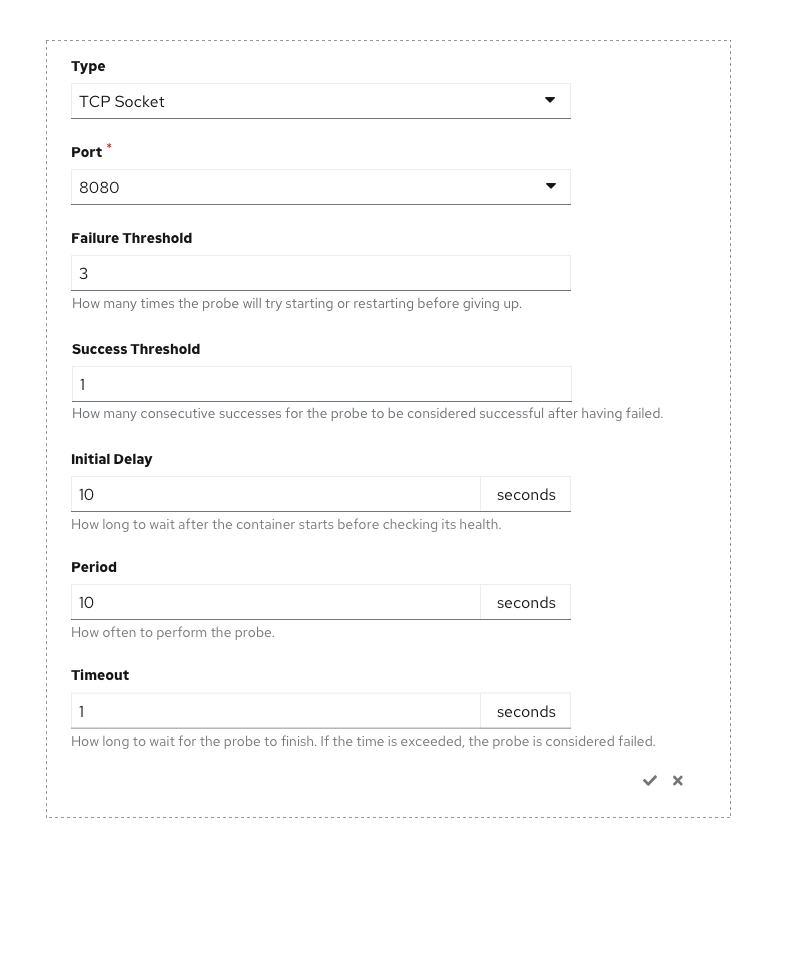

# Add Flows - Advanced Options - Health Checks

The ability to add Health Checks is within the Advanced Options section of the Import from Git and Deploy Image Add flows. A Health Checks link appears after the Routing link and before the Build Configuration link in the list of Advanced Options links.

When a user clicks on the Health Checks link, a Health Checks sub-section is expanded within the Advanced Options section.

When the Health Checks sub-section is expanded, there are 3 probes listed (Readiness, Liveness, and Startup). Each probe has a \"Add \<probe name\> Probe\" link which allows the user to create the probe for that type.

When the \"Add \<probe name\> Probe" link is clicked, a probe form becomes visible, exposing all of the fields associated with the probe.  The user can confirm or cancel the adding of the Health Check using the check or x at the bottom of the probe form.  There are 3 variations on the Health Checks probe form which are based on the Type that is selected. The default Type is HTTP GET. See the Health Checks Form section below for these variations.

If the check is clicked, the probe is added and the form is hidden, displaying a checkmark icon and \"\<probe name\> Probe\". If the x is clicked instead of the checkmark, the form is cleared and hidden. The added probe can be removed after it has been added by clicking on the minus sign icon. An \"Edit Probe\" link can be used to review the entered values.

* Required fields shall have a required field indicator. Any required field that is not filled in or any field that has incorrect data shall have a client side error message displayed under the field. Client side field validation shall occur when the field loses focus.

* The probes are created when the Create button is clicked and the form is submitted.

* Server side error messages shall appear at the bottom of the form with the same design as other fields in the form. If a server side error message occurs, the probe form shall be made visible so that the field with the error is visible.

## Health Checks Probe Form
The Health Checks form is a form within the Import from Git and Deploy Image forms.
* All Health Checks forms have Failure Threshold, Success Threshold, Initial Delay, Period, and Timeout fields.
* However, there are three variations on the Health Checks form that each display different dynamic fields. These variations are outlined below.
* If the Type is changed after data has been entered in the dynamic fields, the data must persist in any fields that are hidden until the form is submitted.

### HTTP GET
* HTTP Get is the default type for Health Check forms.
* HTTP Headers, Path, and Port are dynamic fields displayed for HTTP GET.

### HTTP Get - Knative Services
* When the Knative Services Resource Type is selected, the Port value is 0 and the Port dropdown is disabled

### Command
* When the Type is changed to Command, the dynamic field changes to Command.

### TCP Socket
* When the Type is changed to TCP Socket, the dynamic field is Port.

### TCP Socket - Knative Services
* When the Knative Services Resource Type is selected, the Port value is 0 and the Port dropdown is disabled

