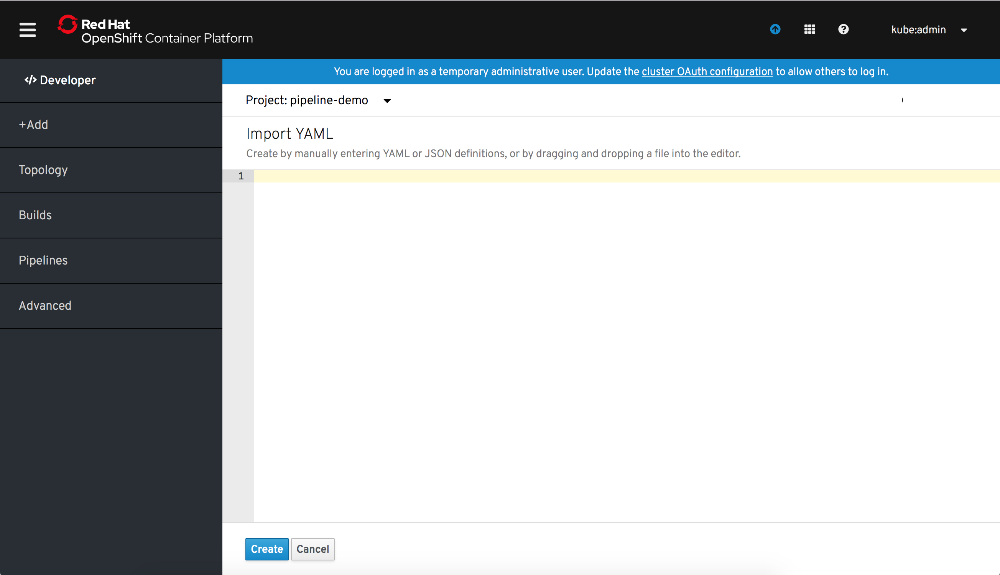

# Add page

Add is a primary navigation item in the OpenShift Developer perspective.

The Add page enables the user to create an application, component or service. Upon clicking a card, the user is brought to the appropriate flow to add the item to their project.

The basic visuals and behavior of this card view is consistent with that of the developer catalog and operator hub.

## Add Flows
There are 6 Add Flows for adding an application, component or service. Each flow has different subsections.

### From Git
Design documentation for the From Git scenario when creating a source secret can be found [here](From-Git/Import-from-git.md)

### Container Image
Design documentation for the Container Image git can be found [here](Container-Image/Deploy-Image.md)

### From Catalog
Design documentation for the items From Catalog can be found [here](From-Catalog/Add-from-catalog.md)

### From Dockerfile
Design documentation for the From Dockerfile can be found [here](From-Dockerfile/Import-from-Dockerfile.md)

### YAML
When clicking on YAML, Add remains selected in the navigation.  The secondary masthead is shown with the selected project, and the YAML editor is displayed.

### Database
Design documentation for the Database is still tbd

## Common Sections to Add Flows
Add flows have dynamic sections that are displayed when appropriate for the flow:

### General
Design documentation for the General section can be found[here](sections/General-Section.md)

### Advanced Options
There are a number of Advanced Options which are available, based on the flow:
- [Routing](sections/Adv-Routing.md)
- [Build Configuration](sections/Adv-Build-Config.md)
- [Deployment Configuration](sections/Adv-Deployment-Config.md)
- [Scaling](sections/Adv-Scaling.md)
- [Resource Limits](sections/Adv-Resource-Limits.md)
- [Labels](sections/Adv-Labels.md)
