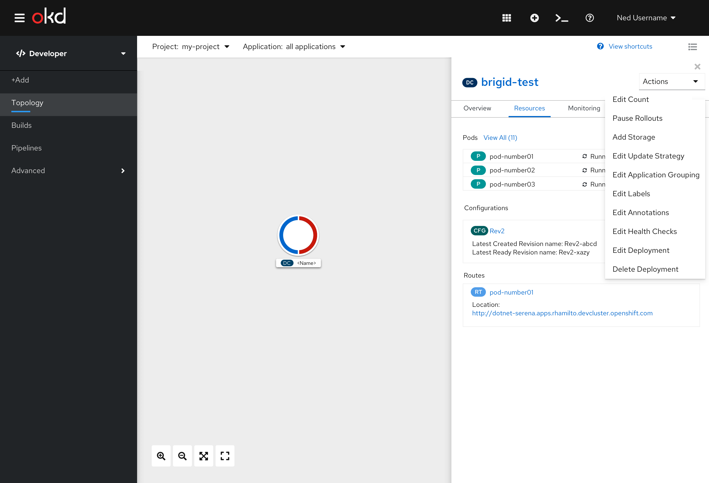
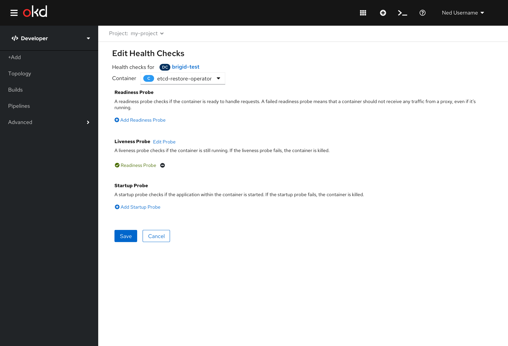

# Health Checks
Health Checks allow users to detect and handle unhealthy containers in OpenShift.  There are 3 probes that currently exist: Readiness, Liveness, and Startup. A probe is a Kuberbetes action that periodically performs diagnostics on a running container.

## Health Check Configuration
If there is only one container that doesn’t have any health checks configured, there will be an inline alert with the message shown below and a link to add health checks. If the user clicks the ‘x’ on the inline notification, this message won’t be shown again for this specific deployment/deployment config, but will show on other deployments until the user dismisses it.

This inline alert would also be displayed on the deployment details page.  It would be under the Container header before the list of the containers.

Since only one container exists, the user will be brought to this page with the container name listed at the top after “Container”.

If there is more than one container and any of the containers don’t have health checks configured, there will be an inline alert with the message shown below and a link to add health checks. If the user clicks the ‘x’ on the inline notification, this message won’t be shown again for this specific deployment/deployment config, but will show on other deployments until the user dismisses it.

Since more than one container exists, the user will be brought to this page with a dropdown menu of all of the containers listed at the top after “Container”.  As the user changes the dropdown, the entire page below will also update.  Once the user begins to edit the form, the dropdown will become disabled.

## Edit Health Checks
Users can add or edit health checks using the actions dropdown menu.  If there are no health checks configured the action will be “Add Health Checks”. 

If at least one health check is configured, the action will be “Edit Health Checks”.

If there are no health checks configured the title of the form will be “Add Health Checks” and the actions at the bottom will be “Add” and “Cancel”. If only one container exists, that container name will be listed at the top after “Container”.

If more than one container exists in the deployment/deployment config, the container name will be listed in a dropdown after “Container”. 

When there is more than one container, the dropdown will be disabled once the user begins to add health checks.  Depending on which health check the user chooses to add or edit, the corresponding part of this form will expand. The user must then click save or cancel to the entire page. Refer to the [Health Checks Add Form](developer/add-45/sections/Adv-Health_Checks.md) for the expanded forms and interactions.

If there is at least one health check configured the title of the form will be “Edit Health Checks” and the actions at the bottom will be “Save” and “Cancel”. If only one container exists, that container name will be listed at the top after “Container”.

If more than one container exists in the deployment/deployment config, the container name will be listed in a dropdown after “Container”. 

When there is more than one container, the dropdown will be disabled once the user begins to add health checks.  Depending on which health check the user chooses to add or edit, the corresponding part of this form will expand. The user must then click save or cancel to the entire page. Refer to the [Health Checks Add Form](developer/add-45/sections/Adv-Health_Checks.md)for the expanded forms and interactions.

## Health Check Errors
In 4.5, Health Check Errors will be visible in the Monitoring tab of the Topology view. Health Check violations should be warning events, thus will be shown under the Events (Warning) section of the Monitoring tab in the side panel. In the future, when the Notification Drawer is available for Developers, we would expect this to be shown in the drawer as well.

