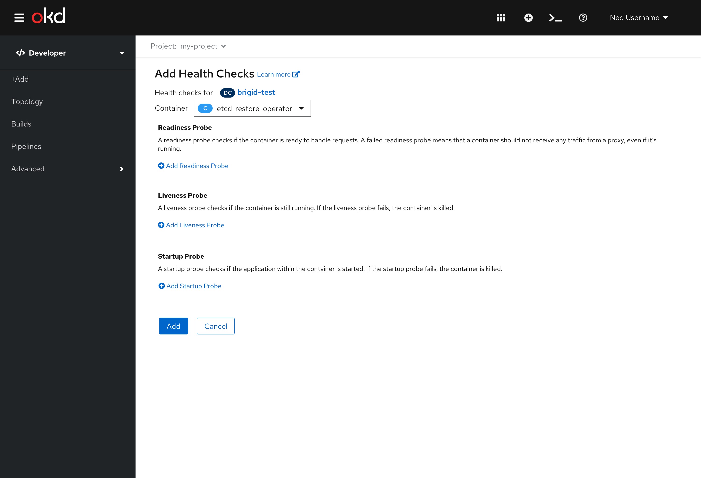

# Health Checks
Health Checks allow users to detect and handle unhealthy containers in OpenShift.  There are 3 Health Check probes: Readiness, Liveness, and Startup. A probe is a Kuberbetes action that periodically performs diagnostics on a running container.

## Health Checks Alert
Health Checks can be configured through an inline alert on the side panel of the Topology view. The inline alert will have a message with a link to add or edit Health Checks. An ‘x’ on the top right corner of the inline alert allows the user to close the alert. This alert won’t be shown again. However, an alert will show on other deployments until the user dismisses the alerts individually.

For individual containers or container groupings that don’t have Health Checks configured, a Health Checks inline alert with a link to "Add Health Checks" shall be displayed at the top of the panel below the title. When the user clicks on the "Add Health Checks" link they are brought to the Health Checks form.

<!--This inline alert would also be displayed on the deployment details page.  It would be under the Container header before the list of the containers.

-->

For individual container that have Health Checks configured or container groupings that have at least one Health Check configured, a Health Checks inline alert with a link to "Edit Health Checks" shall be displayed at the top of the panel below the title. When the user clicks on the "Edit Health Checks" link they are brought to the Health Checks form.

[Picture here]

## Actions Menu

Health Checks can also be configured using the Actions dropdown menu in Topology.  If there are no Health Checks configured the action will be “Add Health Checks” and should be listed above "Add Storage". When the user clicks on the "Add Health Checks" they are brought to the Health Checks form.

If at least one Health Check is configured, the action will be “Edit Health Checks” and should be listed above "Edit Deployment". When the user clicks on the "Edit Health Checks" they are brought to the Health Checks form.

## Health Checks Form

The Health Checks form allows the user to add and edit Health Check probes for Readiness, Liveness, and Startup.

For single containers, the user will be brought to this page with the container name listed under the page title and deployment name.

(fix image - remove edit probe link)

For groupings with more than one container, the user will be brought to this page with a dropdown menu of all of the containers listed under the page title and deployment name.  As the user changes the dropdown, the entire page below will also update to reflect the Health Checks configuration for that container.  

(fix image - remove edit probe link)

Once the user begins to edit the form, the dropdown will become disabled. Depending on which Health Check the user chooses to add or edit, the corresponding part of the form will expand. If the user selects "Cancel", the dropdown will become active again. If the user selects "Save", the form will be submitted.

If there are no Health Checks configured the title of the form will be “Add Health Checks” and the actions at the bottom will be “Add” and “Cancel”.

If there is at least one Health Check configured the title of the form will be “Edit Health Checks” and the actions at the bottom will be “Save” and “Cancel”.

Refer to the [Health Checks Add Form](developer/add-45/sections/Adv-Health_Checks.md) for the expanded forms and interactions.

## Health Check Errors
In 4.5, Health Check Errors will be visible in the Monitoring tab of the Topology view. Health Check violations should be warning events, thus will be shown under the Events (Warning) section of the Monitoring tab in the side panel. In the future, when the Notification Drawer is available for Developers, we would expect this to be shown in the drawer as well.
