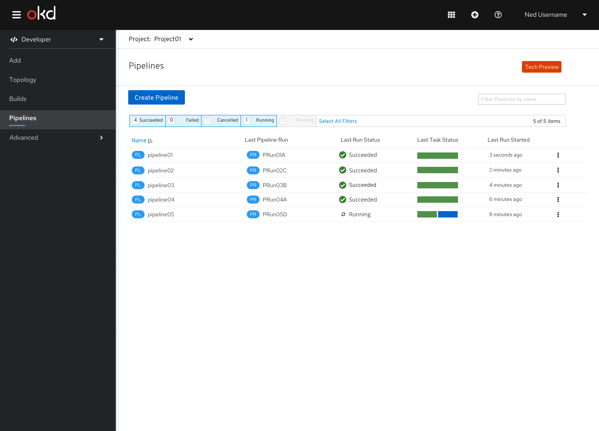
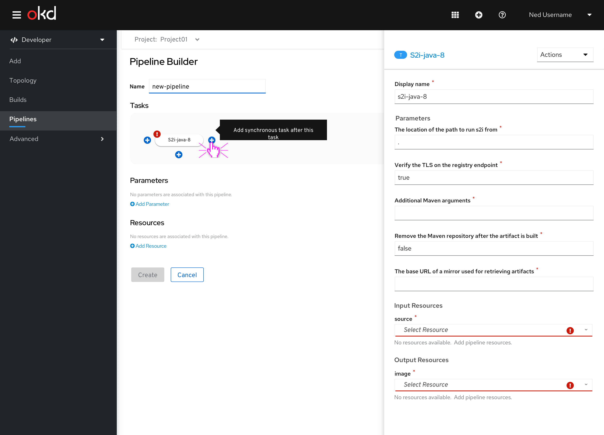
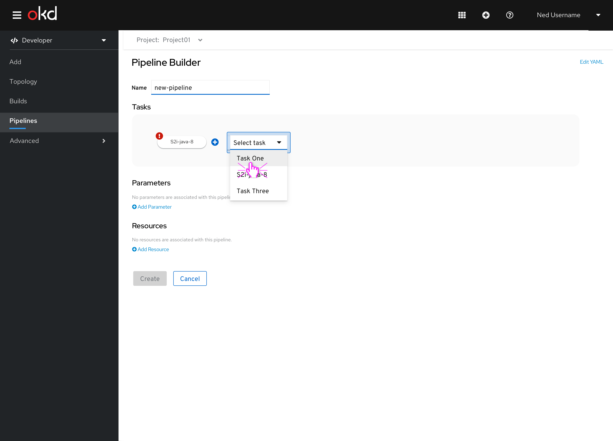
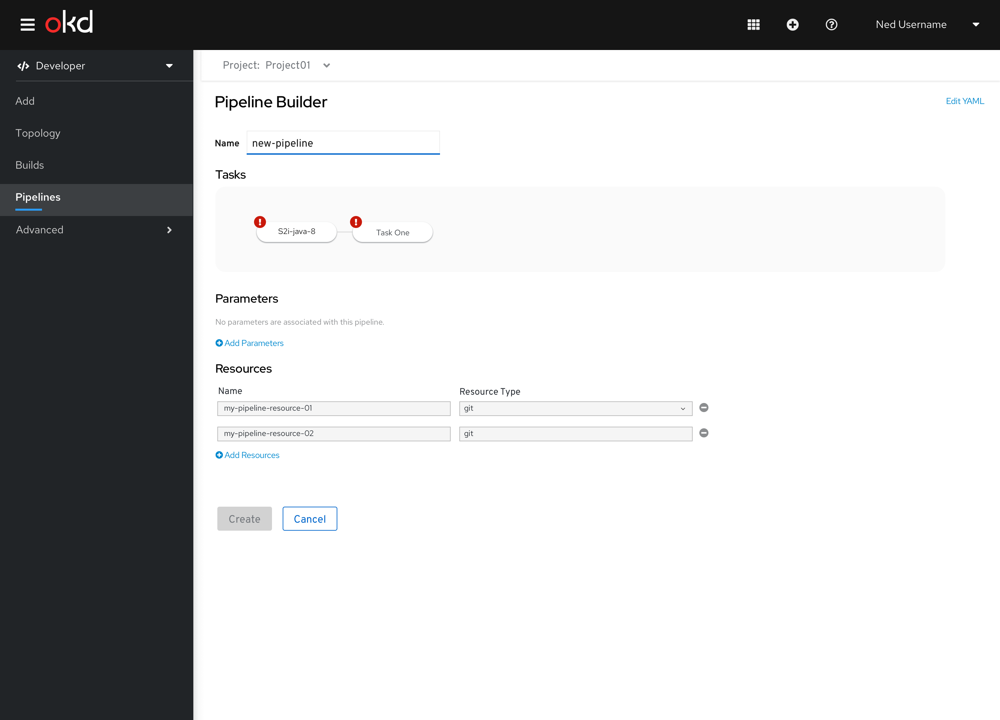
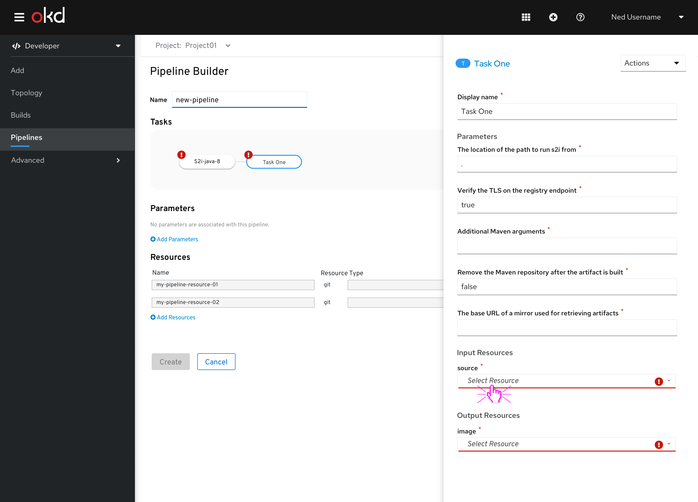
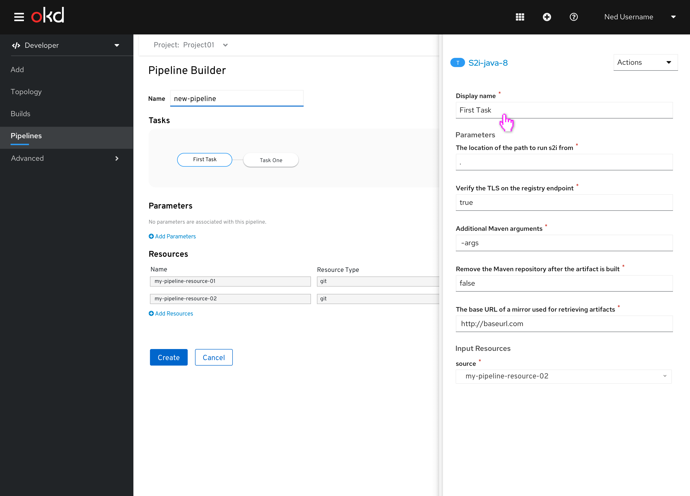

# Pipeline Builder

The Pipeline Builder provides developers a visually guided interface to easily define their pipeline.  

The interface allows the user to define structure of their pipeline, arranging tasks sequentially or in parallel to suit their needs.  Parameters and resources are added which will be mapped to resources, thus input once the Pipeline is started.  The side panel makes it easy to edit the settings for each of the tasks.

## Creating a Pipeline action
The Create Pipeline button is available on the Pipelines page.

Figure 1 - Pipeline List View

## Structure of the Pipeline Builder
The Pipeline Builder has 4 main sections:
1. Input field for the namespace
2. Tasks section, which allows you to define the task structure of the pipeline.
3. Parameters section.  If defined, parameters are required input when the pipeline is started.  The parameters can be referenced by the tasks.
4. Resources section. If defined, resources are required input when the pipeline is started.  The resources can be referenced by the tasks.

Figure 2 - Initial state of the form

## Adding the first task
Selecting the dropdown allows the user to set a task in the pipeline.  Clicking the drop-down displays all available tasks in the namespace and Cluster Tasks.

Figure 3 - Adding the first task

The user selects a task from the list.

Figure 4 - Selecting a task

If information needs to be input to satisfy the required fields for the task, an error icon is displayed on the top left corner of the task bubble.

## Structure of a task
Tasks have the following information:
1. Display name, which defaults to the task name
1. 0+ parameters, all of which are required.  
1. Task parameters can have a default value.  
1. Task parameters can reference Pipelines tasks.
1. 0+ Input resources
1. 0+ Output resources

## Task details
Selecting a task bubble shows the task details in the side panel.  The side panel is dynamically generated based on the structure of the task.

Figure 5 - Task details panel

## Hover over task bubble
Hovering over a task bubble shows arrows which enable the user to continue to add tasks to define the pipeline structure.

Figure 6 - Hover over task bubble

## Hover over a plus sign
Hovering over a “plus” sign displays a tooltip:
+ below the bubble: Add parallel task
+ to the left of the bubble: Add sequential task before this task
+ to the right of the bubble: Add sequential task after this task

Figure 7 - Hover over a plus sign

Clicking on a plus sign create a new dropdown, prompting the user to select a task.

Figure 8 - Adding another task

The user selects clicks on the plus sign, and the task dropdown is added to the visualization.

Figure 9 - Task dropdown is added

Figure 10 - Select task from the list

Once the user selects the task, the task bubble is added to the pipeline structure.

Figure 11 - Adding Resource
New task bubble is added to the pipeline structure

Task One shows an error indicator because all required input is not yet defined.  Both an input and output resource is not yet defined.  The help text lets the user know that there are no pipeline resources defined yet.

Figure 12 - Required input

### Adding resources
Adding resources to the pipeline in the pipeline builder is simple.  Click on the Add Resource link button.

Figure 13 - Add Resource link button

Adding a resource requires a resource name, and a resource type.  Resources can be of type cluster, git, image and storage.

Multiple resources can be added.

Figure 14 - Adding multiple pipeline resources

Figure 15 - Multiple pipeline resources

### Assigning resources to task
Now that your resources have been added, the user can go back to the task panel and assign pipeline resources to the task resources.

Figure 16 - Setting a task resource

Figure 17 - Setting a task resource

Figure 18 - Setting resource

### Setting the display name of a task
Users can editing the display name of the task in the task side panel.

Figure 19 - Editing the task display name

When the display name is updated, the task bubble in the pipeline visualization will also be updated.

Figure 20 - Updated task display name

### Creating the pipeline
When all required is input, the Create button is enabled.

Figure 21 - Creating the pipeline

Once the pipeline is created, the user is brought to the Pipeline details page.

Figure 22 - Pipeline details page

## Edit Pipeline
Edit pipeline is one of the menu actions from the Actions menu on the Pipeline details page.   

Figure 23 - Pipeline Actions menu

Editing the pipeline brings the user to the Pipeline Builder form, with the pipeline in context loaded. The available buttons are Save and Cancel.  Save remains disabled until something is edited.

Figure 24 - Pipeline Builder - Delete Task confirmation

## Deleting a task from the pipeline definition
If you want to delete a task from the pipeline definition, click on the task bubble.  The Delete Task action is available in the Actions menu in the task details side panel.

Figure 25 - Pipeline Builder - Delete Task confirmation

A confirmation dialog is issued, forcing the user to confirm the deletion.

Figure 26 - Pipeline Builder - Delete Task confirmation
