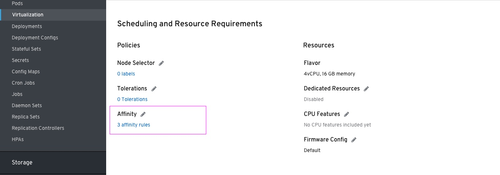
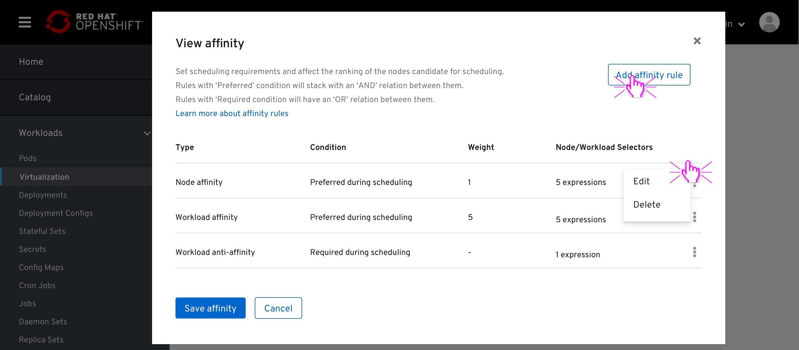
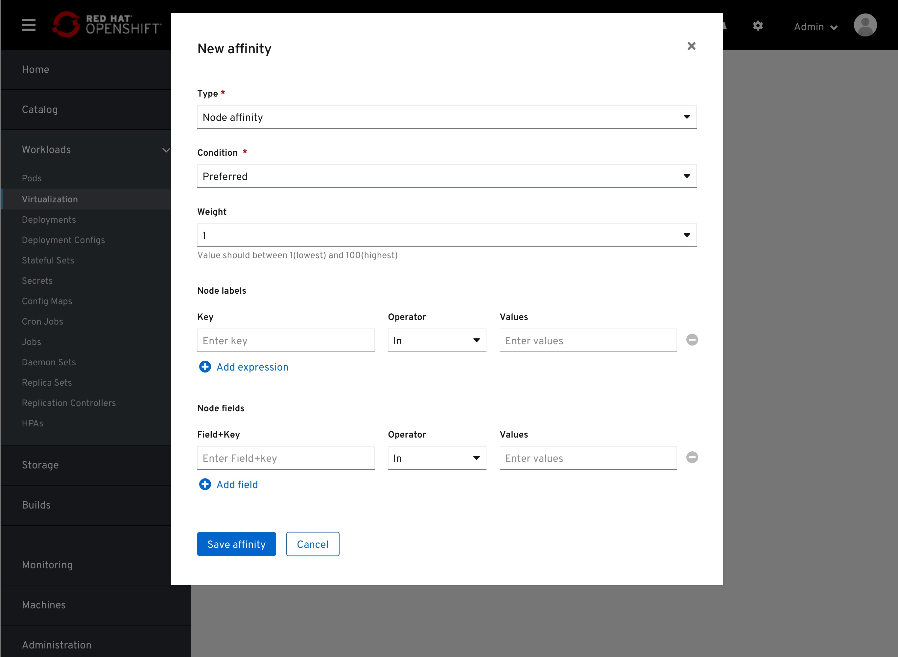
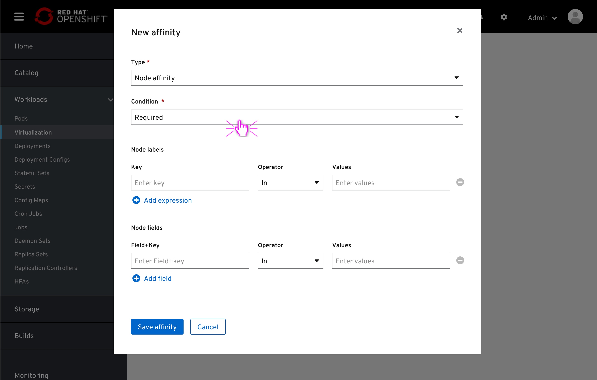
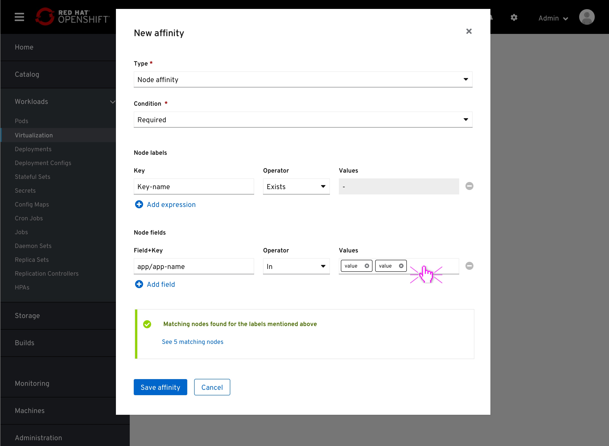

# Affinity

Introducing Affinity as it appears in-page and the Edit modal.

The affinity field is placed in the Workload details page, Details tab, Scheduling section, Policies columns.

The affinity field counts the number of rules applied.

On clicking on the counter Or the Edit pencil icon, the user will be presented with a modal, containing all the applied rules for this workload.
Clicking on the 'Add affinity rule' button will replace this modal with the 'Add affinity rule' modal.
Selecting 'Edit' from each existing rule kebab menu will replace this modal with the 'Edit affinity rule' modal

TThe default fields for an affinity rule are:
- type: Node affinity
- Condtion: Preferred
- Weight: 1 (out of 100)
- Select nodes via: Node labels
- Operator (between Key and Value): In

There is no need to mention the Default to the user.

Switching to 'Required during scheduling' option from the Condition field, the Weight field will be excluded.

Swtiching to 'Any key:value expression on YAML' will change the Key field to be able to accept stings. The placeolder will reflect that as well.
'Any key:value expression on YAML' option will also change the 'Add button' from 'Add label' to 'Add expression'.

On 'Any expression' option, the user will be required to enter full path to the key:value pair.
The 'values' field is a multi-value field and will be applied using the white labels.
Entering values in the label/expression rows ill relulst in a 'Matching nodes' notification.

When selecting the target node/workload to apply "affinity to"
the user can select one of the following Operator options:
- In (any node/workload with the specified key and has one or more of the following values)
- NotIn (any node/workload with the specified key none of the following labels)
- Exists (ny node/workload with the specified key - Values field is disabled)
- DoesNotExost (any node/workload that does not have the specified key - Values field is disabled)

On selecting Workload affinity, the form will align by changing any 'Node' mention to 'Workload'.
The 'Explore nodes list' will change to 'pods', directing the user to the search page with pods selected, on an external tab. 