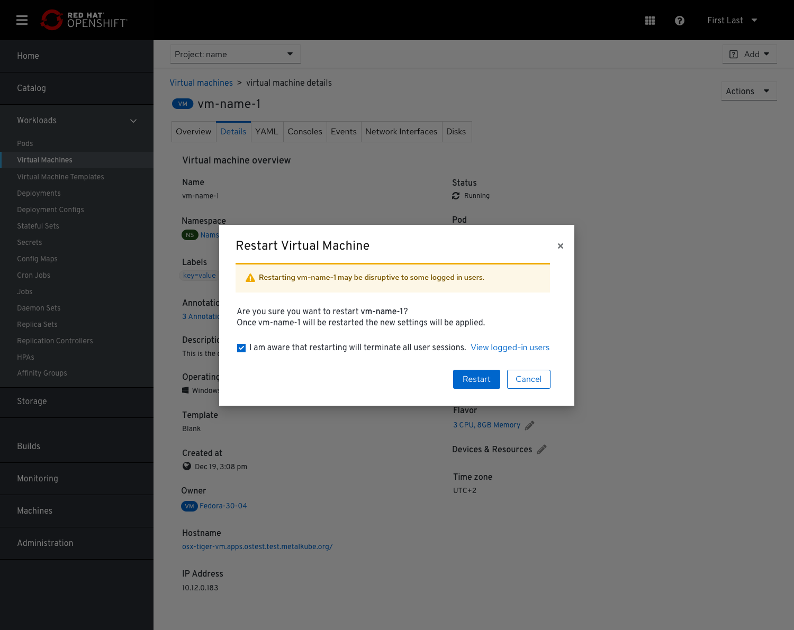
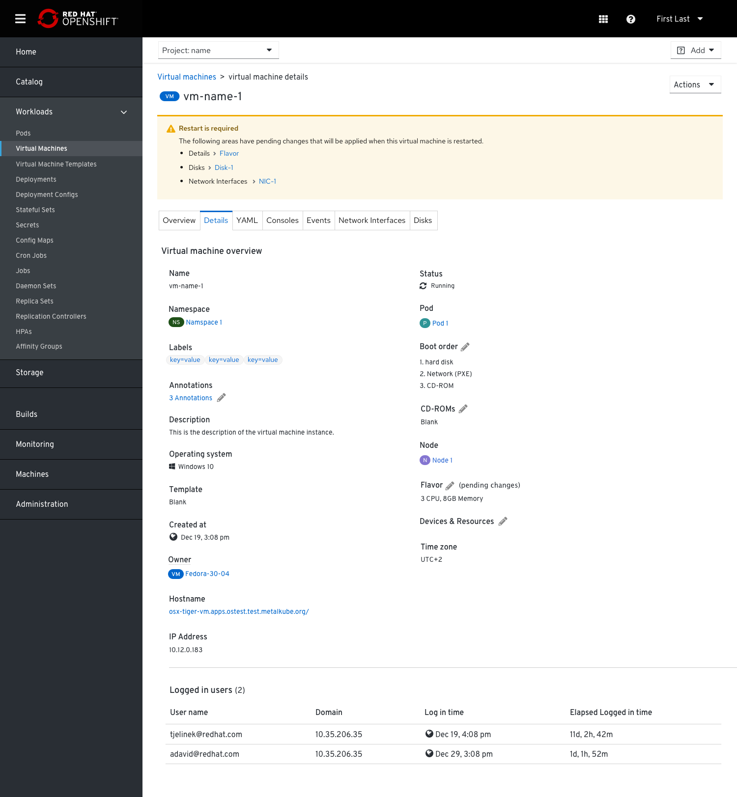
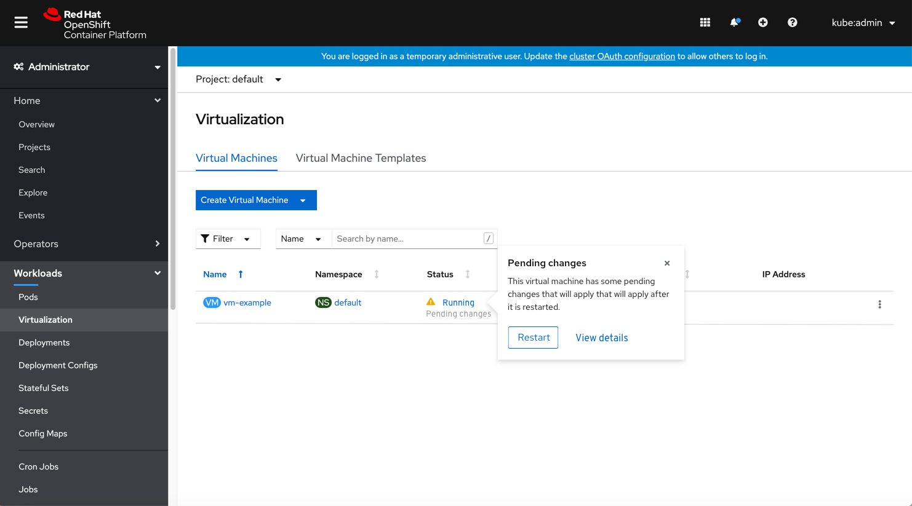
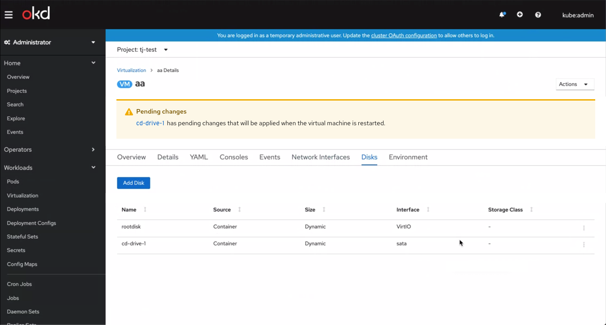

# Next run configuration

As a user makes changes to a running Virtual machine they will need to wait for the VM to restart to see the changes applied (the changes won’t be applied until the next start of the VM).

## Editing

When a user clicks to edit/ update one of the attributes (f.e. Flavor) it will open a modal with an alert notification letting the user know that the VM must be restarted in order to see the changes applied. The alert will persist until they restart the VM.
This alert will not appear until the user has made changes, so the user will then know that they will need to restart.

In general, users will be able to clear the changes and keep what they had, but at the very first time the modal is opened in case the user hasn't saved any changes yet, the 'Clear changes' button will not be shown.

To avoid confusion users will be able to view the current settings in The VM Details page.

At this point the user can either just save the requested changes and postpone the restart or save and restart the VM.

## Restart modal

If the user chooses to save and restart the VM they will be asked again to ensure that and will get into a modal including an inline notification that restarting may be disruptive to some logged in users and a notification that the new setting will be applied upon restart. The notification will include a confirmation checkbox so they would be aware of the effect that the restart action might cause and a link to the logged in users list at the bottom of the VM Details page.

## VM Details page

In the VM Details page they will be notified that the changes they have made will get applied only after the VM will be restarted.
Next to the ‘Flavor’ section we will add a link that will lead to the Flavor modal where they can view the pending changes.
Only in cases when users have made changes to the part of the YAML which are not exposed in the ui, we will add a link to ‘View pending changes in YAML editor’.

In case there are multiple changes that are on different tabs, we will show a list of them and the same notification will be shown on every tab. Clicking each will take the user to the relevant tab and will open the modal.
An environment change can also be presented as a Disk change (if a user adds an environment key-value it is being added as a disk), so a change in the environment tab should be reflected in both 'Disks' and 'Environment' tabs and include a separate inline notification about the changes with the ability to clear them.

In cases users made changes to the part of the YAML which are not exposed in the ui we’ll add the option to ‘View pending changes in the YAML editor.

## List view

In the List view, we will show un-restarted VMs as 'degraded' with yellow warning statuses and 'Pending Changes' subtext underneath the regular Running status. This way they would appear in the Cluster Overview and Project Overview Inventory cards as well. That should make it easier for the users to notice VMs that need to be restarted.

Clicking the 'Running' status will open a popover explaining that this VM has some pending changes that will apply once it will be restarted.
Users will be able to restart from the popover to save the step of clicking into the kebab menu.
The popover will also let the user know where to see the pending changes by clicking 'View details' which will take them to the VMs Details page so they can see the 'Restart is required' inline alert at the top.

## Adding a ‘Clear changes’ option

Users will be able to view the pending changes from the ‘Edit’ modals and also have the option to clear the changes they have made by clicking the ‘Clear changes’ link.

Clicking 'Flavor' will open the 'Edit Flavor' modal with the inline alert that lets the user clear the change they made.

We will add a (Pending changes) label beside the items that have been changed.

If they will choose to clear changes - that action will remove the changes they have made,  the current settings will stay the same and the users will return to the details view.

In case of multiple pending changes, the inline alert on the Details page will say 'Clear all changes' and the modal will include a list of all the changes.

## Disks and NICS examples

