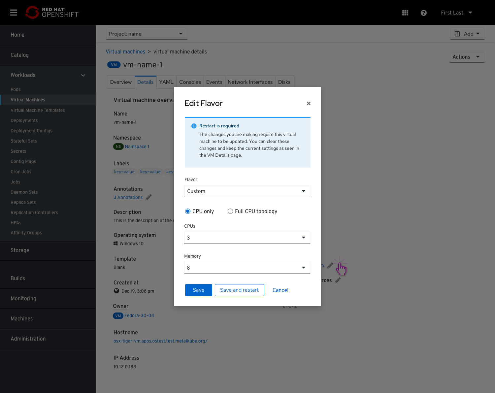
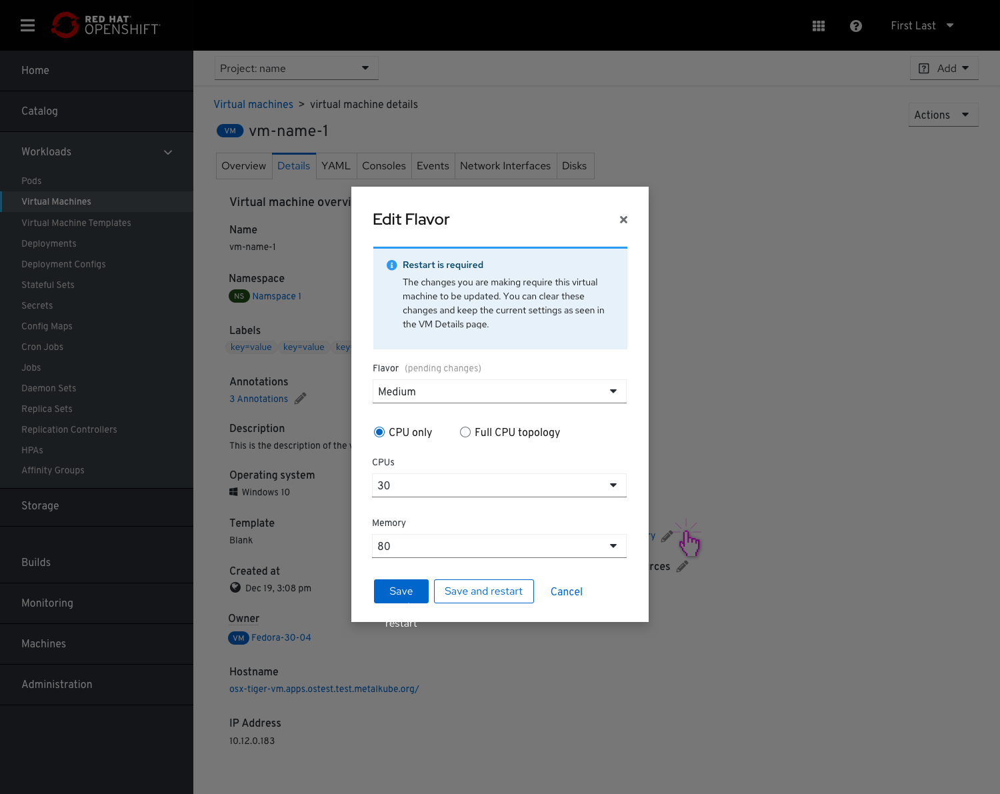
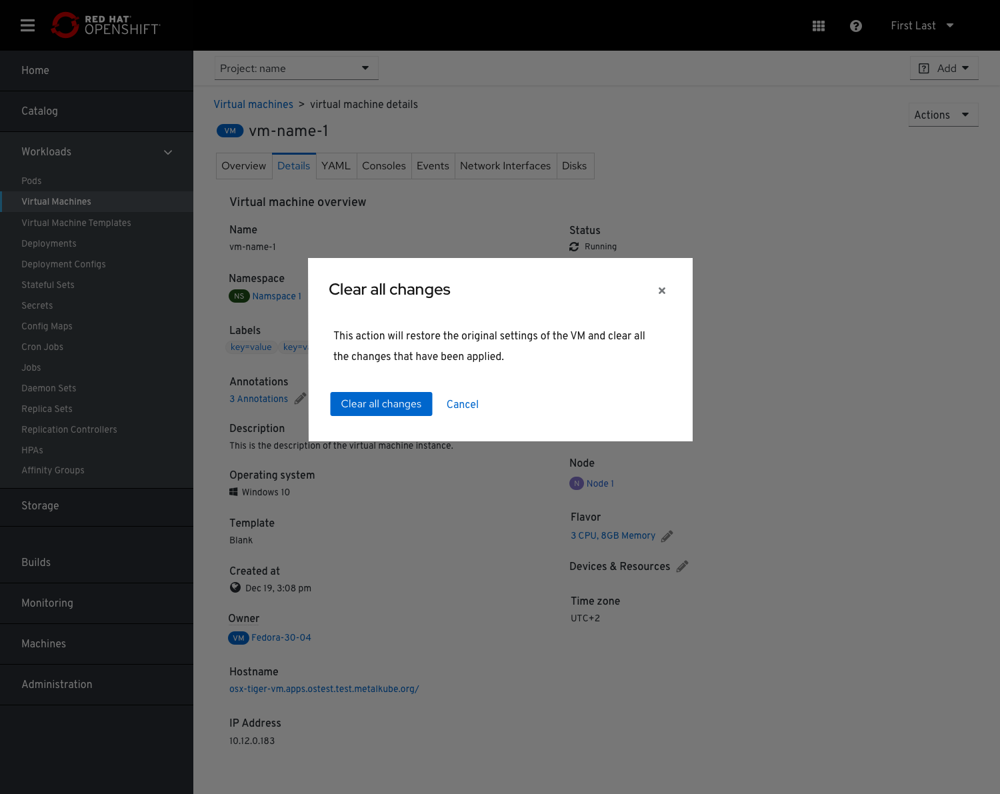
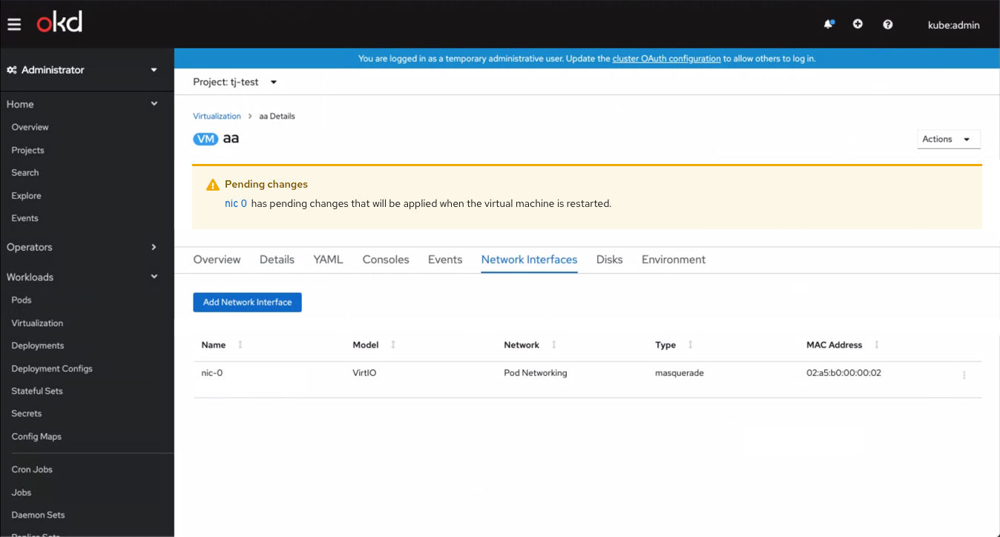

# Editing

When a user clicks to edit/ update one of the attributes (f.e. Flavor) it will open a modal with an alert notification letting the user know that the VM must be restarted in order to see the changes applied. The alert will persist until they restart the VM.
Alternatively they could clear the changes and keep what they had.
To avoid confusion they will be able to view the current settings in the VM Details page.

At this point the user can either just save the requested changes and postpone the restart or save and restart the VM.

## Restart modal

If the user chooses to save and restart the VM they will be asked again to ensure that and will get a modal including an inline notification that restarting may be disruptive to some logged in users and a notification that the new setting will be applied upon restart. The notification will include a confirmation checkbox so they would be aware of the effect that the restart action might cause and a link to the logged in users list at the bottom of the VM Details page.

## VM Details page

In the VM Details page they will be notified that the changes they have made will get applied only after the VM will be restarted. 
Next to the ‘Flavor’ section we will add a link that will lead to the Flavor modal where they can view the pending changes.
Only in cases when users have made changes to the part of the YAML which are not exposed in the ui, we will add a link to ‘View pending changes in YAML editor’.

In cases users made changes to the part of the YAML which are not exposed in the ui we’ll add the option to ‘View pending changes in the YAML editor.

## List view

In the List view, we’ll show the Running* status. Clicking it will open a popover explaining that this VM has some pending changes that will apply once it will be restarted.
Users will be able to restart from here to save the step of clicking into the kebab menu.

## Adding a ‘Clear changes’ option

Users will be able to view the pending changes from the ‘Edit’ modals and also have the option to clear the changes they have made by clicking the ‘Clear changes’ link.

If they will choose to clear changes - that action will remove the changes they have made and the current settings will stay the same.

## Disks and NICS examples

In Disks and NICs table view we’ll add ‘*pending changes’ link right beside the name so users will be able to see there are some changes that need to be applied.

The link will lead to the ‘Edit’ modal where the changes will be shown and users will have the option to clear them. If the user hasn't restarted the VM yet, we will add a  “Pending changes” label  beside the  items that have been changed.

