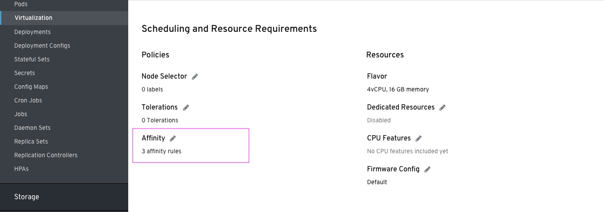
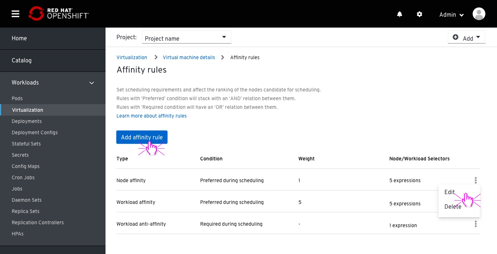
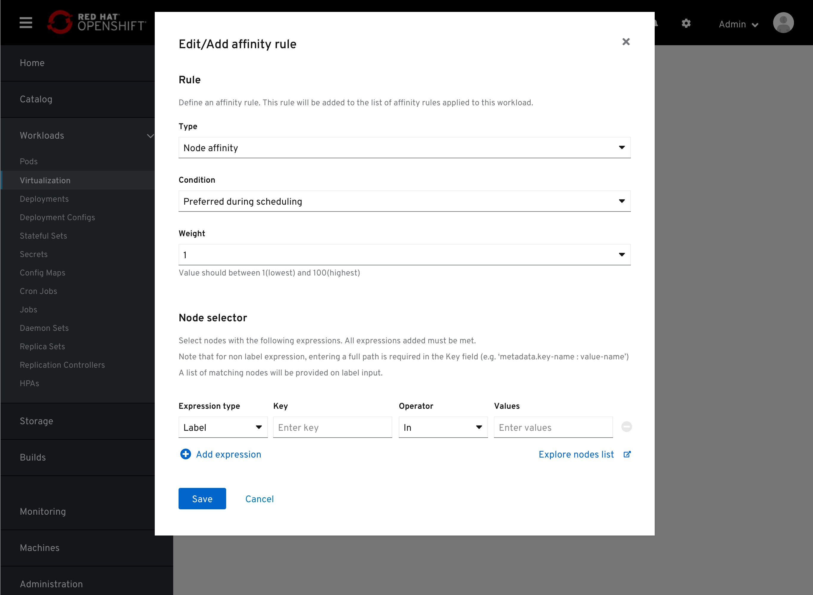
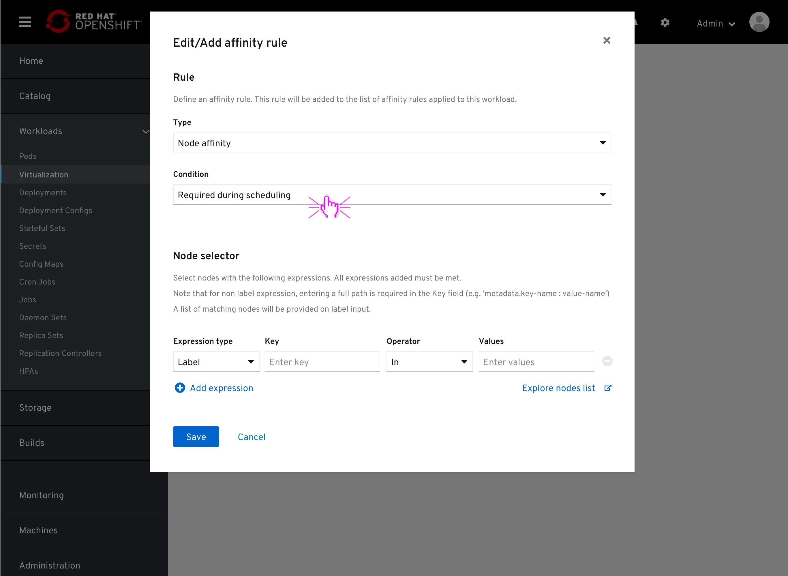
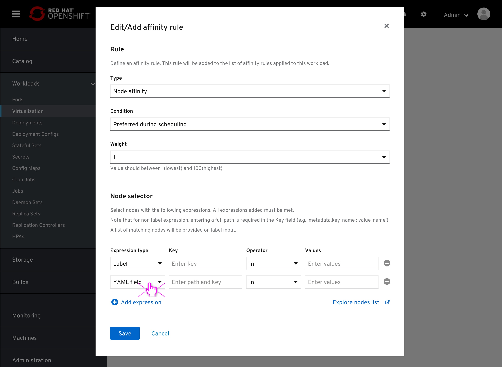
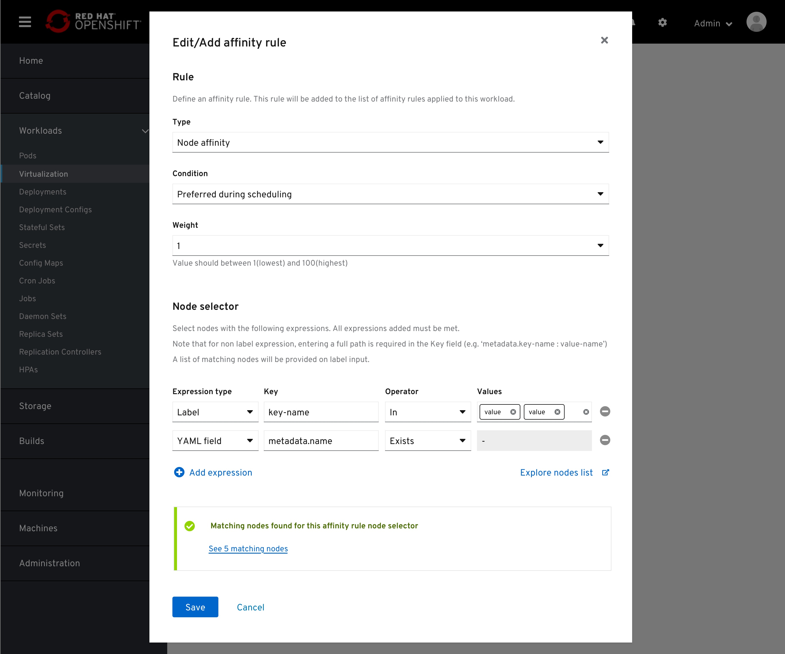

# Affinity

Updating affinity rules for 4.x

## In-page placement

Affinity is placed in the Workload details page > Details tab > Scheduling and Resource Requirements section > Policies column.

Affinity field in the Scheduling section.
The affinity field counts the number of rules applied.

### Affinity rules list

When clicking on the Edit pencil icon, the user will be presented with a drill down page containing all the applied rules for this workload.
Clicking on the 'Add affinity rule' button will open a modal with the 'Add affinity rule' modal.
Selecting 'Edit' from each existing rule kebab menu will replace this modal with the 'Edit affinity rule' modal

A support text below the header will notify the user that: "Rules with ‘Preferred’ condition will stack with an ‘AND’ relation between them. Rules with ‘Required condition will have an ‘OR’ relation between them."

The "learn more about affinity rules" links to: https://kubevirt.io/2020/Advanced-scheduling-with-affinity-rules.html

## Add/Edit affinity rule modal

The default fields for the following fields are:

- type: Node affinity
- Condition: Preferred
- Weight: 1 (out of 100)
- Expression type: Label
- Operator (between Key and Value): In
There is no need to mention the Default to the user.

Switching to 'Required during scheduling' option from the Condition field, the Weight field will be excluded.

Within the 'Node labels' section, the user can select the nodes/workloads by entering labels or any full string of key:value that appears in the node YAML file.
Selcting 'Node fields' option from the 'Expression type' dropdown will offer the user the ability to enter any key;value pair, as long as full path is provided to that pair. Full path is not required for labels.

The 'values' field is a multi-value field and will be applied using the white labels. Entering values in the label/expression rows will result in a 'Matching nodes' notification.

When selecting the target node/workload to apply "affinity to", the user can select one of the following Operator options:

- In (any node/workload with the specified key and has one or more of the following values)
- NotIn (any node/workload with the specified key none of the following labels)
- Exists (ny node/workload with the specified key - Values field is disabled)
- DoesNotExist (any node/workload that does not have the specified key - Values field is disabled)

'Add expression' button will allow the user to add more conditions to this rule, with an 'AND' relation between these conditions, meaning, all these conditions must be met.

On selecting Workload affinity, the form will align by changing any 'Node' mention to 'Workload'.

On the opposite side of the 'Add expression' button, a link to texternal Node/Workload list will be provided.

