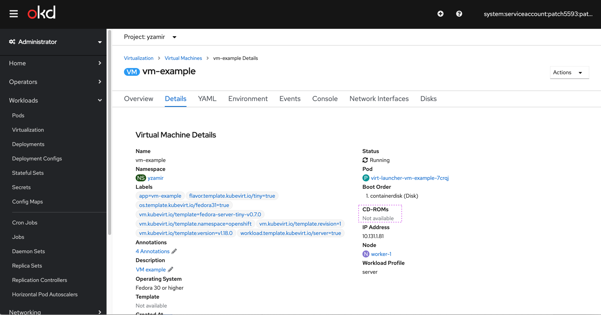
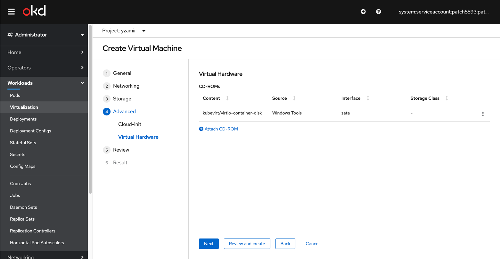
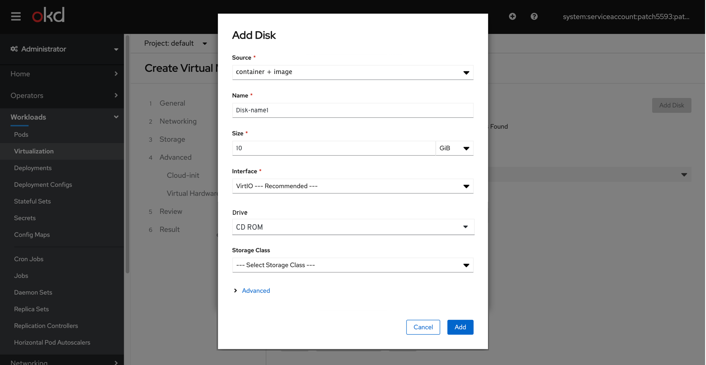

# CD ROMs

## CD-ROMs on VM Details page

It's been determined that separating CD-ROMs from the rest of the disks has technical overhead and complicates the flow. It makes more sense to include them as a lower level item in the disks rather than highlight them in the details view like we currently do.

We'll add a ‘Drive’ column to the ‘Disks’ table view.
The default type will be ‘Disk’ and the other option(s) will be ‘CD ROM’.

## CD-ROMs on Create VM wizard

We'll remove the CD ROMs from the ‘Advanced’ step and place it in the Storage step.
For cases where we point the user to them (windows guest tools), we’ll direct the users via a notification with a link to the Disks table under the Storage step.

This is the current state (CD ROM is placed under the Advanced step)

If we take out the CD ROMs from the ‘Advanced’ step, the ‘Virtual hardware’ sub-step will be omitted and we’ll only have the ‘Cloud-init’ as a single option in the Advance step.

Moving the CD-ROM creation to the storage step, will enable us (instead of directing users to the ‘Advanced>CD ROMs’) to direct them to the ‘Storage>Disks’ table.

So opening the ‘Add Disk’ modal once they get redirected from General step to Storage step will ensure users know they have the right disk selected.

