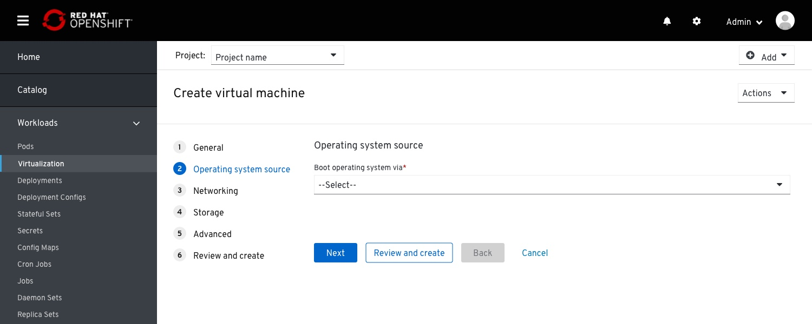
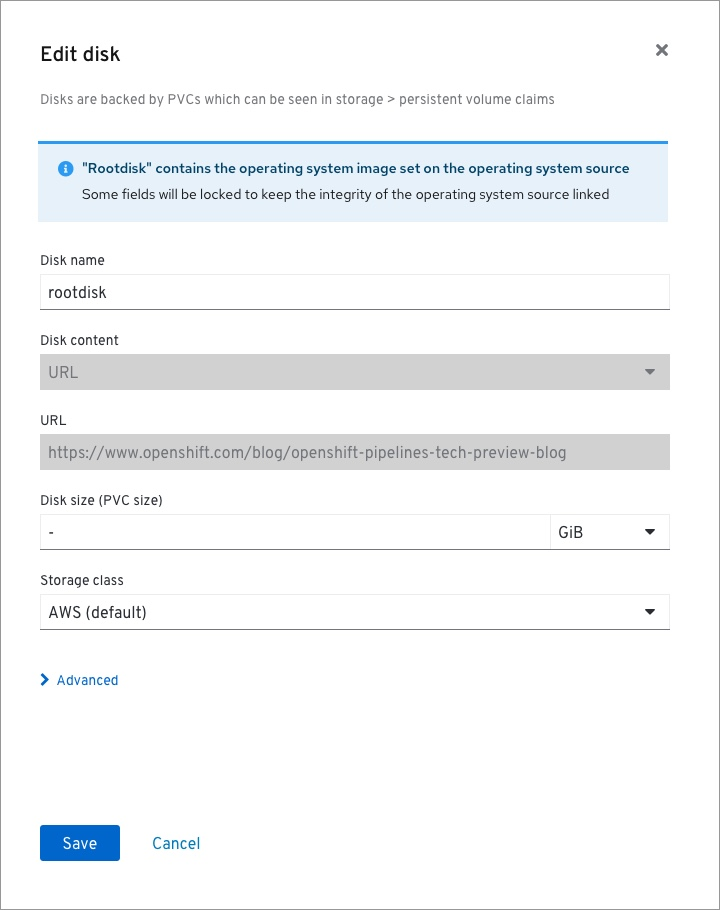
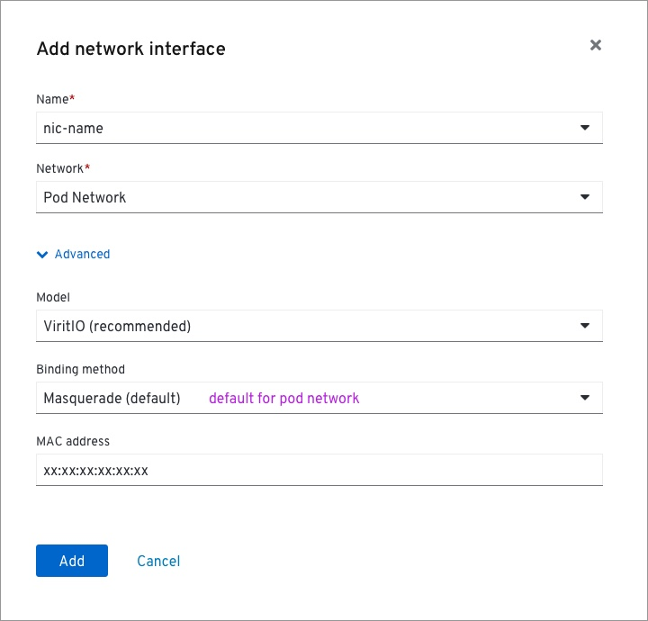
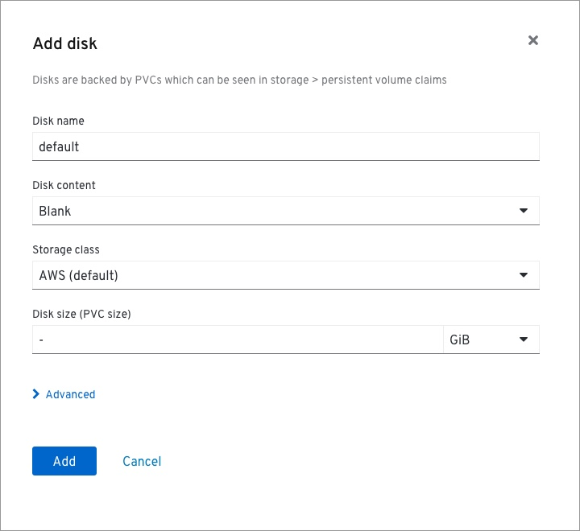
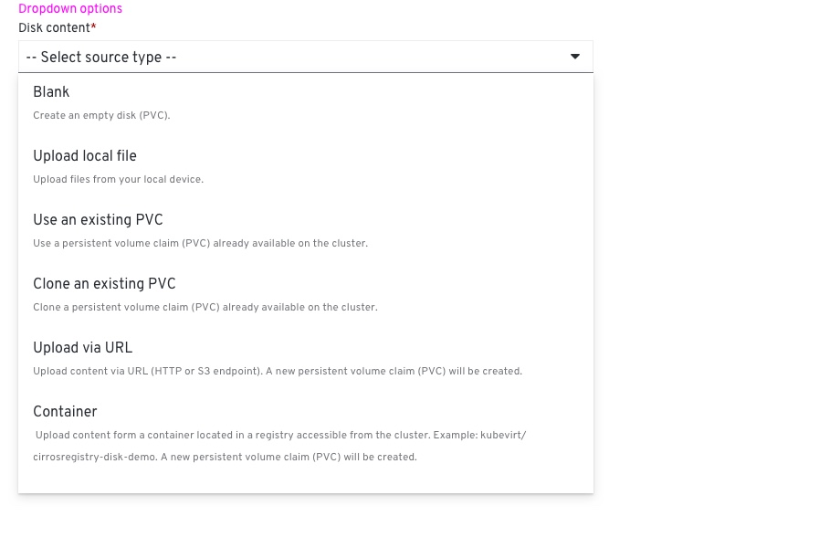

# create VM dropdowns

This item will cover various updates to the VM creation wizard
- Adding descriptions to the dropdown fields (using this pattern https://github.com/patternfly/patternfly-design-kit/issues/218)
- Renaming fields
- Reordering fields
- Adding 'Operating System source' step

Landing on the General step, Default mode.
Section titles added, and fields reorgenized and renamed.
Any OS image source related fields are mofed to the next step.

'General' section:
- 'Name'
- 'Description'
'Resources & configuration' section'
- 'Operating system'
- 'Workload type' (previously Workload profile)
- 'Flavor (CPU and Memory)' (previously only 'flavor')
- 'Common template'

## General step

Upon selecting an operating system, the Workload type and Flavor (CPU and Memory) fields will be enabled and their defaults will be selected.

Workload type options
Server is the default

Flavor options.
Medium is the default

On selecting all the above, the Common tempate field should be filtered to one option, therefor be locked.
However, in some cases, there will be more than one option, so this field should be available. 

## Operating system source step (new)

Operating system source step,landing mode.

'Boot operating system via' field options

Selecting an option from the 'Boot operating system via' field will expose below all the fields required to upload the image and create the correlating disk/NIC.
For example: on selecting the 'URL' option, additional fields will appear below.
These fieldss are required in order to point to the desired URL asl well as creating a disk via PVC that will containt the image on that URL.
The fields are basically mapped 1:1 to the Disk modal, with the URL option selected for 'Disk content' field.

An Advanced (settings) drawer is available here as well, containing the same options as the Advanced options on the disk modal.

Once the user clicks next, the disk containing the OS image from the URL is added. This disk will be available on the Storage step and will appear as the first item on the list.
This disk cannot be deleted bu can be modified to some extent.

Editing that disk will display an info notification within the edit modal, mentioning the link between this disk and the one created omn the OS source step.
The fields related to the OS source, in this case, the URL, will be locked.

## Netwroking step

NIC list.
For any VM source selection (with the exception of PXE) a default NIC will be added.
This NIC exposes the VM to the cluster.

On editing this default NIC, an info alert will remind the user that modifying this NIC might break that 'exposing to cluster' configuration.

Add NIC modal.
The Advanced drawer is closed by default, as seen in the previous image.
All fields have moved into the advanced drawer, except the Name and Network fields.
Network field does not require description for each option since these options are created and managed by the user.

'Model' dropdown options.
ViritIO marked as (recommended)

'Binding method' dropdown options (previously 'Type')

This field's default is dependent on the Network field.
For 'Pod network' the default option will be 'Masquerade'.
For other Network option, the default will be 'Birgde'.

## Storage

Disks list.
In case no disk type OS image source selected in the General step, a default disk will be created in order to make the VM operational.

Editing the default disk will present an info box notification.

The Add/Edit modal has been modified.
- Name
- Type changed to 'Disk content'. This will change the configuration below
- Advanced drawer added containing: 
    - Interface
    - Volume mode
    - Access mode (should be automatically selected and locked to the Storage class default)
    - Make disk bootable checkbox (new)

Disk content dropdwon options.

## Review & create

 
The name of this step has changed to correlate better with the 'Create and review action' that is available along previous steps.

The 'Start VM on creation' and 'Create template from this VM' checkboxes had been removed from the General step and placed in this step at the bottom of the page.