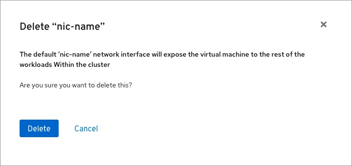
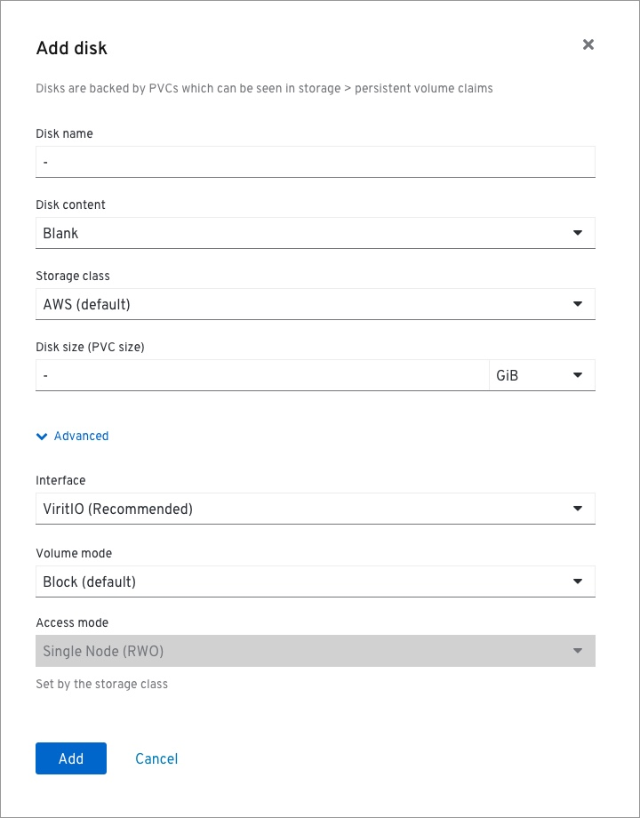
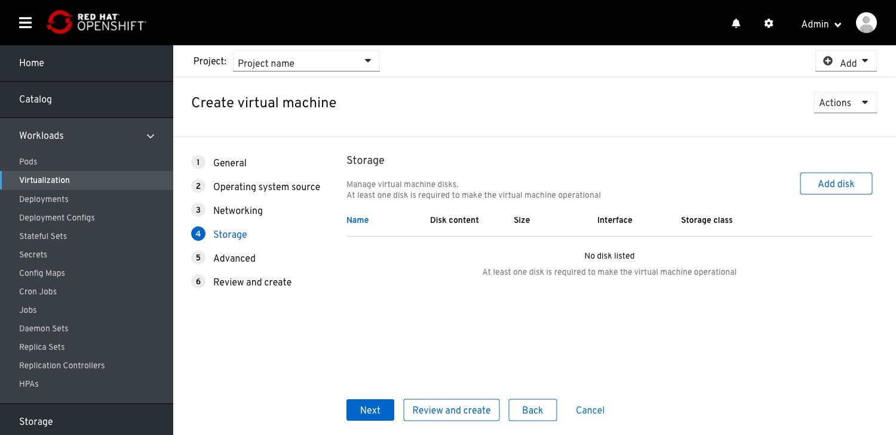
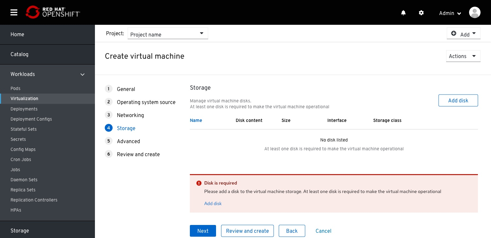
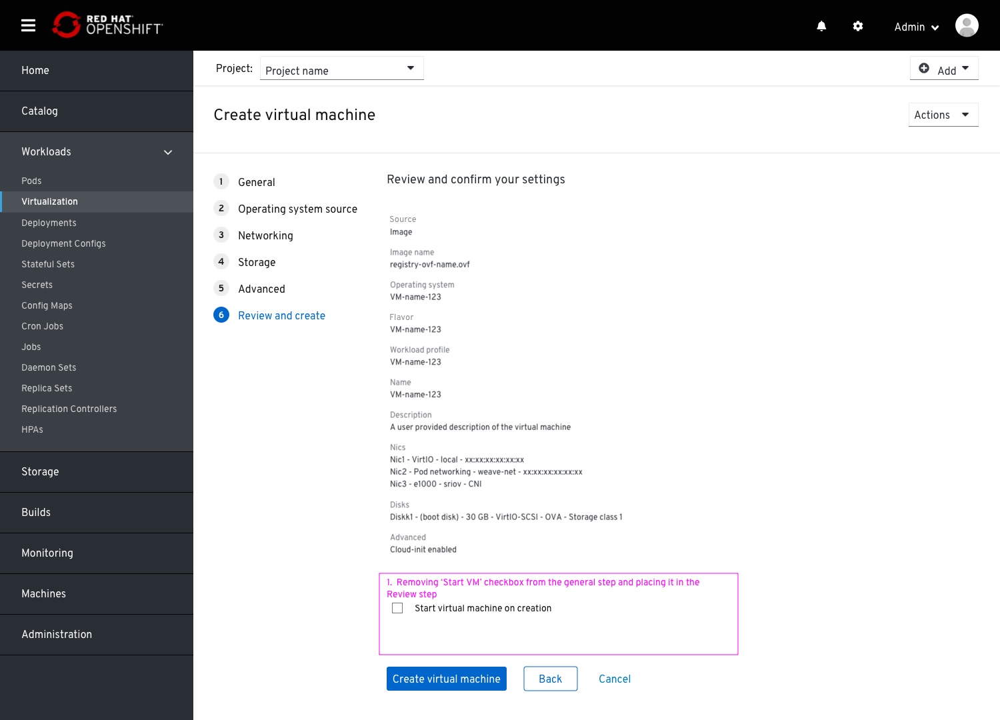

# create VM design updates

This item will cover various updates to the VM creation wizard
- Adding descriptions to the dropdown fields (using this pattern https://github.com/patternfly/patternfly-design-kit/issues/218)
- Renaming fields
- Reordering fields
- Adding 'Operating System source' step

Landing on the General step, Default mode.
Section titles added, and fields reorgenized and renamed.
Any OS image source related fields are moved to the next step.

'General' section:
- 'Name'
- 'Description'
'Resources & configuration' section'
- 'Operating system'
- 'Workload type' (previously Workload profile)
- 'Flavor (CPU and Memory)' (previously only 'flavor')

## General step

Upon selecting an operating system, the Workload type and Flavor (CPU and Memory) fields will be enabled and their defaults will be selected.

Workload type options
Server is the default

Flavor options.
Medium is the default

## Operating system source step (new)

Operating system source step,landing mode.

'Boot operating system via' field options

Selecting an option from the 'Boot operating system via' field will expose below all the fields required to upload the image and create the correlating disk/NIC.
For example: on selecting the 'URL' option, additional fields will appear below.
These fields are required in order to point to the desired URL as well as creating a disk via PVC that will contain the image on that URL.
The fields are basically mapped 1:1 to the Disk modal, with the URL option selected for 'Disk content' field.

An Advanced (settings) drawer is available here as well, containing the same options as the Advanced options on the disk modal.

Once the user clicks next, the disk containing the OS image from the URL is added. This disk will be available on the Storage step and will appear as the first item on the list.
This disk cannot be deleted but can be modified to some extent.

Editing that disk will display an info notification within the edit modal, mentioning the link between this disk and the one created on the OS source step.
The fields related to the OS source, in this case, the URL, will be locked.

## Netwroking step

NIC list.
For any VM source selection (with the exception of PXE) a default NIC will be added.
This NIC exposes the VM to the cluster.
an info alert will notify the user of the purpose of this NIC and that modifying this NIC might break that 'exposing to cluster' configuration.

On deleting the default NIC, a confirmation modal will present itsself.

Edit modal.
The Advanced drawer is always collapsed by default

'Binding method' dropdown options (previously 'Type')

This field's default is dependent on the Network field.
For 'Pod network' the default option will be 'Masquerade'.
For other Network option, the default will be 'Birgde'.

## Storage

Disks list.
In case no disk type OS image source selected in the General step, a default disk will be created in order to make the VM operational.
This will be highlighted by an in-line info alert (like in the Networking step)

On deleting the default disk, a confirmation modal will present itsself.

Add disk modal.
- 'Type' field changed to 'Disk content'
- 'Name' field changed to 'Disk name'
- 'Size' changed to 'Disk size (PVC size)'
- Some fields pulled into the the Advanced drawer (see image below)

The Add/Edit modal expanded view.
- Advanced drawer added containing:
    - Interface
    - Volume mode
    - Access mode (should be automatically selected and locked to the Storage class default)
    - Make disk bootable checkbox (new)

Disk content dropdwon options.

List empty state will notify the user that at least one disk is needed.

This will be supported by an alert blocking the user from moving from this step when there are no disks.

## Review & create

 
The name of this step has changed to correlate better with the 'Create and review action' that is available along previous steps.

The 'Start VM on creation' checkbox had been removed from the General step and placed in this step at the bottom of the page.
The 'Create template from this VM' checkbox had been removed completely from the wizard for now.
