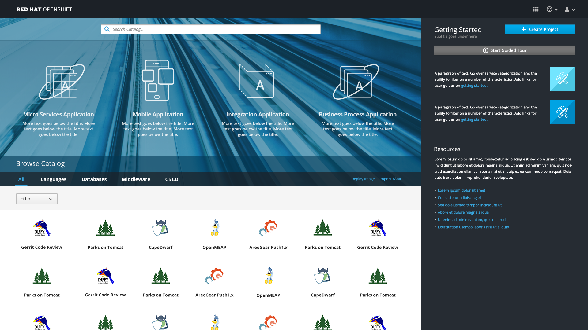
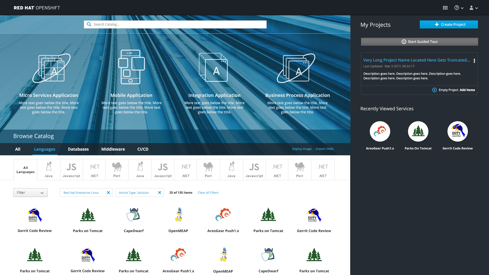
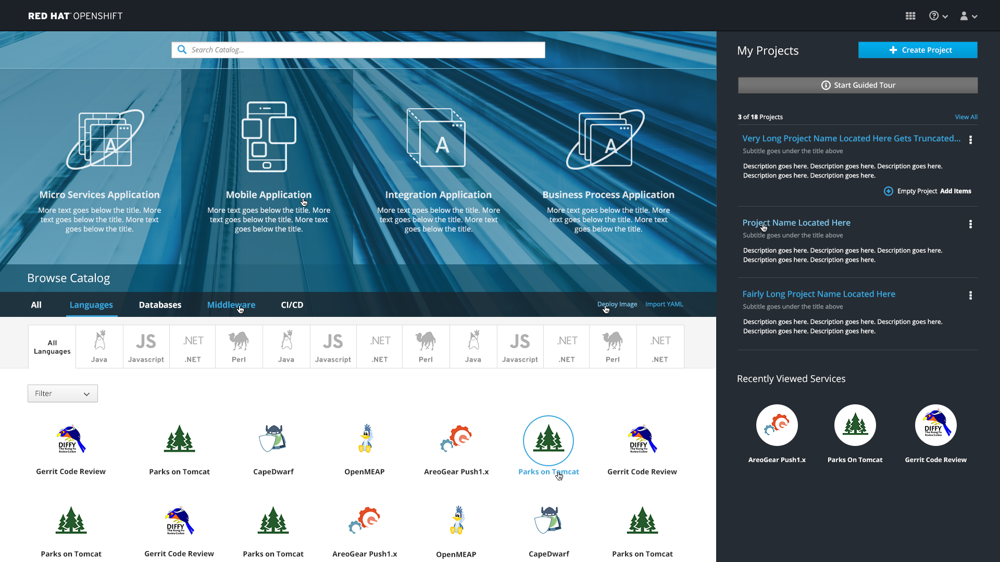
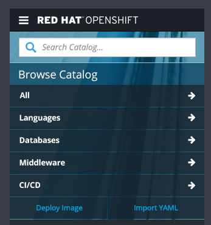

# Catalog

- The Catalog section is found at the bottom of the web console homepage.
- The Catalog contains catalog items and provides the means to browse, sort, and filter them.

## Browse Catalog

- Initially, upon arriving on the page, the `All` section is highlighted, underlined and expanded, with the catalog items sorted alphabetically by name.
- Deploy Image and Import YAML/JSON links are available on the right side of the catalog primary categories bar.
- Clicking either link will trigger the relevant [overlay panel actions](http://openshift.github.io/openshift-origin-design/web-console/4-patterns/overlay-panel).

- Any tabs that have subcategories of catalog items will have those subcategories displayed as tiles.
- These tabs should also contain an a `All` tile for catalog items from all subcategories.

### Hover States

- Primary categories are highlighted in a lighter blue on hover.
- Deploy Image and Import YAML are highlighted in a lighter blue on hover.
- Hovering over a catalog item will highlighted the item in a circle and change the item name to blue.

### Implementation Details
- Administrators should have the ability to determine which catalog items are available to users.      
- Disabled catalog items should not appear.    
- The `All` category should be the first primary category and it should always be displayed.
- For remaining primary category tabs, if no catalog items exist, the tab should be hidden.
- Initially, category tabs will be limited to the defined list shown, with the addition of an `Other` category for customers to place resources that don’t fit in an existing category.
    - **Note:** Eventually, customers will have the capability to add their own custom category tabs.
- Some primary categories will have a secondary level of categorization available.
- For secondary levels of categorization, there should again be an `Other` category if there are items to display (not shown in mockup).
- Clicking on a subcategory will open a scrollable panel that contains the catalog items.

### Responsive State

- On smaller viewport sizes, the catalog tabs should stack with arrows to the right.
- Deploy Image and Import YAML should be displayed below all primary categories and should have a different visual treatment from the tabs.

- If subcategories exist, selecting the primary category will bring users to another screen to view subcategories as tiles.
- Clicking back will bring users back to the home page with all primary tabs listed.

- Selecting a subcategory tile will bring users to another screen to view catalog items by scrolling.

- The category title will be listed with a dropdown option to switch to another subcategory without navigating back to tiles.
- The current selection will be highlighted with the icon in full color. All other images are muted.
- Clicking "back" from this screen will navigate back to the initial Home Page (skipping the subcategory tile view).
- **Note:** When subcategories do not exist for a tab, selecting a primary category will bring the user directly to a screen like this (without a dropdown option at the top).

******************************

# Future Use Cases

## Filter Catalog Items

- Opening the filter dropdown enables the user to select a number of filters to apply to the current set of catalog items

#### Implementation Details
  - Filters between categories are combined with an AND relationship
  - Selecting a second filter within a category will replace the previous value for that category.
    -Filter values within each filter category should be selected with radio buttons
  - The available filters may be different for each tab

-

#### Customer Feedback (if applicable)
- TBD
