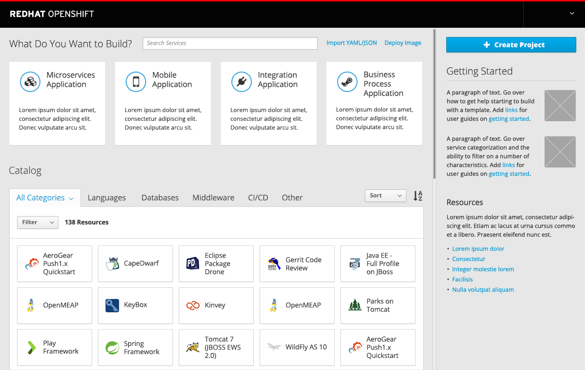
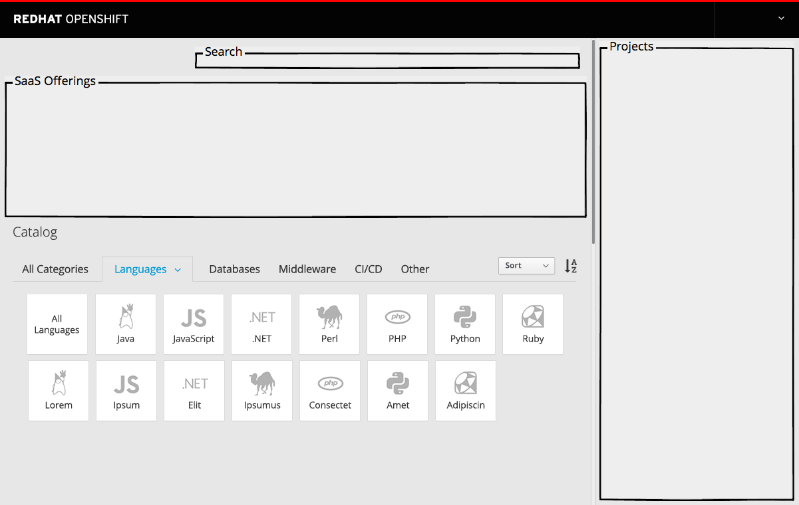
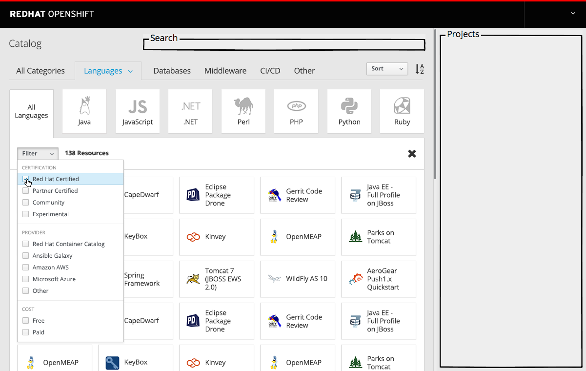
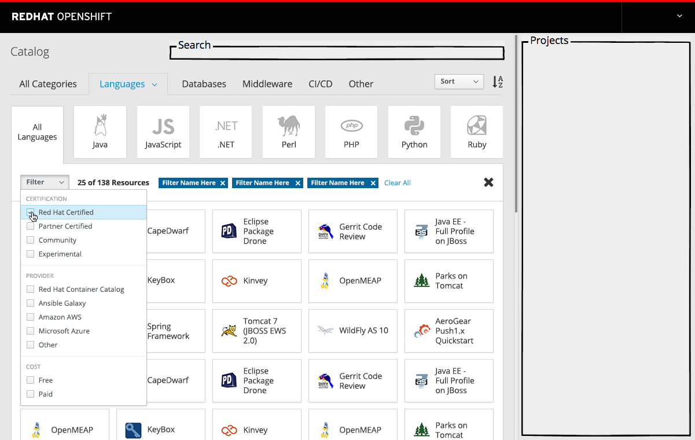
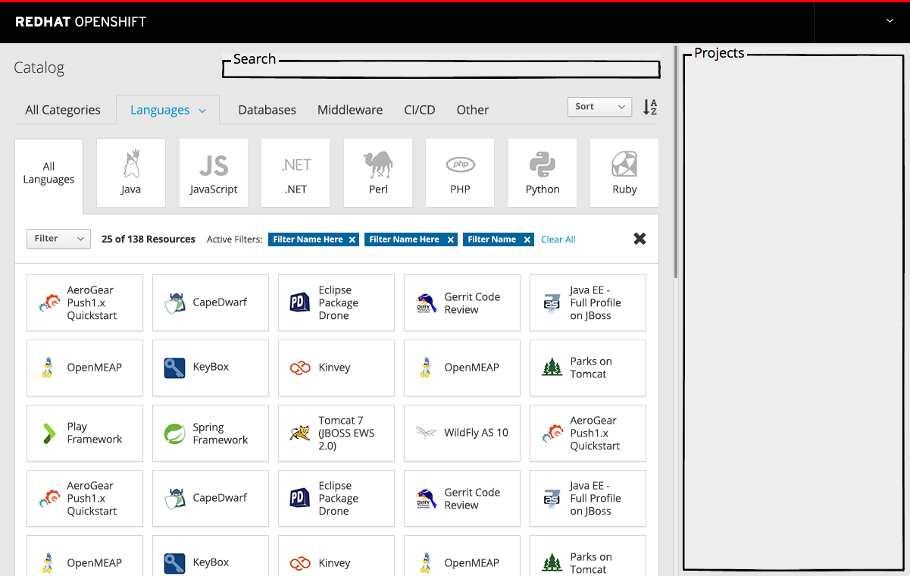

# Catalog

- The Catalog section is found at the bottom of the web console homepage.
- The Catalog contains catalog items and provides the means to browse, sort, and filter them.

## Browse Catalog

- Initially, upon arriving on the page, the `All` section is expanded and the resources are sorted alphabetically by name.

#### Implementation Details
  - Administrators should have the ability to determine which catalog items are available to users;      
    - Disabled catalog items should not appear.
    - Any tabs that do not contain any catalog items should not be displayed.
  - Initially, category labels will be limited to those that we define, potentially including an `Other` category for customers to place resources that don’t fit in an existing category.
    -Eventually, customers should have the capability to add their own category headers.

- Any tabs that have subcategories of catalog items will have those subcategories displayed as tiles.
- These tabs should also contain an a `All` tile that contains catalog items from all subcategories.

#### Implementation Details
  - Any subcategories that do not contain catalog items should not be displayed.
  - If a tab has subcategory tiles, they should not be mixed with regular catalog items. Loose catalog items should be placed in an `Other` tile.

- Clicking on a subcategory will open a scrollable panel that contains the catalog items

## Filter Catalog Items

- Opening the filter dropdown enables the user to select a number of filters to apply to the current set of catalog items

#### Implementation Details
  - Filters between categories are combined with an AND relationship
  - Selecting a second filter within a category will replace the previous value for that category.
    -Filter values within each filter category should be selected with radio buttons
  - The available filters may be different for each tab

-

#### Implementation Details
  - Note PatternFly design patterns
  - Note icon references

#### Customer Feedback (if applicable)
- Customer Feedback Received
  - Overview of customer feedback received
- Necessary Customer Feedback
  - Questions to follow up with customers
