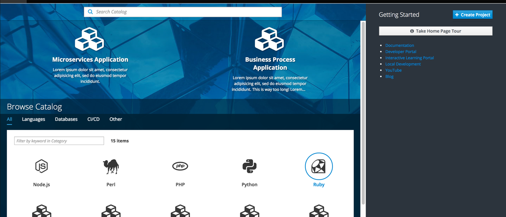
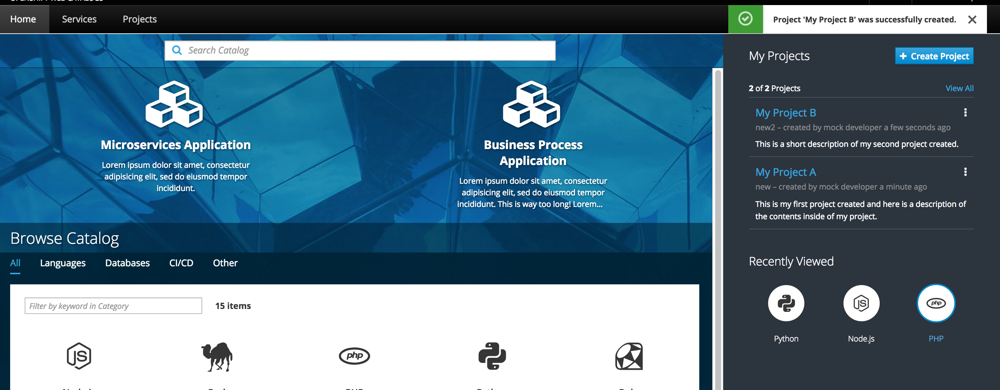
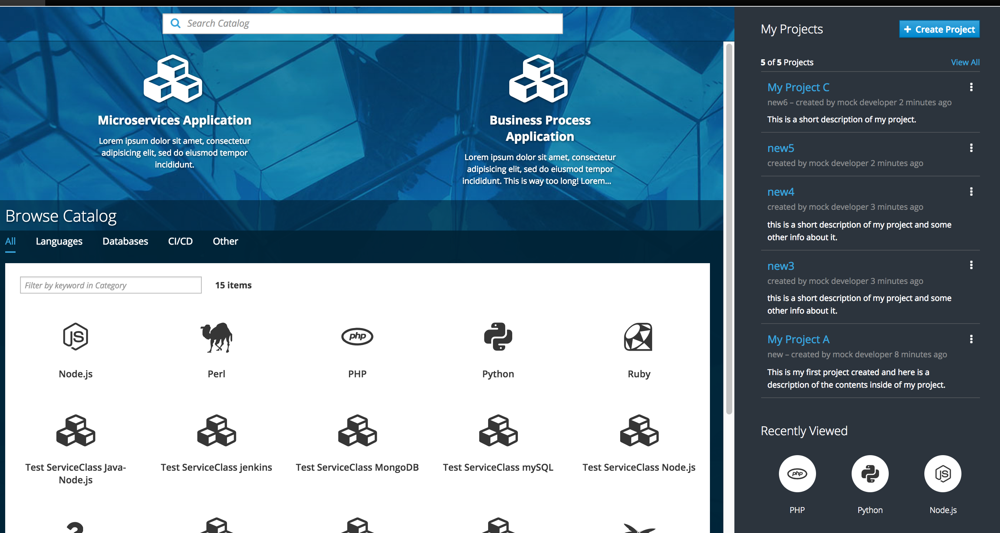

# Project Panel
- The project panel should cover 1/3 of the homepage when viewing on a standard desktop screen.
- The panel is on the far right-hand side for launch.
- **Note:** In the future the panel size and location may be configurable by the user.

## Day 1 Experience

- Brand new users will not have any projects upon initial login.
- On day 1, the projects panel includes the following sections in this order:
  1. **Create Project Button** (optional): The create project button is displayed by default, but admin users may choose to hide this button if desired.
  2. **Guided Tour:** Action button that launches a quick tutorial to identify key sections of the interface.
    * Details TBD
  3. **Resources:** Additional links that may help user learn more about the product will be listed here.
    * Details TBD
  4. **Custom Text/Links** (optional): This section is optional and configurable by the admin user. It allows admin users to provide additional content for their day-to-day users.

- The "Getting Started" section will no longer appear once the user has at least one project created.
- The project panel will then display the Day 2 Experience detailed below.

### Implementation Details
- The **Custom Text/Links** are configurable by an admin user with full DOM access to this section only.
- The **Guided Tour** will use the [Hopscotch framework](http://linkedin.github.io/hopscotch/)

### Customer Feedback
- TBD

## Day 2 Experience

### Create Project

- The create project button will open an overlay panel with a three-field form inside. See implementation details for more info.
- Once the user has at least one project created, the "My Projects" section will appear at the top of the panel. The Create Project button (if being used) will move down under "My Projects".
- The Getting Started section should move below the first project until resources are added to the project.

- Once created, the project will be listed as a card at the top of the projects list, in an "empty state."
- The empty state is defined as a new project which does not have any resources and only has a name, date, and description.
- **Kebab Actions:** There are three actions under the kebab menu for projects: edit details, edit membership, and delete. These actions should function as they currently behave today. The delete action opens a confirmation modal and the other two navigate to a new page.

### Single Project

- Once a project has at least one resource, the card is not longer in the empty state.
- Once the user has viewed at least one resource in the catalog, a "Recently Viewed" section will appear at the bottom of the panel.
- All content from the Getting Started section should be removed from this area and be accessible through the help menu in the masthead.
- If there are any warnings on a particular project, the warning icon should appear on the card, to the left of the project name.

### Multiple Projects

- Any new projects will be added to the top of the project list and will remain in the empty state until resources are added.
- Clicking a project will bring the user directly to the project overview page for the particular project.

- Once there are more than two projects, a summary card should be added to the top of the list.
- This card will be placed underneath the Create Project button (if shown) and will display the number of total projects, as well as the number of projects with associated warnings. If no warnings exist, we should still display 0 warnings. **Note:** Warnings may not be available for the MVP version.
- The projects should always display with the most recently updated projects on top.
- We should show as many projects as space permits on this page.
- Include a count (the number shown out of the total) along with a "view all" link to navigate to the full projects page.
- Users can navigate to a full projects page via the "View All" link on the homepage or by clicking on the summary tile (when displayed).

### Recently Viewed

### Implementation Details
- There is an existing controller and form for the **create project** action already.  We should refactor into a component and move to the common repo so it is available to both console and catalog.
- **Kebab Actions** The edit details and edit membership actions currently exist today for projects and take the user to a new page. For the initial release, this functionality should remain the same. For the delete action, a modal appears asking confirmation. This should remain consistent for MVP as well.
- **Warnings** Events are the only notifications we have access to at this time and it would be a separate API call for each project to determine if warnings exist.
- **Scrolling** TBD per discussion with Jeff

### Customer Feedback (if applicable)
- TBD

## Responsive Behavior/ Mobile View
- TBD  

## Future Work - NOT MVP
- Add a "last updated" date to the project cards and sort by most recently updated, not by created date

### Single Project

- Once a project has at least one resource, utilization metrics (CPU, Memory and Network) should be added to the project card along with the corresponding trendlines.

### Multiple Projects

- The utilization metrics should be shown on the project cards as space permits (2 projects max).

### Kebab Actions
- TBD

### Project Summary
- TBD
