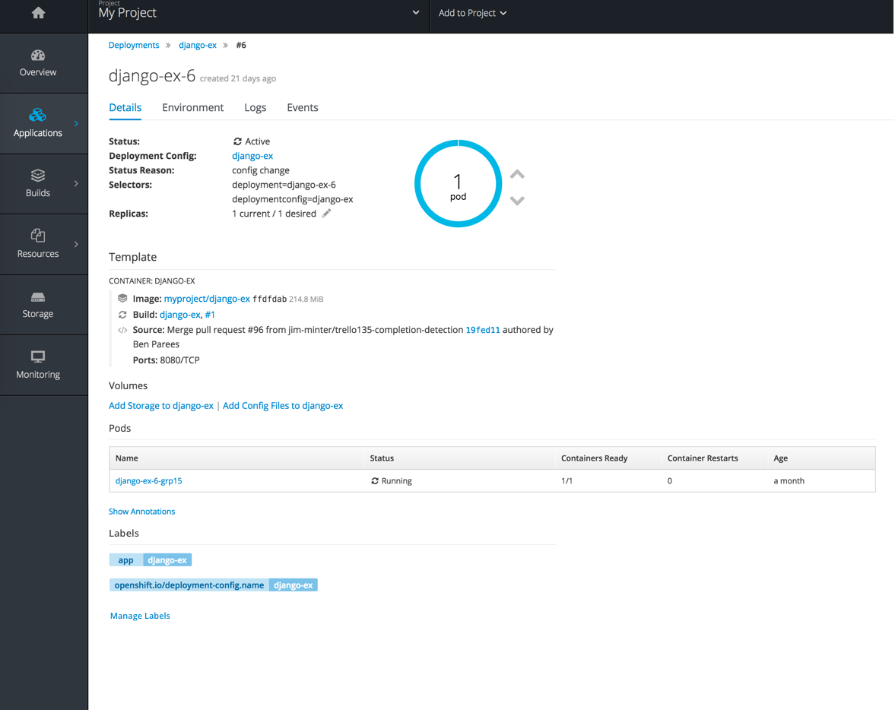
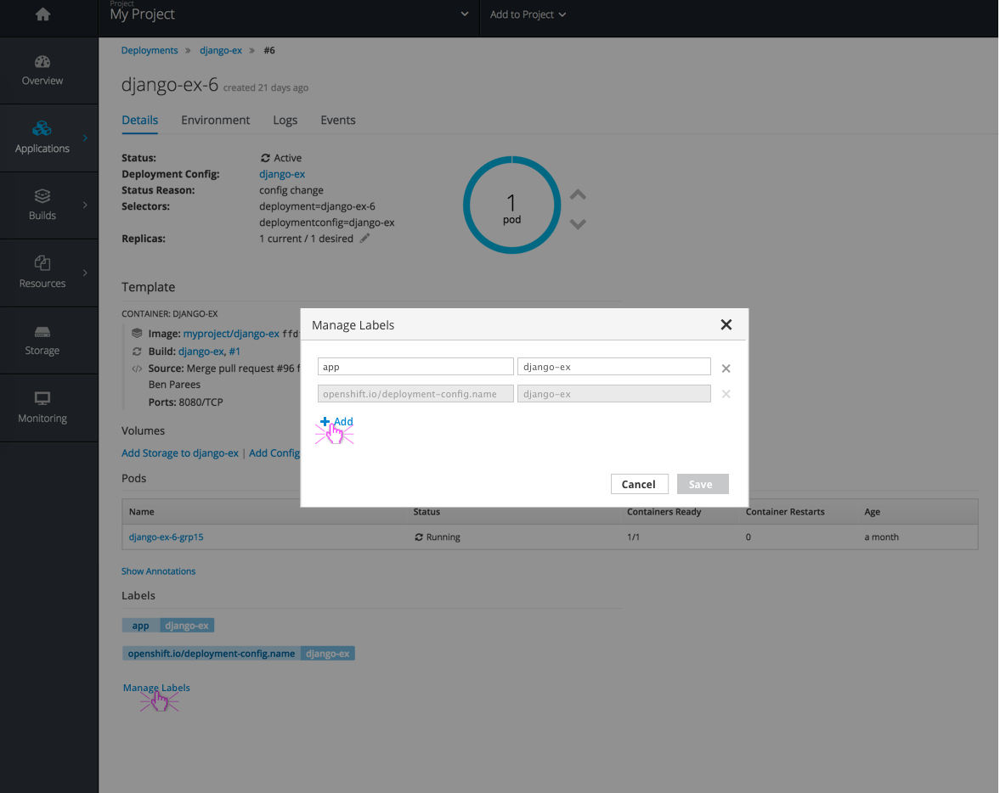
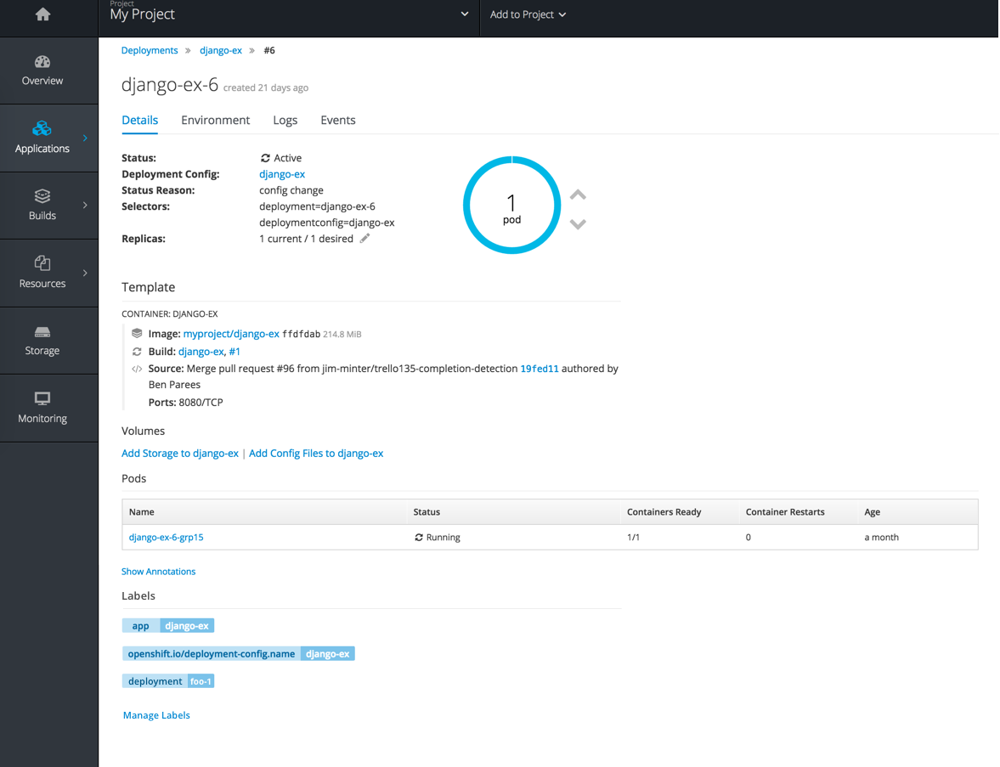

# Labels on Detail Pages

## View Labels
- Labels are currently displayed at the top of most detail pages (Deployments, Pods, Builds, Images, Storage, etc)
- A new `Labels` section should be added to the bottom of the `Details` tab on all of these pages to allow for a more comprehensive labels area

## Add Labels

- A `Manage Labels` link should be displayed below the applied labels
- Clicking the link will open a modal, displaying the labels that are already applied, as well as an option to add new labels.
- Clicking `Add` will display a new row with two empty text fields for label Name and label Value.

- The save button should not be enabled until valid entries are made.

- Invalid characters will result in a field level error once the user changes focus away from the particular field. The error message should be explicit, stating the characters that will be accepted. 

- Label names cannot have more than one value associated.
- Attempting to enter a label name that has already been applied with a value will result in a field level error explaining that label name already exists.

- Once the user clicks `Save` the new label should appear at the bottom of the list of labels on the Details tab.

## Edit Labels

- The same `Manage Labels` link will be used for editing existing labels.
- Users can change a name or value as desired, as long as the name is not already associated with another value.

#### Implementation Details
- Values can be edited in this view, but only the current object will receive the label change. In order to bulk change labels for multiple items (Deployments in this case), users must go to the summary page and multi-select items.
- If there are any restricted labels that users are unable to change, the entire row should be disabled.

## Remove Labels

- The same `Manage Labels` link will be used for removing existing labels.
- Clicking the x icon next to a label will remove that row and enable the save button.
- Applying these changes will only remove the label from this specific object, not from the system entirely.

# Labels on Summary Pages

- Summary lists are provided for each major section such as Deployments, Pods, Builds, Images, Storage, etc.
- **Note:** In the future there may be cases or object types that require label actions to be hidden and labels placed in read-only mode.
- Currently users can filter those lists based on their applied labels, in order to narrow the results.
- Filtering by label should remain, but checkboxes should be added to the left side of each row to allow for multi-select and bulk actions from the summary page.

## Manage Labels
- Users can multi-select using the checkboxes provided and a `Manage Labels` button should be available in the top right corner of the page.
- The `Manage Labels` button will open a modal for any add, edit, or remove actions to take place.
  - The top of the modal should summarize the selections to reiterate the number of objects that will be affected by the label changes. Intro text detailed below:
  - "You have selected 'x' 'Object-Type.' The following changes will be applied to all selections.

### Add

- Users can add a single label or multiple labels to all selected objects.
- If the selected objects have any labels in common, the labels will be listed in rows above the empty one. If not, an empty row will be presented alone, with the option to add more labels.
- Adding the new label and clicking `Save` will close the modal and initiate a toast notification to confirm the changes have been applied to all objects.

- If users select objects without first filtering for common labels, some changes may overwrite existing label values.
- When this is the case, clicking save will replace the modal contents with a warning and confirmation message to inform users that the label change will overwrite an existing label value.
- Users must confirm the changes by clicking `Apply` in order for changes to be saved/applied.

### Edit

- The same `Manage Labels` button will be used for bulk editing any existing labels.
- Users can filter by label before using the multi-select to ensure selections have common labels that can be displayed in the modal.

- In this case, changing `value1` to `value12345` will change the applied label for all three deployments selected.

- A toast notification should be displayed once changes have been made to a label.
- If there is a filter applied, it should be updated to reflect the label changes.

- **Note:** When there is no filter applied, some label edits may overwrite existing label values. A warning message will be presented when this is the case and users must confirm before changes are saved.

### Remove
- The same `Manage Labels` button will be used for removing existing labels.
- Clicking the x icon next to a label will remove that row and enable the save button.
- Applying these changes will only remove the label from the selected objects, not from the system entirely and a toast notification should confirm the changes.

### Notifications
  - Toast notifications should be displayed following any manage label action (Add, edit, or remove) to confirm the change and the number of objects affected.
  - Toast notifications are not displayed for label changes made on detail pages because those changes appear immediately and are visible in the UI following the change.
