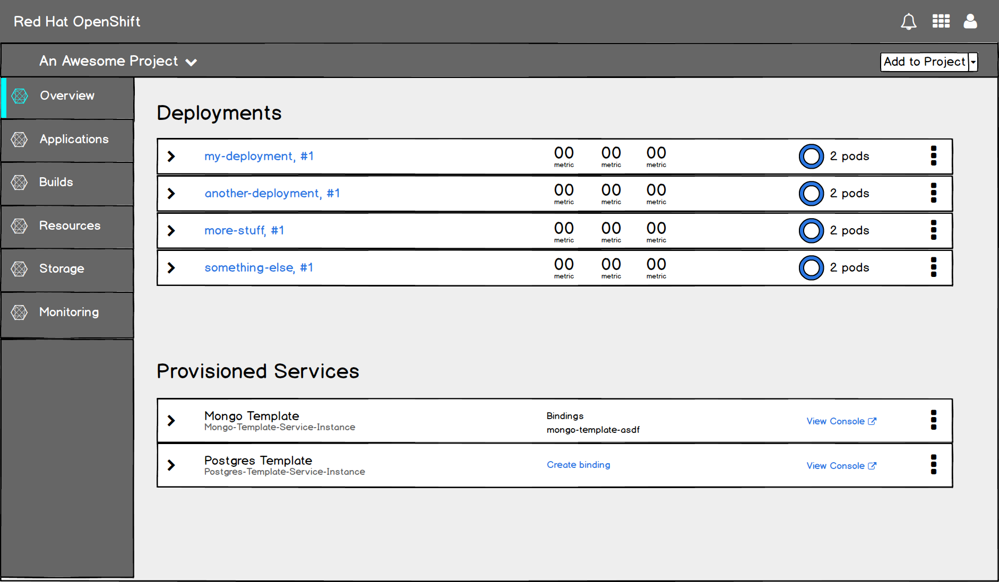
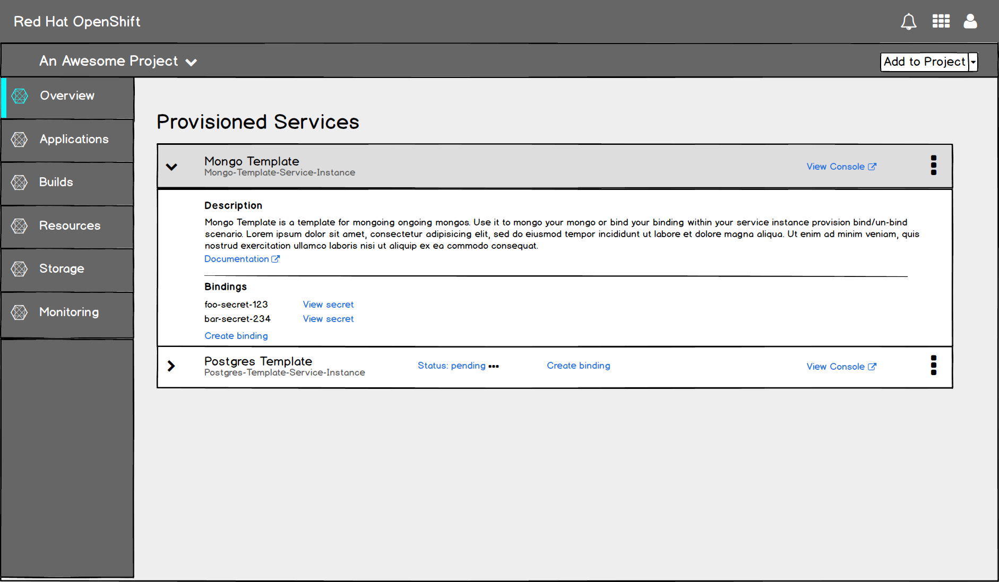
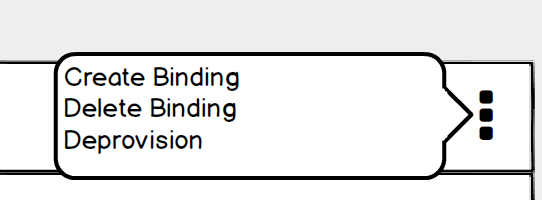

# Provisioned Services in the Overview

- Provisioned Services are those services provisioned from the Service Catalog.
- Provisioned Services need to be shown in the Project Details Overview along with other project resources and would use the same expandable list as the rest of the Overview.

## Collapsed State

- In the collapsed state, show the name of the provisioned service, what that service is bound to, and a link to an external console if one exists.
- If the service has nothing bound to it, indicate that and include an action to create a binding.

#### Implementation Details
- In the Application view of the overview, Provisioned Services will have their own category heading.
- In other views in the overview, for example Pipeline view, provisioned services would be lumped in with other resources that do not have their own category.

- If a provisioned service has more than one thing bound to it, show the first item by name followed by “n others,” which links to the detail page for that service.
- If a service has been provisioned, but is not yet available, that should be indicated between the name and bindings area on desktop. Other warnings or alerts would be placed similarly.
- The View Console action should open the link in a new browser window/tab.
- The indication that a service is not yet available should be followed by an animated ellipsis.

- If the provisioning is in a permanently failed state, we should include an action to delete it.
- The placement of warnings on Provisioned Services should be similar to that of other resources in the Overview.

## Expanded State

- In the expanded view there may be two sections: Configuration details and Bindings.
- The Configuration Details section shows details for the service instance.
- The Bindings section includes the option to create a binding.
- Configuration details for individual bindings are not shown in this view, but should be available from a details page.

#### Implementation Details
- Sensitive data are hidden by default in the Configuration section, with the option to show them.
- The Configuration section is not displayed if there are no data to show.

- If the service is not available yet, show an inline alert message in the expanded state. Other warnings/alerts from the service would be shown inline as well.
- Include a link to more information, if any is available.
- In the event that the provisioning of a service instance is in a failed state, include an action to delete that service from the project.

## Kebab Actions

- The kebab menu should include actions for binding, unbinding and de-provisioning.
- Are there other actions to include here?

## Unbindable Services

- In the collapsed state there should be an indication that the service is unbindable with a link to documentation that explains what that means.

- The expanded state maintains the "Bindings" section, but that section includes a message that the service is unbindable,Why as well as a link to relevant documentation.

- The "Create binding" and "Delete binding" actions are disabled in the kebab menu.

#### Customer Feedback (if applicable)
- Customer Feedback Received
	- Overview of customer feedback received
- Necessary Customer Feedback
	- Questions to follow up with customers
