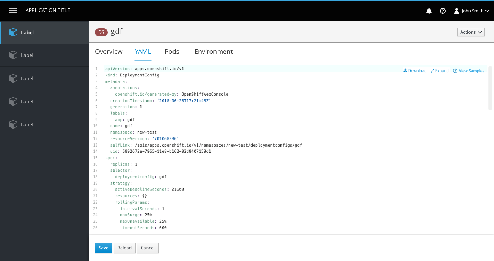

# Code Editor

## Edit YAML

- The code area is borderless at the top and has the button bar at the bottom as a separator.
- The Edit action can be removed from the Actions dropdown on every detail page. Users can access the tab as needed.
- The Download and Expand actions are displayed as links in the top right corner above the YAML editor, with a vertical separator between them. The icons belong to the left of each link.
- Download will produce a YAML output for the user to view outside of OpenShift.
- Expand will allow a user to view the code in fullscreen mode.

- When the editor is expanded, it takes up the entire screen, covering the console entirely (including navigation and masthead).
- The bottom button bar remains visible in the expanded state.
- A new tab is not opened for the expanded view.
- A collapse icon and link will be in the top right corner of the expanded view for users to exit full-screen mode.

#### Errors
- Errors are shown with an icon on the corresponding line. Users can hover over the icons to see details of each error.

- If errors exist, an inline notification will appear below the editor summarizing the number of errors. Users can click the Show Details link to view all error details in one place.
- The action bar is sticky at the bottom of the page and actions include Save, Reload, and Cancel. The Save button is disabled if changes have not been made or if there are still errors to resolve.
- The Reload button allows users to reload the code in the event that there was a change in the backend or they made a change that they would like to undo.
- The Cancel button does not save changes and brings users back to the page they were on prior to the edit page.

- If save is enabled and a user clicks away from the editor (by clicking on another tab or a navigation item) a modal dialog will appear to remind the user they have unsaved changes.

## Create YAML

- The create page is a newly loaded page within the console.
- Users are presented with a preloaded template with which they can create their object (primary way to create new).
- Users may alternatively choose to browse their file directory and upload a file with which they can create their object (secondary way to create new). This would replace the original template contents.
- The expand link and functionality is available on the create page.
- The bottom button bar is sticky and actions are Create and Cancel. Both buttons are enabled unless there are errors detected, then create is hidden.
- Error handling is the same for both Create YAML and Edit YAML. See error handling above.
