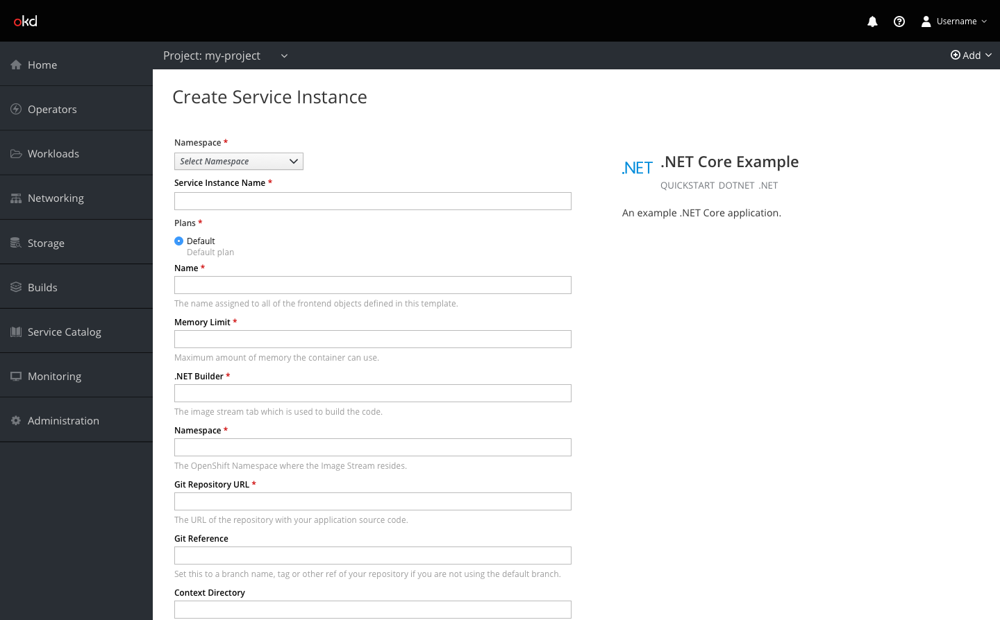
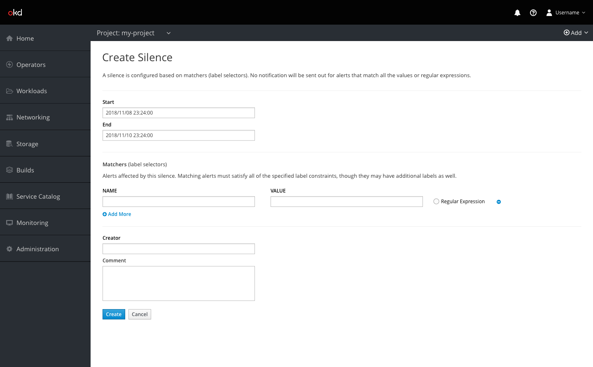
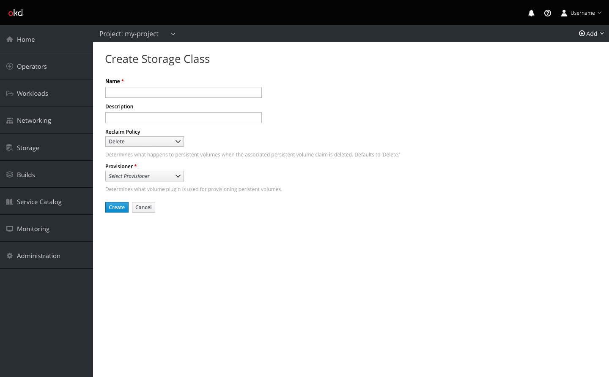

# Forms

## Labels

* Labels should be written in headline style.
* Labels should be top-aligned.
* Required fields should be identified with a red asterisk to the right of the label.

## Buttons

* Button labels should be written in headline style.
* In embedded forms, confirmation buttons should be left aligned at the bottom of the page. Cancel buttons should be to the right of confirmation buttons.
* In modal forms, confirmation buttons should be right aligned at the bottom of the modal. Cancel buttons should be to the left of confirmation buttons.
* Submit, Save, and other confirmation buttons should always be enabled.

## Fields

* Input fields in embedded forms should provide enough space for an appropriate input but should never span the full width of a page.
* Input fields in modals or side panels may span the full width of the modal or panel.
* Helper text should be below the input field.
* Syntax hints should be used only for open text input fields. They should be inside the input field and disappear when users begin to type. They should not be a duplicate of the field name.
* Horizontal separators should be used between fields only when there are separate and distinct sections of the form. Section headers can be used where appropriate, but should always appear above the form content rather than to the left.
* Fields may appear next to each other in cases where fields are strongly related. For example, First Name and Last Name, Name and Value, or Start Date and End Date.
* Dropdowns should show the default selection if one exists; if a default does not exist, dropdowns should read Select [Item Name] in italicized black text.

## Wording

* The word “please” should only be used when the user is being inconvenienced. For example, “This may take a minute. Please wait.” is acceptable. However, “Please enter a description.” is not.
