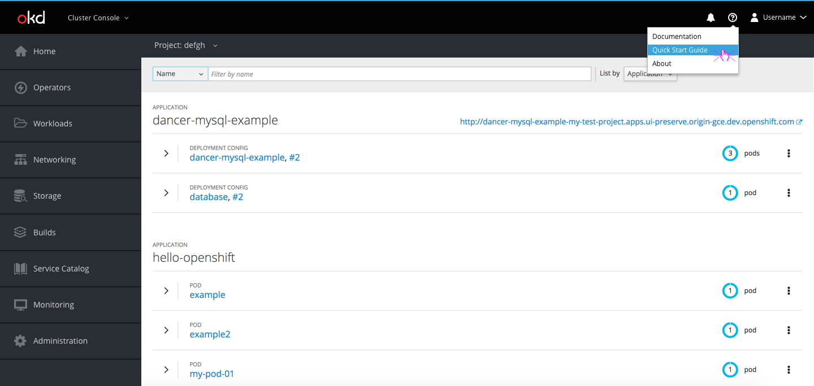
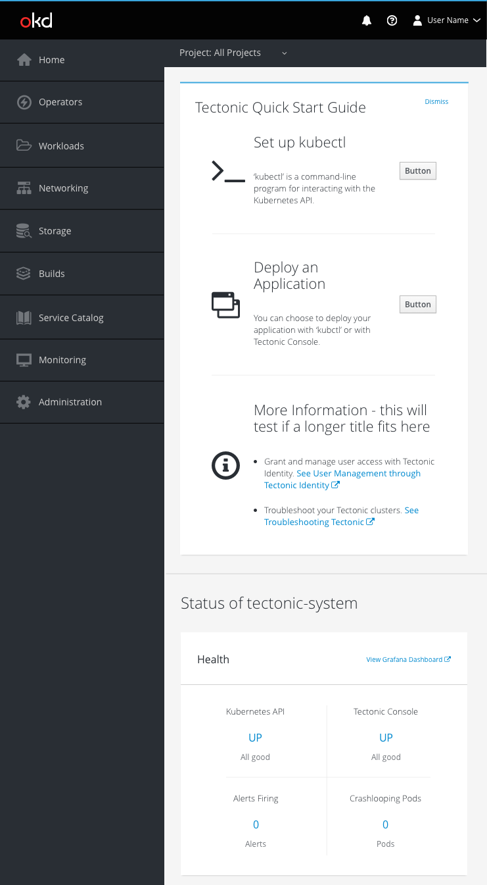

# Quick Start Guide

## Design
* The quick start guide will be displayed on the overview page.
* Users can dismiss the guide by using the dismiss button in the top right corner of the guide.
  * If a user dismisses the guide, it will no longer show up on subsequent page loads.
  * Users can access the quick start guide again by using the Quick Start Guide link under Additional Support on the overview page, or by accessing it from the help menu on any page.

* The quick start guide will be displayed in a horizontal layout by default, but can be displayed in a vertical layout in a responsive view.
* The quick start guide content should be divided into appropriate sections.
  * Separate each section with vertical keylines.
  * Each section should have an associated icon, title, description, and button or link.
  * Calls to action that result in internal changes should be displayed as a secondary buttons.
  * Calls to action that lead to external sites should be displayed as links with the fa-external-link icon.
  * Note: If there is one primary call to action, it may be displayed as a primary button. However, there should never be more than one primary button on a page.

**Overview page default (horizontal layout)**

* Display the quick start guide in a separate box at the top of the page
* Display the quick start guide content horizontally
* Use a horizontal divider beneath the quick start guide area

**Overview page responsive (vertical layout)**

* Display the quick start guide in a separate box in the main content area
* Stack the quick start guide content vertically
* Use a vertical divider between the quick start guide area and the rest of the page content
