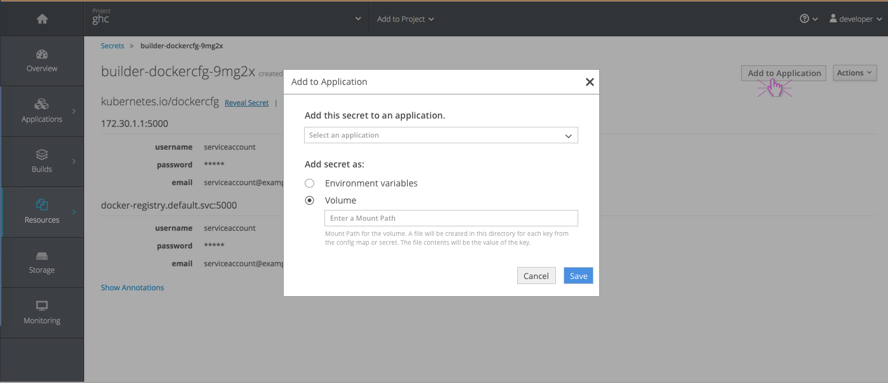
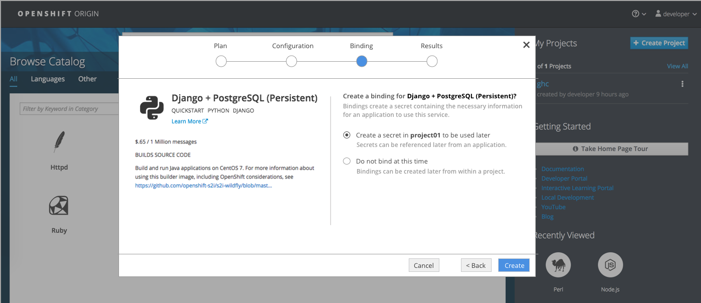
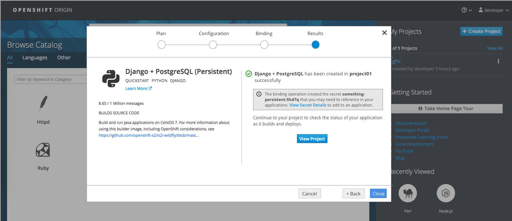
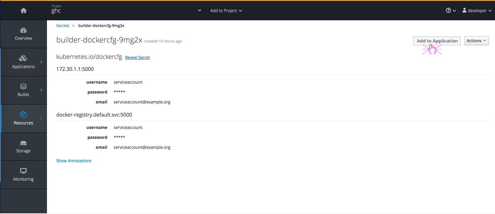

# Add to Application
- The "Add to Application" action allows a user to inject a secret into an application.
- This action should be available on the details pages for Secrets and Config Maps.

## Design

- The "Add to Application" action button should be in the top right corner of the page.
- Selecting this action will pop a modal so users can choose the application to add to and then select to either add as environment variables or as a volume. 
  - Environment Variables should be the default selection with nothing shown under "Volume."
  - If Volume is selected, the additional field "Mount Path" should show up underneath. When Volume is selected, Mount Path is a required field in order to save changes.
- A notification should be surfaced once the secret has been successfully (or unsuccessfully) added to the application.

##  Ordering flow for provisioned services
- Services that include the Binding step during the ordering process will provide the following two options only:
  1. Create a secret to be used later
  2. Do not bind at this time
- The default selection should be "Do not bind at this time" and should allow the user to skip this step by clicking the create action in the bottom of the wizard.
- If the user selects the other option to create a secret for later use, the results step will include an inline notification regarding the binding details. This message will include a link to "View Secret Details" which will bring the user directly to the secrets page where they can use the "Add to Application" action in the top right.

