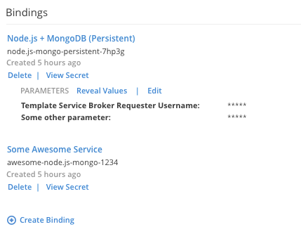
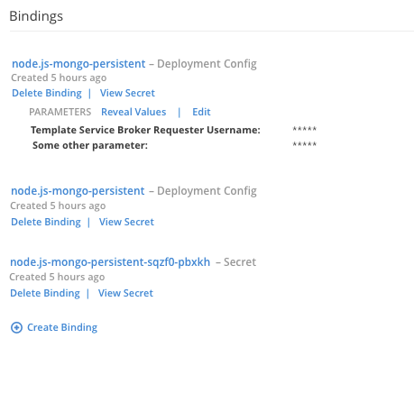

# Binding Details
- The binding details would be shown in the expanded state in the overview as well as on details pages for applications, pods and provisioned services.

##  On Application (Deployments and Pods) Details Pages
- Applications pages for resources that have pods (e.g. Applications/Deployments/mongodb) should include a Bindings section on the Configuration tab.
- Pages for specific replication controllers (e.g. Applications/Deployments/mongodb/#3) should include a section for Bindings on their Details tab.
- Pages for pods (e.g. Applications/Pods/mongodb-3-deploy) should include a section for Bindings on their Details tab.

### Design
- For each binding show:
	- The Service Class display nam(if one exists). This should link to the details page for the Provisioned Service.
	- The service instance name
	- A timestamp that reflects when the binding was created.
	- Actions to Delete the binding and view the secret associated with the binding.
- For bindings with parameters:
	- The parameters section should be indented.
	- Show a parameters heading with actions to reveal values and edit parameters.
	- Parameter keys are shown but values should be obfuscated by default.
	- If there are more than five parameters, only the first five are shown with a "Show More" action.
- The binding section should always include a "Create Binding" action if there is a bindable service in the namespace, even if there are no bindings.

- If there is not a bindable service in the project, the “Create Binding” action will be replaced by the message "You must have a bindable service in your namespace in order to create bindings" and link to browse the service catalog.

##  On Provisioned Service Details Pages
- Pages for Provisioned Services should include a section for Bindings on their Details tab.

### Design
- For each binding show:
	- The application name. This should link to the details page for that application. The application name should be followed by the type of object that is bound to (e.g. deployment config, secret).
	- A timestamp that reflects when the binding was created.
	- Actions to Delete the binding and view the secret associated with the binding.
- For bindings with parameters:
	- The parameters section should be indented.
	- Show a parameters heading with actions to reveal values and edit parameters.
	- Parameter keys are shown but values should be obfuscated by default.
	- If there are more than five parameters, only the first five are shown with a "Show More" action.
- The binding section should always include a "Create Binding" action.

## Expanded State on the Overview
### Applications (Deployments and Pods)
- The bindings section is only shown for applications if bindings exist for that application.
- The information is the same as on [Application (Deployments and Pods) details pages](#on-application-pages) with the exception that parameters are not shown in the overview.

### Provisioned Services
- Provisioned services always include the bindings section.
- Binding information is the same as on [Provisioned Service details pages](#on-provisioned-service-details-pages) with the exception that parameters are not shown in the overview.
