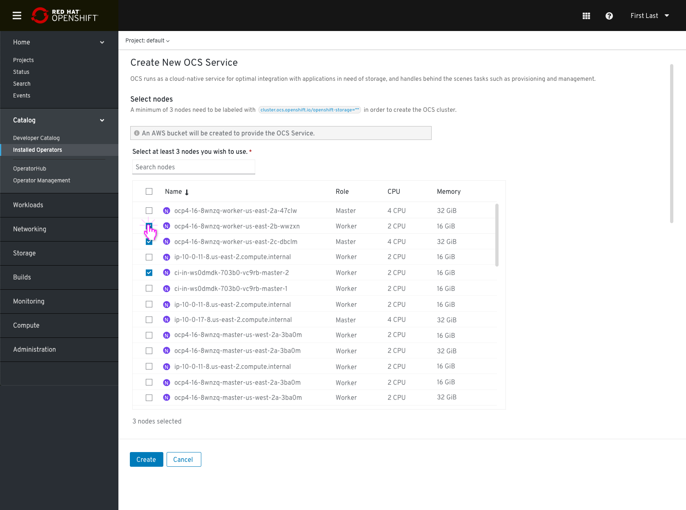
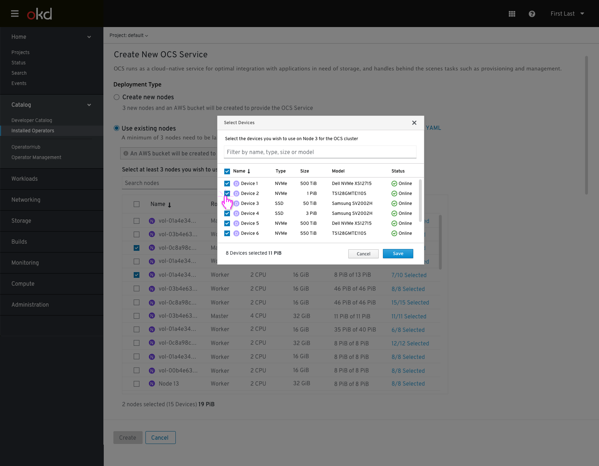
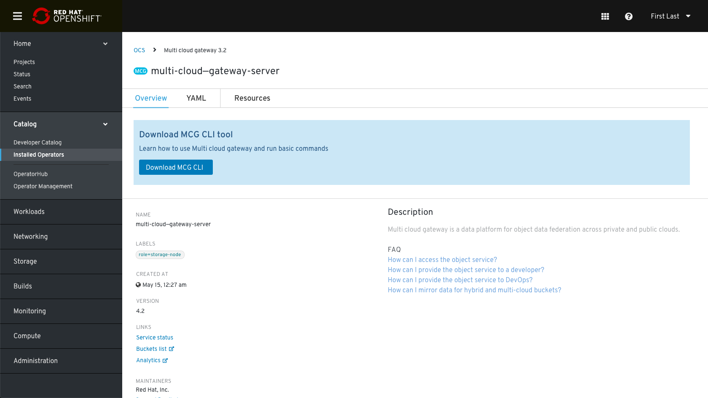

# OCS Install Workflow

### Operator Hub

There will be 2 OCS operator entries in Operator Hub covering each of the following modes. 
* Converged Mode -- Local Cluster / Hyperconverged 
* Independent Mode -- External Cluster (Ceph Cluster is deployed externally)

### Converged Mode Design

Operator Hub

Installation

After the subscription process, the user will see the subscribed operator page. 
In the installed operator view the user can see the OCS operator installed. 

OCS Overview page

# OCS Installation UPI (deployed on the cloud)

Clicking on "create new" (OCS Service) Will start the following installation flow: 
### Step 1- Select Nodes
 * Admin needs to select 3 nodes to label with “role=storage-node” to be used for the OCS cluster.
 * For each node selected, all available devices will be selected on the node by default.  Admin can elect to change the device selection, i.e. to use a subset of the devices if he/she needs to.

* Clicking on the devices button link will open  the “select Device” modal. the user is able to choose which devices he wants to use to support the OCS service.

### Step 2- Connect to the cloud
* Provider: the provider can be AWS S3/ Azure blob. If the service can be auto-detected this field can be pre-selected and cannot be edited. 
* Region: The region dropdown can also be auto-detected, should be editable anyway.
* Endpoint: Pre-typed field. The endpoint can be changed according to the provider and region, the field should always be editable. 
* Access+Secret key: If not auto-detected, the user should provide matching key set. Secret key should be masked. 
* Target bucket: The target bucket can be an existing bucket on the provider side. If no bucket is selected, the bucket claim generates a valid new bucket on AWS/ Azure/ other provider. This field should be disabled until connection details set (endpoint+keys) are successfully validated. 

At any point, Admin can switch to YAML by clicking on the “Edit YAML” link in the top right corner.

# The installation process for UPI (deployed on-prem)
In this case, Only step 1 (select nodes) is required

# The installation process for IPI (deployed on a cloud)
AWS, S3 m4.large EC2 nodes will be created with the label role=storage-node, which would be used by OCS.

A new bucket will be created automatically in AWS S3 connected cloud, same region as the OpenShift.

In this case, the user will be notify of the nodes/ cloud resource creation in a popup message: 

# After Installation
* OCS Overview

When the creation process starts new tabs for “OCS” and “MCG” will be presented. If the deployment process runs for a while, the status “deploying” will be presented (the cluster link is not linkable during the process).

* OCS Tab

* MCG Tab

* MCG Overview
