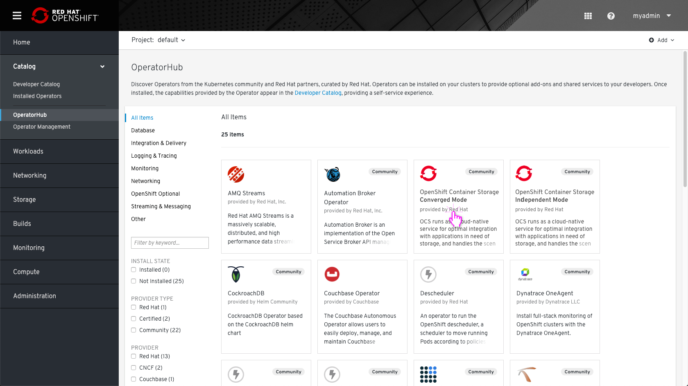
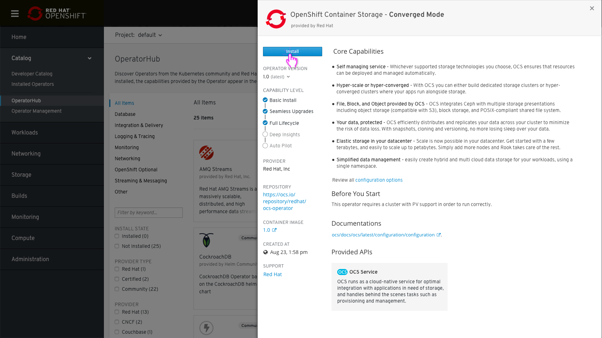
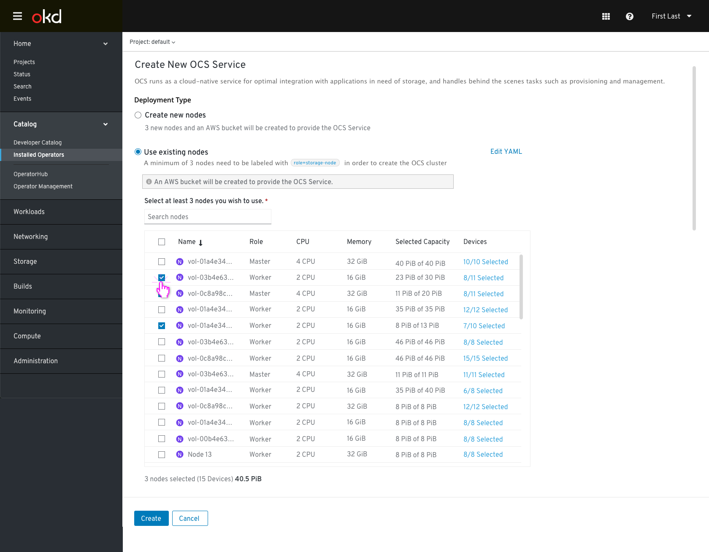

# OCS Install Workflow

### OperatorHub

There will be 2 OCS operator entries in OperatorHub covering each of the following modes. 
* Converged Mode -- Local Cluster / Hyperconverged 
* Independent Mode -- External Cluster (Ceph Cluster is deployed externally)

### Converged Mode Design

OperatorHub

Installation

After the subscription process, the user will see the subscribed operator page. 

 

In the installed operator view the user can see the OCS operator installed. 

# The OCS installation process
OCS Overview page

Clicking on "create new" (OCS Service) Will start the following installation flow: 

Based on the underlying platform, the user can select between “Create new nodes” (IPI) and “Use existing nodes” (UPI).
* Create new nodes -- System (OCS) creates new nodes along with underlying storage devices/volumes in the cloud, i.e. AWS, Azure, Google
    * Note: not applicable for VMware currently and not applicable for baremetal
* Use existing nodes -- uses existing OCP nodes and existing storage devices/volumes (in AWS and VMware, and for baremetal), which Admin has to select

## For AWS or Cloud Deployments (IPI and UPI)
* “Create New Nodes” (IPI) option:
In AWS, three m4.large EC2 nodes will be created with the appropriate storage node label, which would be used by OCS.

A new bucket will be created automatically in the AWS S3 connected cloud, in the same region as the OpenShift.

* “Use Existing Nodes” (UPI) option:
A new bucket will be created automatically in AWS S3 connected cloud, in the same region as the OpenShift. 

This info note should be added in cloud deployment:

The provider name should be modified according to the Cloud Credentials operator.

### Select Nodes:
 * Admin needs to select 3 nodes to label with “node-role.kuberentes.io/storage=" "node.ocs.openshift.io/cluster=" to be used for the OCS cluster.
 * For each node selected, all available devices will be selected on the node by default.  Admin can elect to change the device selection, i.e. to use a subset of the devices if he/she needs to.

* The user can choose the devices he wants to use on each node by clicking on the Devices cell for a given node allows the Admin user to view and modify the device selection.  By default, all available devices on the node will be presented.

**Note: The device modal will vary based on platform:**
* Baremetal -- local devices presented
* AWS -- EBS volumes presented. Device list should include the (EBS volume) name, EBS Type, Used Capacity, Capacity/Size, Availability Zone, Status

* VMware -- VMDKs / RDMs presented. Device list should include the (VMDK) name, Type (VMDK or RDM), Used Capacity, Capacity/Size, Status

At any point, Admin can switch to YAML by clicking on the “Edit YAML” link in the top right corner of the second radio button.
After switching to YAML, the Admin cannot switch back to the form entry.

The "Create" button is only enabled once all mandatory fields have been filled with valid input.

## For Non-Cloud Deployments, e.g. VMware or Baremetal (UPI)
In The case of on-premise the flow remains the same, the info message for creating a bucket in the cloud would be omitted.

### 0 Devices use case
* If available devices on node = 0, tell Admin to add capacity via a Day 2 workflow (for capacity and storage class to use to create PVC(s)). 
The OCS service status will be “Missing Capacity”.

Example:

After Installation process is done, show a status
that capacity is missing. 

In the OCS service details page- show a static error message. 

# After Installation
* OCS Overview

When the creation process starts new tabs for “OCS” and “MCG” will be presented. If the deployment process runs for a while, the status “deploying” will be presented (the cluster link is not linkable during the process).

* OCS Tab

* MCG Tab

* MCG Overview
