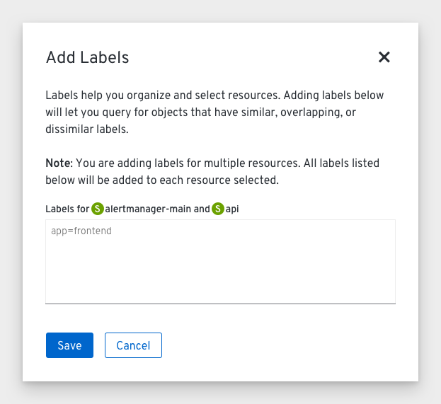
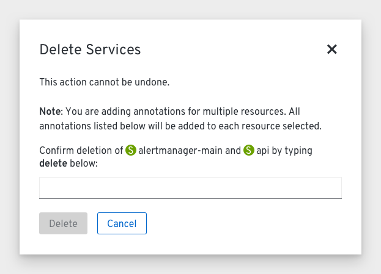

# Bulk actions

Bulk actions will be added to a number of pages in the OpenShift console.

## Behavior
* The bulk selector will be the first component in the toolbar on pages where bulk actions are available.
* Users can click the checkbox in the bulk selector to select all items in the list. If all items are selected, the bulk selector checkbox will be filled with a check and the bulk selector will read 'All items selected'. Clicking the bulk selector checkbox again will deselect all items.
* Users can also choose to select a group of items by clicking the associated checkboxes next to them. The bulk selector checkbox will be filled in with a '-' to indicate that some items are selected, and the bulk selector will display the number of items selected (e.g. '2 selected'). Clicking the bulk selector checkbox will deselect all items.
* If no items are selected, the bulk actions dropdown will be enabled, but the actions within will be disabled. A tooltip will explain to users that they must select resources in order to take actions.

## Actions
* Only specific actions will be available to take on multiple resources. The default bulk actions are 'Add Labels', 'Add Annotations', and 'Delete Resources'.
* Additional actions may be added in future depending on the resource type.

### Add Labels

* The `Add Labels` modal is the same as the `Edit Labels` modal, but notes that any changes will add labels rather than replace.
* Users can add labels in the textbox and click 'Save' to add the labels to the selected resources.
* The new labels will appear in the list and the items will remain selected.

### Add Annotations

* The `Add Annotations` modal is the same as the `Edit Annotations` modal, but notes that any changes will add annotations rather than replace.
* Users can add annotations and click 'Save' to add the annotations to the selected resources.
* The items will remain selected.

### Delete Resources

* To bulk delete resources, users will be asked to confirm by typing **delete** in a textbox. Then the delete destructive action button will be enabled.
