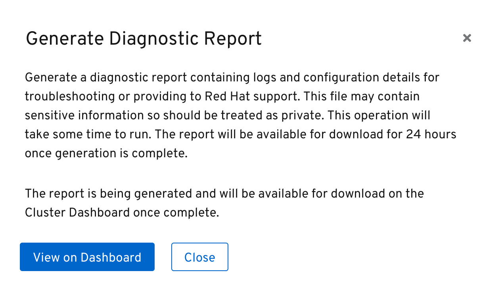

# Generating Diagnostic Report

Users can download a cluster diagnostic report based on must-gather tool for upload to Red Hat Support or their own diagnostics.

## Accessing 'Generate Report' actions

There are several ways the user can access the `Generate (diagnostics) report` action.

### Via the masthead help menu

### Via the cluster dashboard status card kebab menu

### Via a cluster dashboard status card message action

- In the future, the cluster dashboard will support warning messages to notify the user that CNV or OCS are degraded. From these messages the user will be able to immediately `Generate report` using the action link within the message.
- This access point is unique in that dialog's form will default to only include data for the relevant component. `Container-native Virtualization` would be the only component checked in this case, for example.

## 'Generate Diagnostic Report' dialog

- The user can select which components and what time period of information should be included in the report and `Generate` it. The default state when launched from masthead help or status card kebab would be all components selected over an 8 hour time period.

- Once generation has begun, the user can `Close` the dialog to return to the context they launched it from, or `View on Dashboard` to immediately be taken to the cluster dashboard.

## Report generation

### Generation in progress

- An ongoing activity appears that conveys the generation is in progress.

### Generation success

- Upon successful generation of the report, an informational status message appears with a `Download report` link that begins the download process in the user's browser.

- The user may `Delete` the report and message via the message kebab menu. It will otherwise be automatically deleted and the message cleared after 24 hours from generation.

### Generation failure

- If the report generation fails, a message appears with a `Retry` link to restart generation.

- User may `Clear` the failure message via the kebab or this message will automatically be removed after 12 hours.

## Out of scope for 4.3
- Narrowing report generation by Project or Operator
- Only include non-healthy components in report
- Generate and immediately attach to (existing or new) support case
- Option to turn on automatic case open for certain number of severe alerts and attach report
- Some sort of method that doesn’t involve user downloading/uploading file from local machine, somehow file goes straight to support
