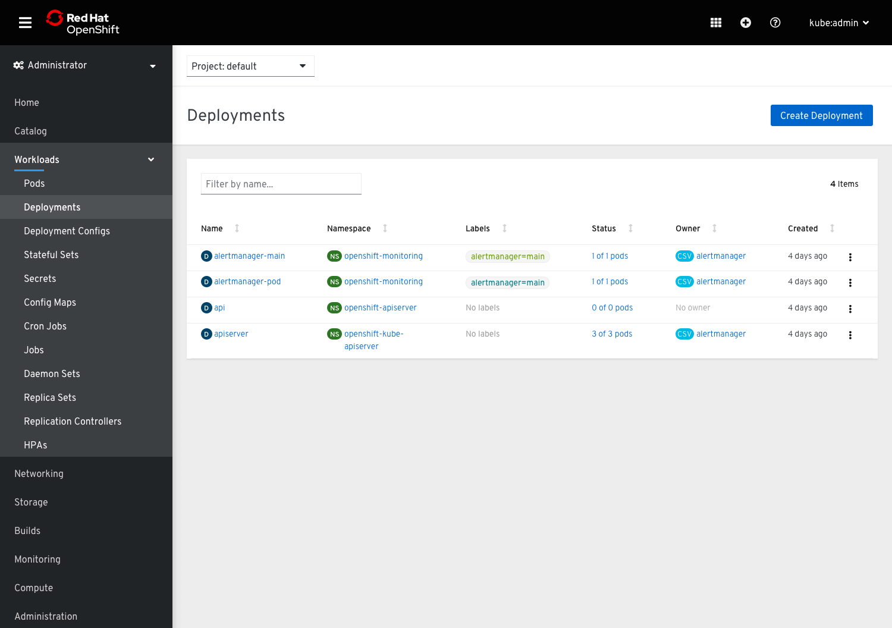
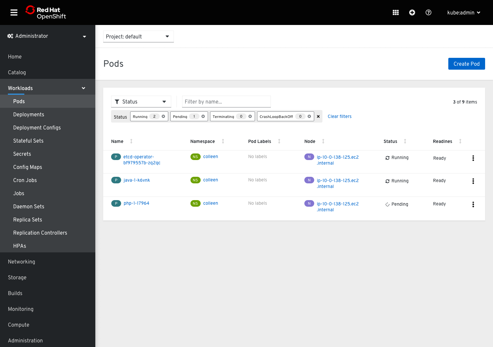
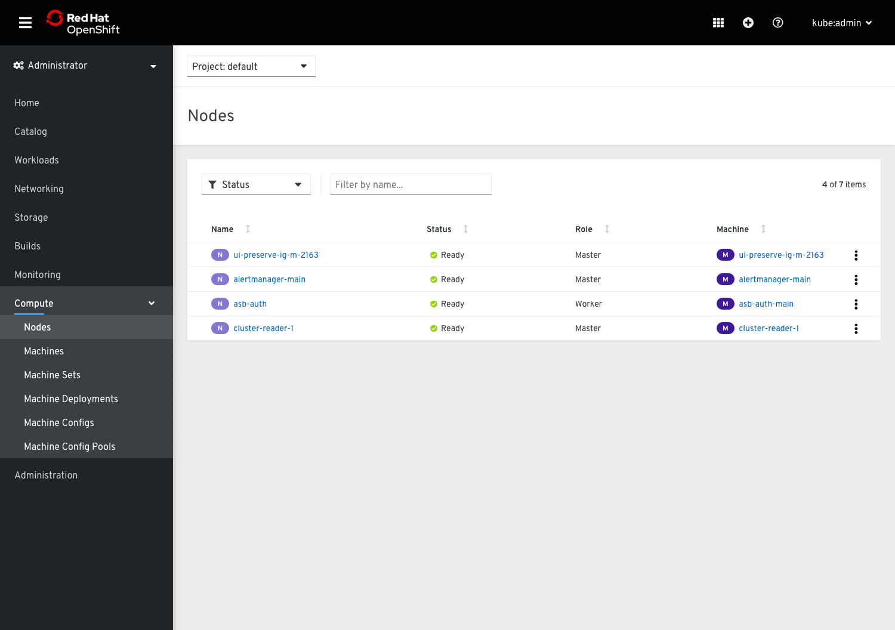
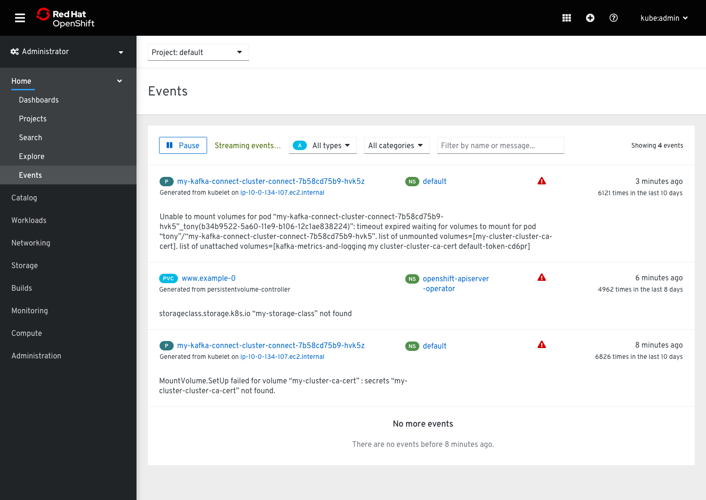
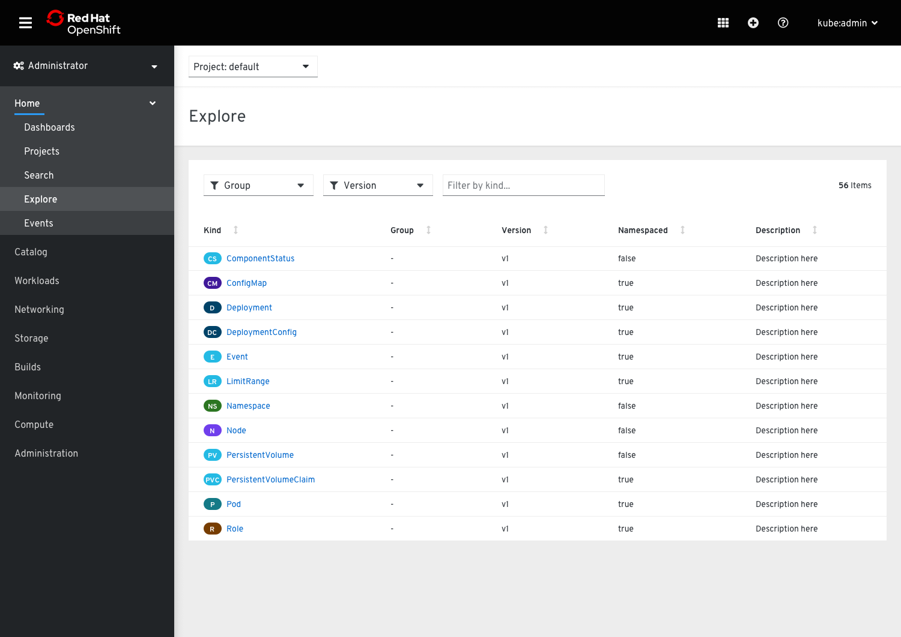
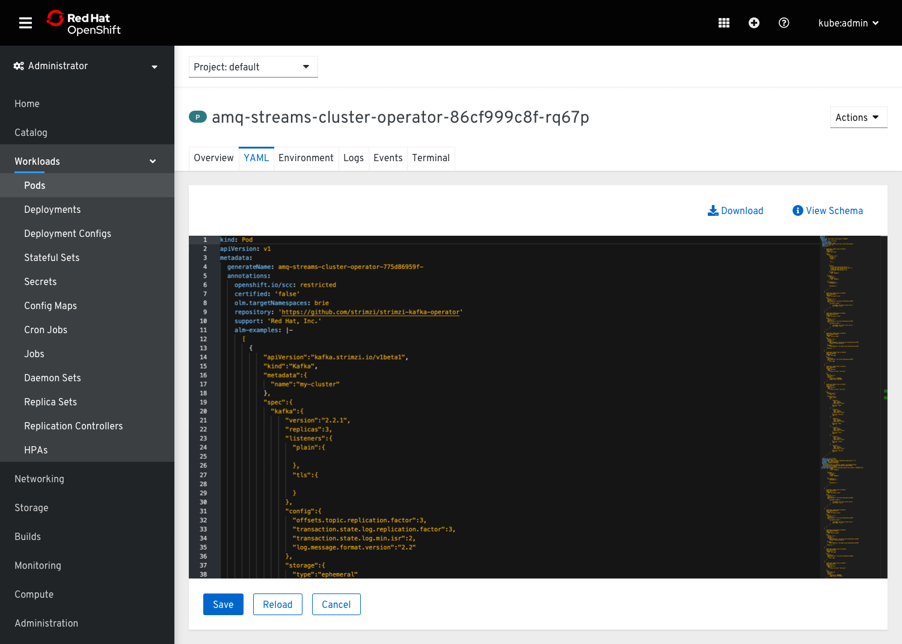

# Toolbars

There are various toolbars used across the OpenShift console.

## Basic toolbars
* The most basic toolbars in OpenShift have a textbox filter and an item count. The primary 'Create' button lives outside the toolbar in line with the page title.

Example

## Toolbars with faceted filters
* This type of toolbar is similar to the basic toolbar but adds faceted filters. When filters are applied, the toolbar increases in height to show filter chips on the second row.
* Pages with faceted filter toolbars may or may not have a 'Create' button.
* Toolbars with faceted filters may have opinionated views. In these cases, filters are already applied when a user navigates to that page, and the filter chips are visible to show what is being filtered.
* Faceted filters may allow users to filter on more than one attribute where necessary.

Example with 'Create' button and opinionated view

Example without 'Create' button and no opinionated view

Faceted filter with multiple attributes

* Faceted filters can also be used to filter on multiple attributes in a list.
* Each attribute will have a section with its appropriate values.

## Special toolbars
* There are a number of pages that have custom toolbars.

Search
See [search page](http://openshift.github.io/openshift-origin-design/web-console/future-openshift/search/search) documentation.

Events

API Explorer

YAML tab

Logs tab

Terminal tab

