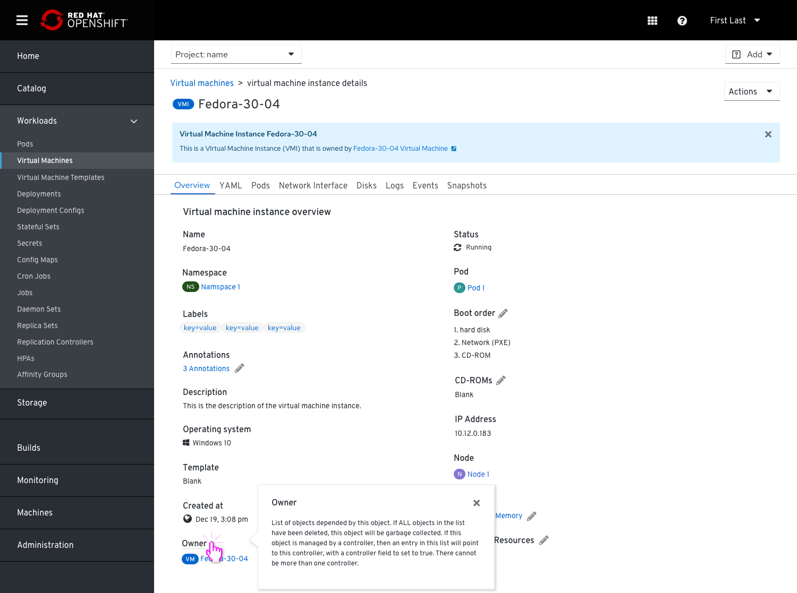

# Surfacing VMIs in the UI

VMI is the current running VM.
The initial reason for surfacing VMIs in the UI was that there is no point in hiding the VMIs from the UI.

## UCs

1. Debugging - If a user thinks that something isn’t right with the VMs and he wants to check what’s going on. When a VMI isn’t managed by a VM and it’s invisible in the UI but that VMI is actually still there because it’s impossible to delete VMIs (that’s a basic Kubernetes mechanism). This can happen by an orphan delete, or that a replica set isn’t used.

2. On Bare metal machines installed with Kubernetes or users who install Kubevirt for CNV - On these VMs there are clusters that can be scaled up and down and they create the VMIs (and not the VMs).

## 2 Types of personas

1. Traditional VM operation admin that is used to a certain view and behavior of the console, in a traditional virtualization way/ A user who has a virtualization background and has no need to understand the underlying k8s technology
2. Users that use the console in a more ‘Kubernetes’ manner
We need to try to educate users and narrow the gap for CNV users to better understand K8s/OpenShift.
We want to allow this to be surfaced in the UI and live side by side in a way that will not confuse/ frighten/ intimidate the traditional user.

## Mockups

We had finalized into this option and will show 2 parallel columns in the VMs list page, one for each: VMs beside VMIs.

Trying to educate users about VMIs, we will provide hints, whenever it is appropriate.
In most usual cases, the instance name link will take the user directly to the instance page (VM/VMI).
When a VMI is missing an owner VM, clicking the 'No VM' or the 'No VM instance' will provide the user with a popover explanation for the reason it is missing and a link to the details page.

If a VMI is in an off status, the user will also be notified about that via a popover.

## VMI's details view

VMI's details page should be similar to the VM’s details page and act in a complementary manner.
The VMI's details page will provide a hint with a general explanation about what are VMIs and also allow drill down to further details.

In the VMI’s details page, the owner VM will be represented with a link, so users can click and get there and vice versa.
The term ‘Owner’ will be furthered explained in a popover.

## Actions available for the VMI

If the user chooses to delete a VMI, they will be asked via the common pop up if they are sure they want to delete it.

In case the VMI has an owner, they will also be notified that the owner may automatically rebuild the VMI.

