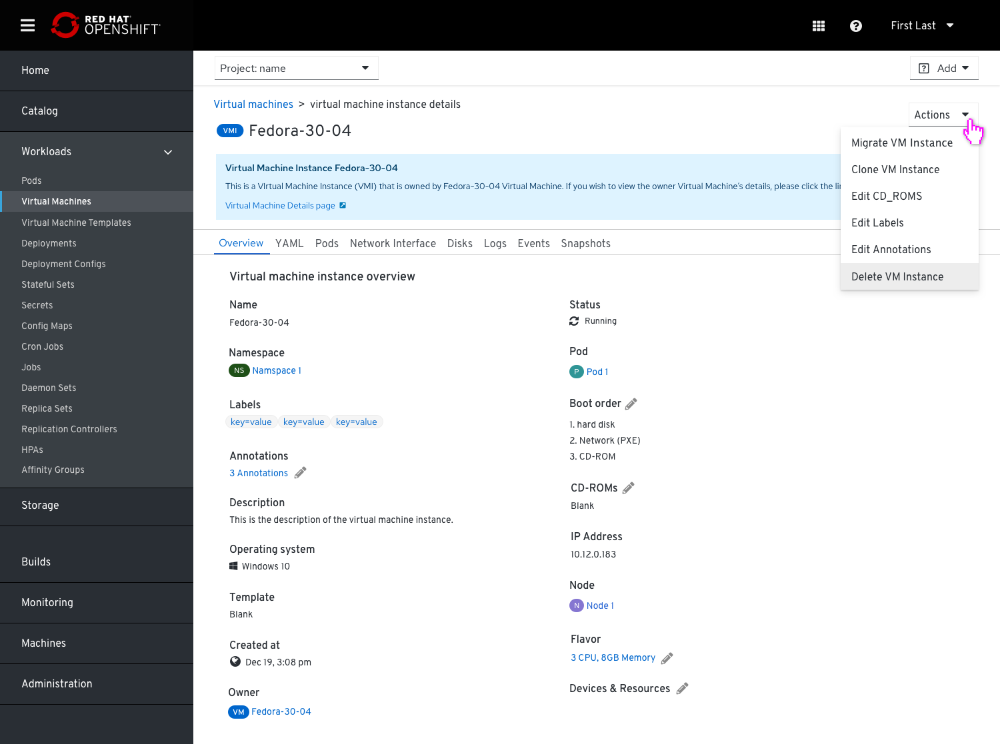

# Surfacing VMIs in the UI

VMI is the current running VM.
The initial reason for surfacing VMIs in the UI was that there is no point in hiding the VMIs from the UI.

## UCs

1. Debugging - If a user thinks that something isn’t right with the VMs and he wants to check what’s going on. When a VMI isn’t managed by a VM and it’s invisible in the UI but that VMI is actually still there because it’s impossible to delete VMIs (that’s a basic Kubernetes mechanism). This can happen by an orphan delete, or that a replica set isn’t used.
User can delete VMs and orphan the underlying VMIs so that the VM will get deleted but the VMI will still be kept.
2. Users can write controllers for VMIs if they need specific UCs which aren’t covered by VMs. F.e. Users would never see VMIs because they are not shown.
3. If in K8s we create Pods via Deployment, then why not create VMI via VMs so the user will learn K8s via VMs? Why create a gap between virtualization and K8s?
4. Upstream Kubernetes is popular because in VMI Replica set and machine controller implementation that is used to “spork(?)” Kubernetes clusters on top of CNV
Bare metal machines installed with Kubernetes
Users install Kubevirt for CNV
On these VMs there are clusters that can be scaled up and down and they create the VMIs (and not the VMs)

## 2 Types of personas

1. Traditional VM operation admin that is used to a certain view and behavior of the console, in a traditional virtualization way/ A user who has a virtualization background and has no need to understand the underlying k8s technology
2. Users that use the console in a more ‘Kubernetes’ manner
We need to try to educate users and narrow the gap for CNV users to better understand K8s/OpenShift.
We want to allow this to be surfaced in the UI and live side by side in a way that will not confuse/ frighten/ intimidate the traditional user.

## Mockups

We had finalized into this option and will show 2 parallel columns in the VMs list page, one for each: VMs beside VMIs.

Trying to educate users about VMIs, we will provide hints, whenever it is appropriate. 
In most usual cases, when no VM or VMI is missing, the instance name link will take the user directly to the instance page (VM/VMI).
When a VMI is missing an owner VM, the user will be provided with an explanation in a popover for the reason it is missing. The name of the VM + badge will be shown in a disabled state for the sake of accessibility so a screen reader would be able to announce it.

### UI definitions for missing VMs and VMIs in the table in a disabled state

Color of badge: #737679, background color of badge: #D2D2D2, color of name text: #737679

If a VMI is in an off status, the user will also be notified about that via a popover.

## VMI's details view

VMI's details page should be similar to the VM’s details page and act in a complementary manner.
The VMI's details page will provide a hint with a general explanation about what are VMIs and also allow drill down to further details.

In the VMI’s details page, the owner VM will be represented with a Iink, so users can click and get to the owner VM details page and vice versa. The term ‘owner VM’ will be furthered explained in a popover.
We might want to surface which VMI doesn’t have an owner VM (orphan VMI) via a notification or maybe even in the dashboard overview page.

## Actions available for the VMI

If the user chooses to delete a VMI, they will be notified that this action will also delete the owner VM of that VMI.

