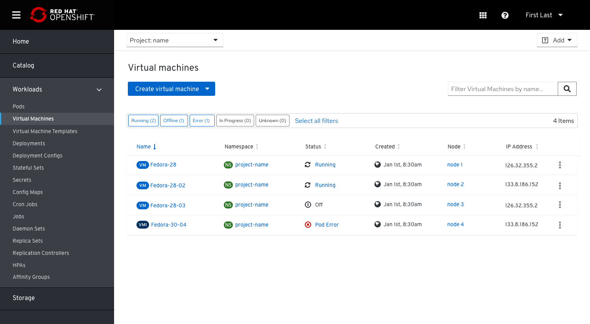
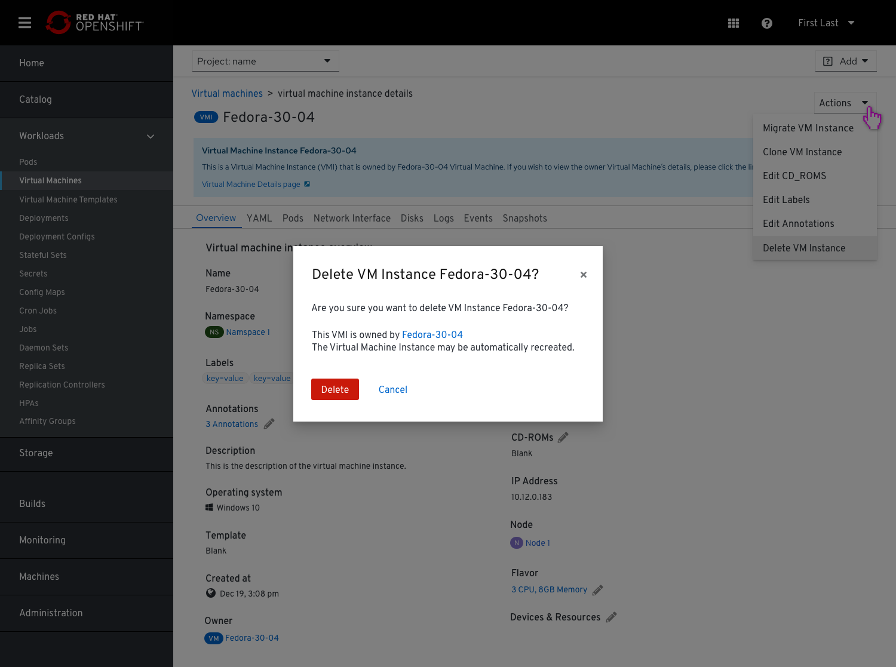

# Surfacing VMIs in the UI

VMI is the current running VM.
The initial reason for surfacing VMIs in the UI was that there is no point in hiding the VMIs from the UI.

## UCs

1. Debugging - If a user thinks that something isn’t right with the VMs and he wants to check what’s going on. When a VMI isn’t managed by a VM and it’s invisible in the UI but that VMI is actually still there because it’s impossible to delete VMIs (that’s a basic Kubernetes mechanism). This can happen by an orphan delete, or that a replica set isn’t used.

2. On Bare metal machines installed with Kubernetes or users who install Kubevirt for CNV - On these VMs there are clusters that can be scaled up and down and they create the VMIs (and not the VMs).

## 2 Types of personas

1. Traditional VM operation admin that is used to a certain view and behavior of the console, in a traditional virtualization way/ A user who has a virtualization background and has no need to understand the underlying k8s technology
2. Users that use the console in a more ‘Kubernetes’ manner
We need to try to educate users and narrow the gap for CNV users to better understand K8s/OpenShift.
We want to allow this to be surfaced in the UI and live side by side in a way that will not confuse/ frighten/ intimidate the traditional user.

## Mockups

In order to avoid duplication and unclutter the UI, We had finalized into an option that presents  VMs and VMIs in a single list view.
We don't surface VMIs in the list if they are owned by a VM.

VMIs and VMS will be distinguished between different color badges. VMI badges color will be bolder than VMs badges color, for accessibility reasons (#002F5D).

## Hints

Trying to educate users about VMIs, we will provide hints, whenever it is appropriate.
In most usual cases, the instance name link will take the user directly to the instance page (VM/VMI).

## VMI's details view

VMI and VM in the list view will lead to the VM and VMI details page.
The details page link from VMI to VM (or note that there is no managing entity=owner) and from VM to VMI (or note that there is no VMI).

VMI's details page is similar to the VM’s details page and acts in a complementary manner.

The VMI's details page will provide a hint with a general explanation about what are VMIs and also allow drill down to further details.

In the VMI’s details page, the owner VM will be represented with a link, so users can click and get there and vice versa.
The term ‘Owner’ will be further explained in a popover.
We chose to use the term ‘Owner’ to align with the current phrasing along the console.

## Adding a link to the VMI from the VM details page

In order to let the user get to the VMI even when there is a VM around it, we added a link in the VM details page.

## Actions available for the VMI

If the user chooses to delete a VMI, they will be asked via the common pop up if they are sure they want to delete it.

In case the VMI has an owner, they will also be notified that the owner may automatically rebuild the VMI.

