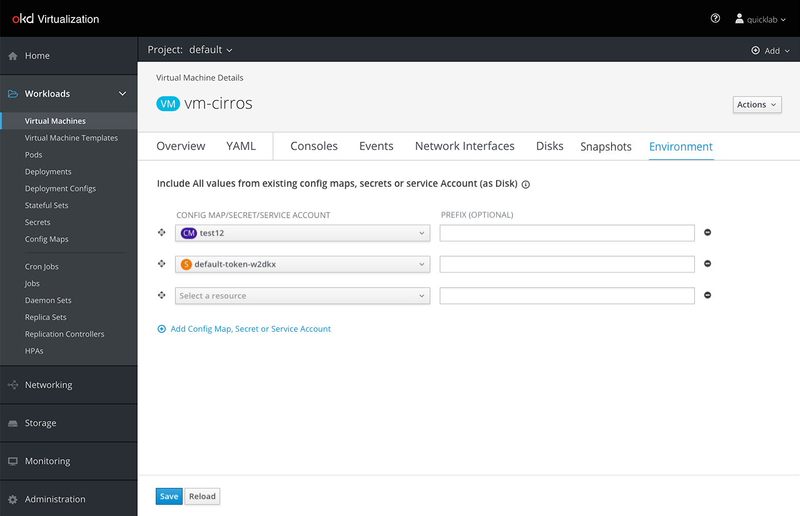
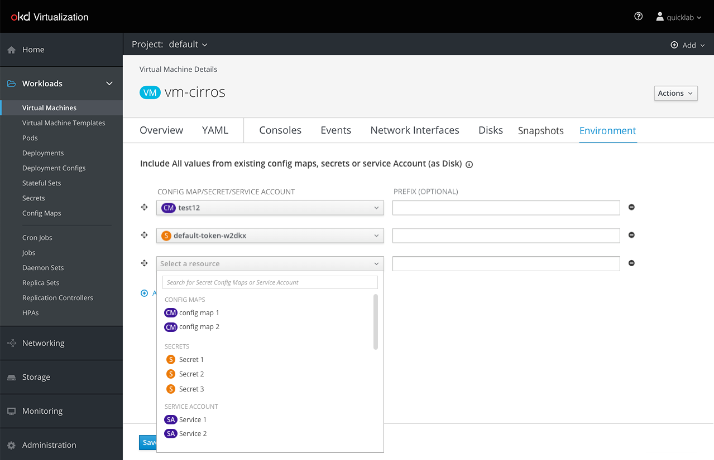
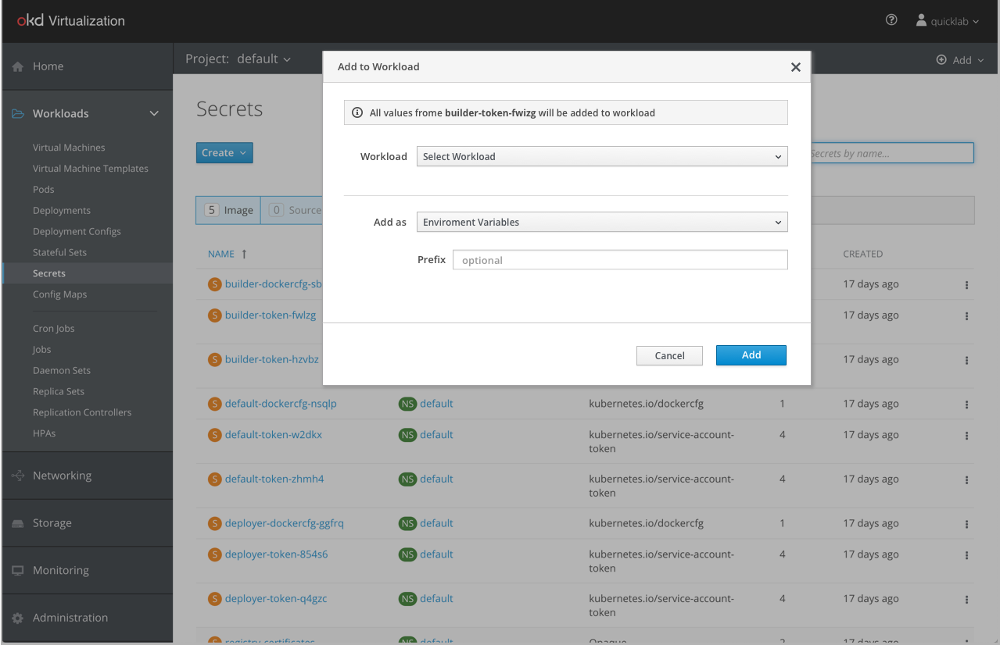
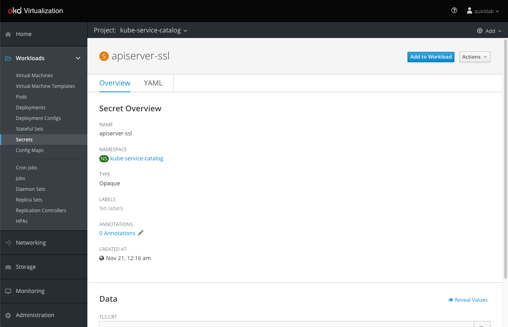

#Expose Secret, Config Maps and Service Accounts as Disks

Kubernetes recently introduced three new volume types (Secrets, Config Maps and Service Accounts). These volumes can be used as additional VM disks, and allow better integration of Virtual Machines with Kubernetes resources.
We will try and define where is the best place for the user to handle these disks.

A similar process already exists when attaching Secrets or Config Maps to a deployment config. This happens in the “Environment” section under deployment and deployment config. The Secret/Config Map can be added as an environment variable or as a volume.
The idea is to be consistent by doing similar processes in the same way across the tool. To support that, we added an “Environment” tab under the VM to handle the attached Secrets, Config Maps and Service Accounts

## Add “Environment” tab to handle the attached Secrets, Config Maps and Services Account

The user can add more Secrets/Config Maps/Service Accounts:

## Expose From Secrets/Config Maps/Service Accounts Lists

We added a new action to the kebab Menu called “Add to Workload”.

In Open Shift, there were two ways for attaching Secrets or Config Maps to a workload: 1) as an environment variable 2) as a volume.
We added a third option to support VMs that is called “Disk”. This option will be available only when selecting a VM in the workload dropdown.

When selecting a VM in the workload dropdown the selection in the “Add as” menu will automatically change to “Disk”. The “Disk” option won’t be available for Deployment or Deployment Config workload.

## Expose From Secret/Config Map/Service Account Detailed Page

The process is practically the same as adding from the list, only now we are doing it from the detailed page of the Secret/Config Map/Service Account.

Clicking the “Add Secret to orkload” button will open the same menu we saw in the lists section above.

