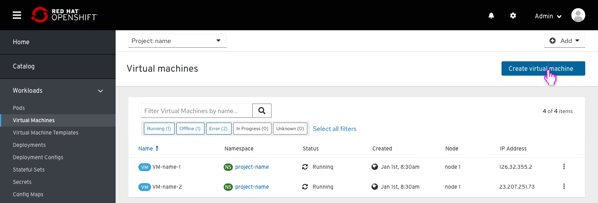
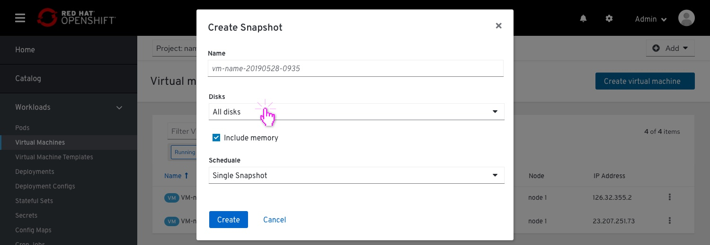
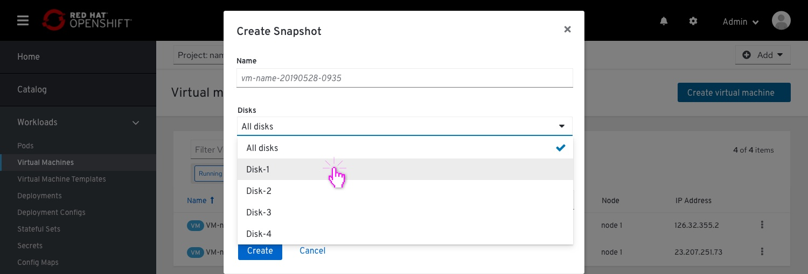
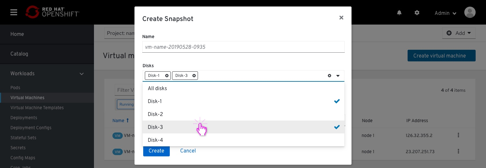
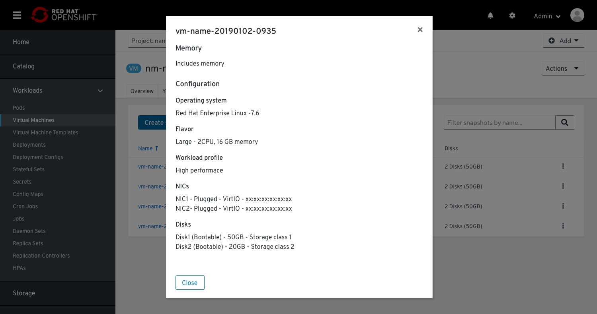
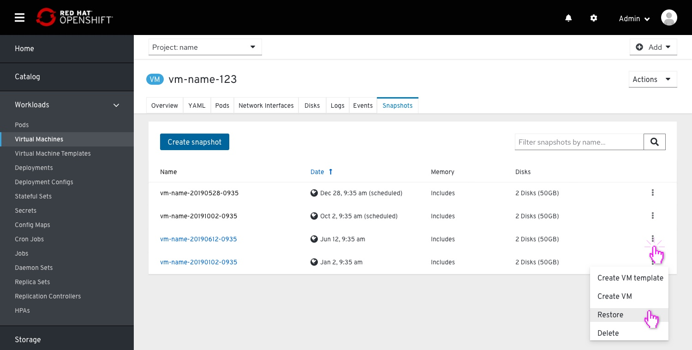
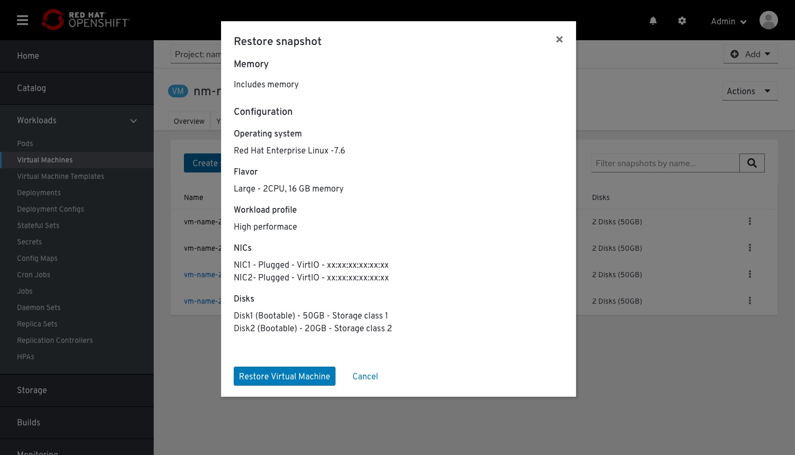
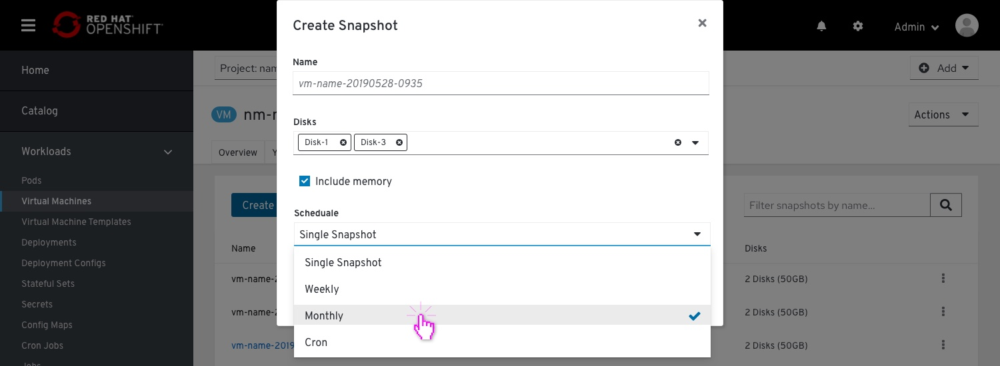
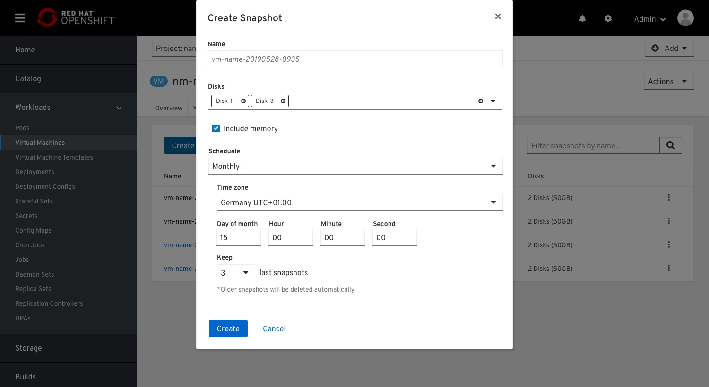
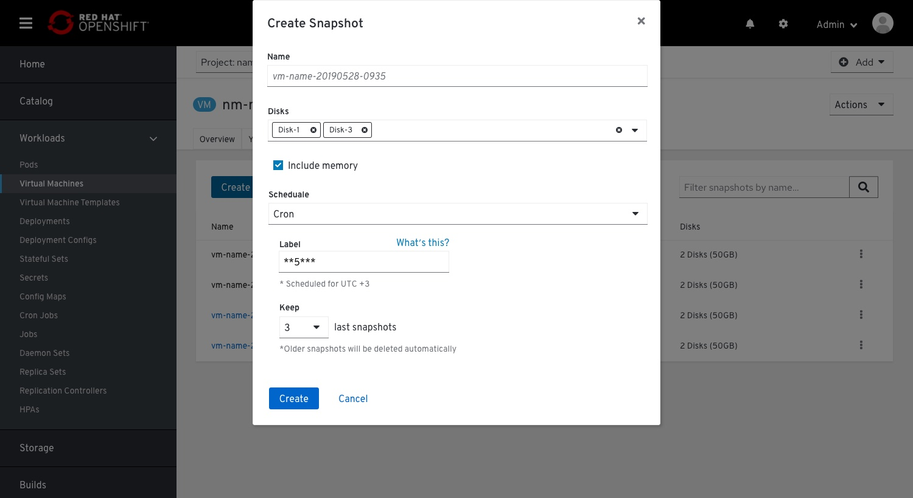

# Virtual Machines Snapshots

Snapshots allow users to create a copy of the VM disks and memory, mainly for restore and backup purposes. The snapshots are taken live or offline depending on if the VM is running or not. 
This document describes the snapshot design flow.  

## From VM List 

When clicking on the kebab menu in the VM list, the user will be able to take a snapshot of the VM, meaning he will copy the disks, memory content, and metadata for restoring, backup, creating templates and cloning VMs.

In the basic modal, the snapshot will take all current configuration and selected parameters.
The user must add a descriptive name.

In the disks field, the user will be able to decide if to include all disks or just some of them and if to include memory as part of the snapshot or not.

Any virtual machine that has a snapshot in progress will show this in the state:
When in this progress mode all actions would be disabled and the “Stop snapshot” would be available.

## VM page - snapshots tab

The snapshot list is located under the VM. A tab item in the horizontal navigation will be dedicated for snapshots. The list is ordered by the creation date as a default. 
The user can sort the list by name or date, clicking on the title will allow the user to switch sorting and decide if it's ascending or descending.  

Same modal as in VM list - Snapshot action

List item drawer. The user clicks any place on the row in order to expand the row for more information. 

Kebab actions.
Clicking on the kebab menu on each row will open an action menu with several options:
- Create VM Template
- Create VM
- Restore
- Delete

Restoring VM from snapshot modal. When clicking the restore option in the action menu it opens the restore popup. I tried keeping the restore popup similar to the cloning and template popups.

## Scheduled snapshots

This will be added in the future

A dedicated sub-tab for veiwing, editing and creating scheduled snapshots.

On clicking the 'Schedule snapshot' action, the same modal will appear, but with different defaults for 'Event' field. 

When selecting a date, the 'Repeat' field will update it's selection according to the selected date, mentioning the selected day.

'Repeat' field options

Selecting 'None' for 'Repeat' field will disable the backup instances

## Warning remarks

There are some warning remarks that alert the user about the status of the snapshot he’s going to create. In all cases, the user can still create a snapshot. 
The current alerts are:
- 'No available disk'
- 'Missing guest agent' is still under discussion