# VM Details

## Overview Tab

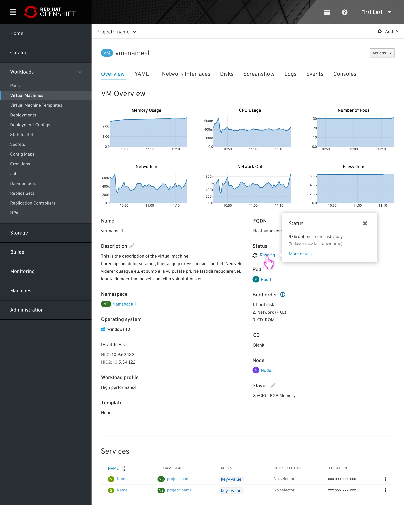
The user clicks a VM’s name from the list view and is taken to that VM’s Overview tab.
The user sees detailed information about the VM’s configuration.

Editing field will be aligned to the rest of the system. For now, only 'Description' and Flavor' have a pencil icon next to the field name to indicate it is editable. Hitting that pencil will open up a modal.

### Editing the CD
Via the pencil icon the cd can be edited.
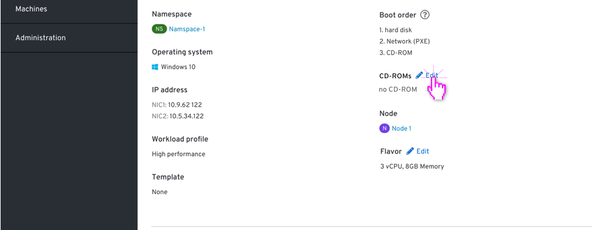

They will then be presented a modal with a type to select from.

Depending on the type selected a new input is revealed. These types would be
#### No CD
This sets CD to none.
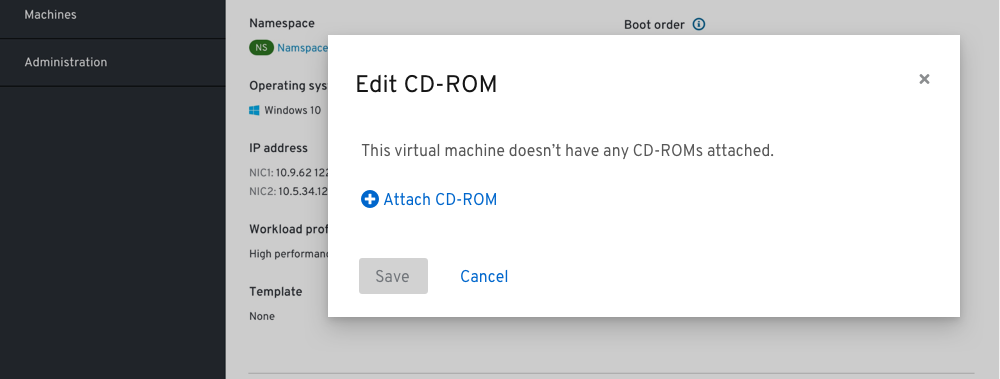
#### Container
A text field is provided to paste in the path to the container.

#### Persistent Volume Claim
A typehead field is provided to find the desired Persistent volume claim. 

#### URL
A text field is provided to paste in the URL to the available CD.
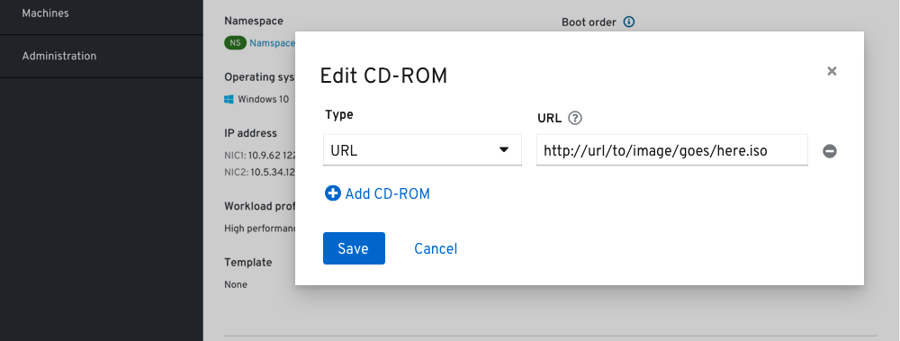

With each selection a tooltip is provided to describe each type.

### Windows drivers
In the case where a Windows operating system has been chosen in the general step a `Windows drivers` option will be available.
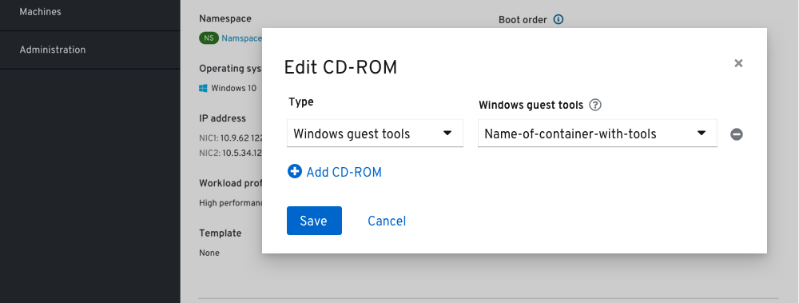

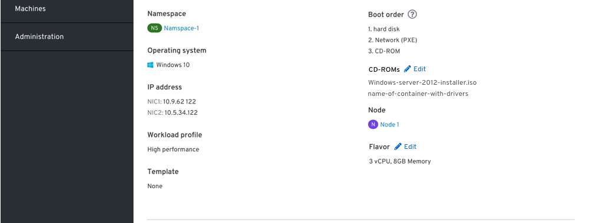

## YAML

Should be inline with the rest of Openshift. Can be seen [here](http://openshift.github.io/openshift-origin-design/web-console/future-openshift/code-editor-updates/code-editor-updates)

## Network Interfaces

This is Network Interfaces tab.

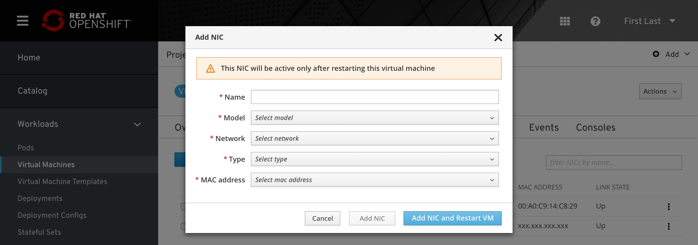
Default modal. The user is notified that activating this upcoming NIC requires a VM restart. 

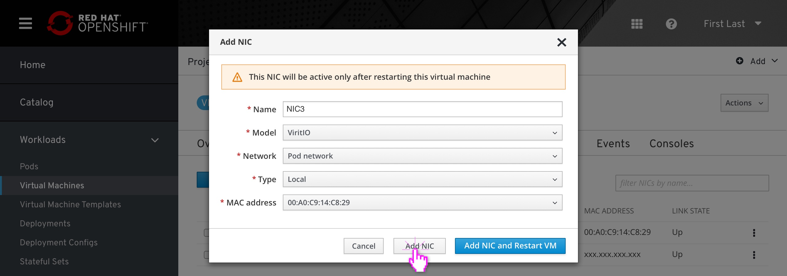
User can choose between adding NIC only, or add NIC and restart VM to make it active.

The new NIC should always appear at the top of the list until the user restarts it. The new nic will have a'Pending VM restart' Link state (as a status).

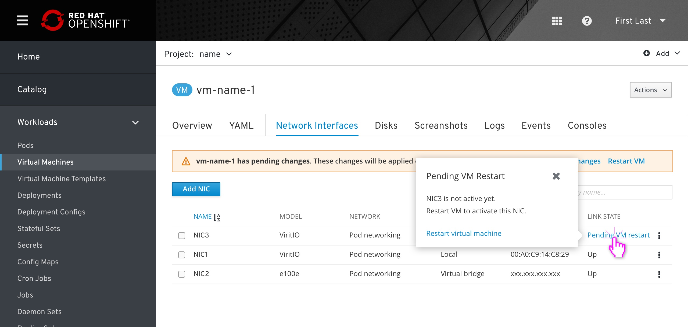
Hover on that link state (status) will display more details with a 'Restart VM action in a popover.

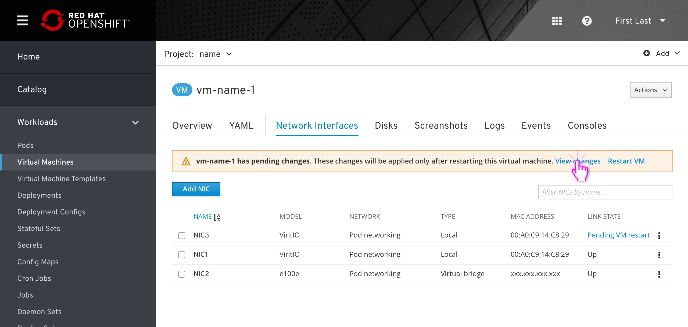
Whenever a NIC has been added or modified in a way that requires the VM to be restarted, an inline alert should appear below the tab area reminding the user to do so. This notification should persist across all tab views, including the Overview (shown previously).

Changes pending VM restart can be viewed in a dedicated modal.

### Edit NIC
Editing NIC is equivalent to creating one, with Modal label and actions label changed accordingly.

Edit NIC available in the kebab menu of each NIC list item
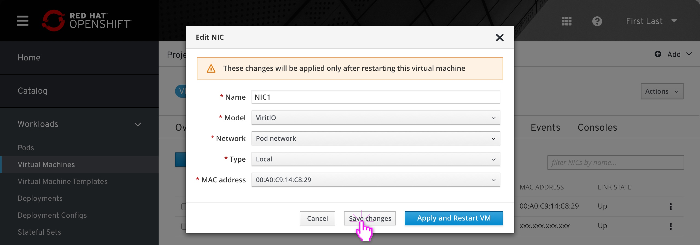
"Save changes" is equivalent to "Add NIC" on creation modal. The VM must be restarted in order for these changes to be applied.
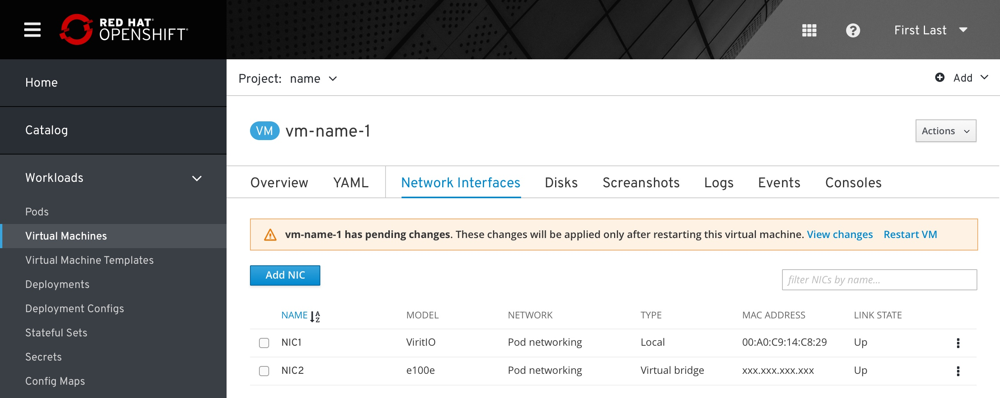
Same notification to restart VM if the user selected to save changes only.

## Disks

The flow for disks is similar to NICs, but adding or editing a disk does not require a VM restart.

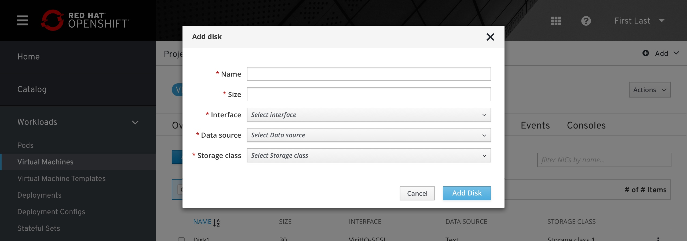
The user clicks “Add Disk”, and is led to an 'Add Disk' modal.

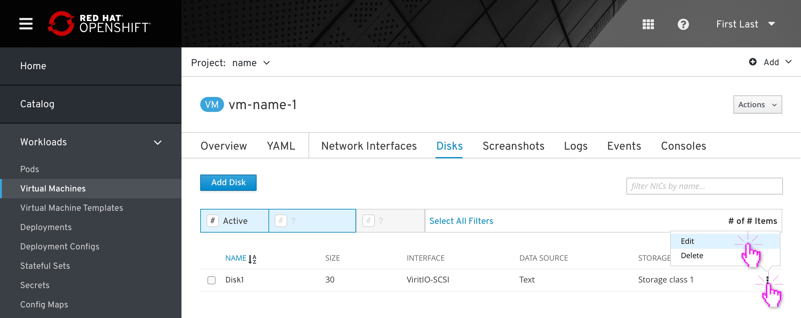
The user edits each input and clicks the confirm button to finish. The new disk is added to the list and is sorted alphabetically.

The user can edit or delete a list item from its kebab menu for each list item.

## Snapshots

Snapshot designs can be seen [here](https://github.com/openshift/openshift-origin-design/pull/183)

## Events

TBD

## Consoles

The Consoles tab allows the user to connect to the virtual machine via an in-browser or desktop-based Graphical and/or Serial console.
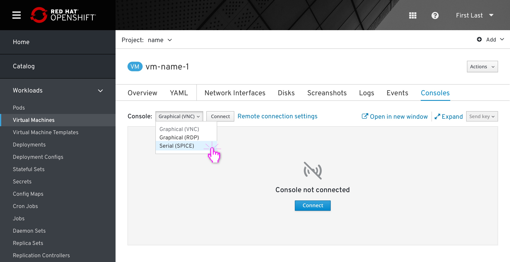
The user can change the console type using the dropdown selector. 'Graphical (VNC)' is selected by default. Any currently selected option is disabled in the dropdown.

Two actions are available on the right-hand side. The “Open in new window” action opens a separate browser window dedicated to the console view. The “Expand” action makes the console viewport fill the current window’s full width and height similar to elsewhere in OKD. The “Send Key” dropdown is disabled when disconnected from the console.

The user can start a console session using either the primary 'Connect' action button in the content area or the secondary 'Connect' button next to the console dropdown selector.

### Connecting from a powered off state

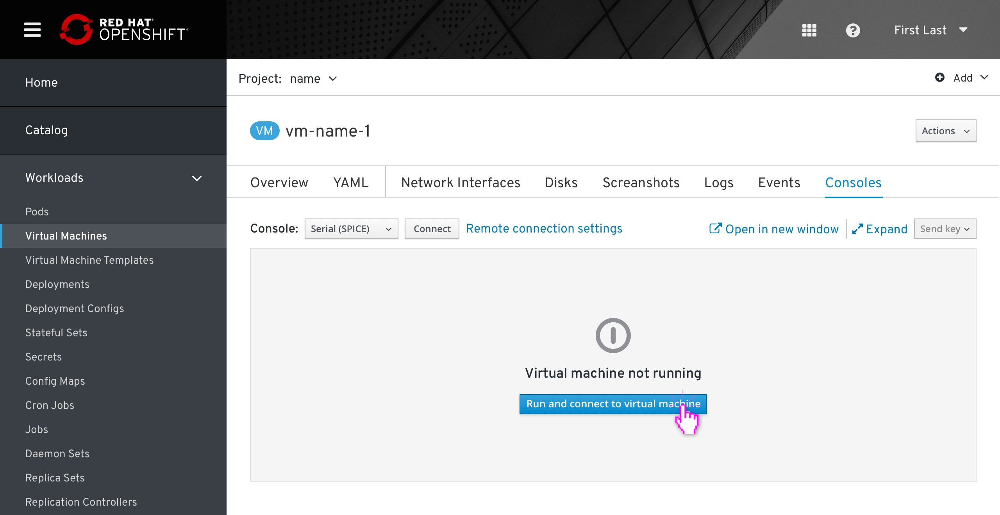
If the virtual machine is powered off, the primary action button will allow the user to both start and connect to the virtual machine with one click. If the user wants to power the virtual machine on without connecting a console (an unlikely use case while in this view) they can use the actions dropdown in the top-right as usual.

While the virtual machine is powering on, the console selector dropdown should be disabled to “lock in” the intended console. When the virtual machine finishes powering on, the console will be connected.

### Sending keys

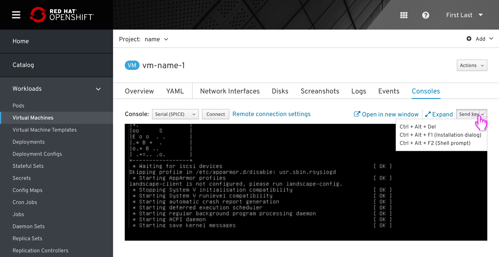

The “Send Key” dropdown helps the user send keyboard shortcuts that would ordinarily be captured by the user’s client operating system. The options available will depend on the VM that is running.

### Remote connection settings

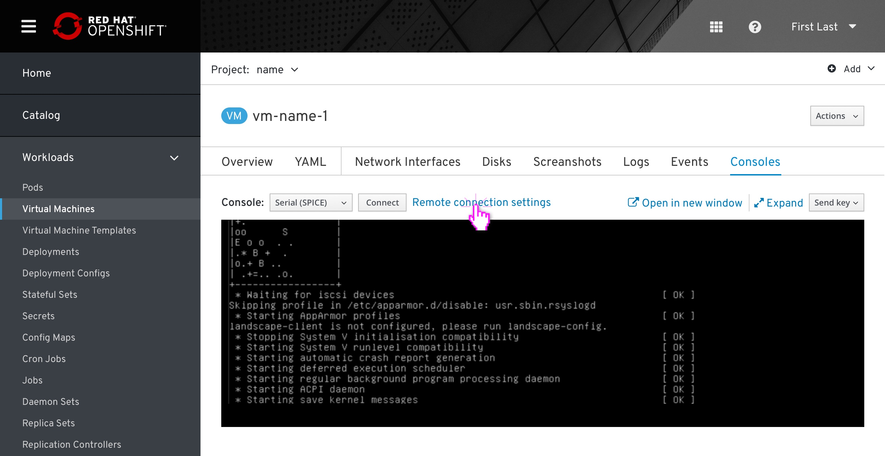

If the user prefers to connect to a VM using their own desktop client or Remote Desktop Viewer, they can find the port and configuration information they need by clicking the “Remote Connection settings” link to reveal a modal.

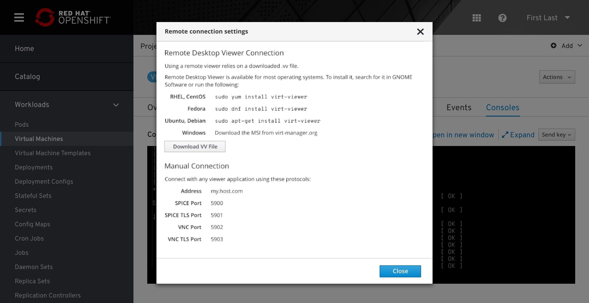
