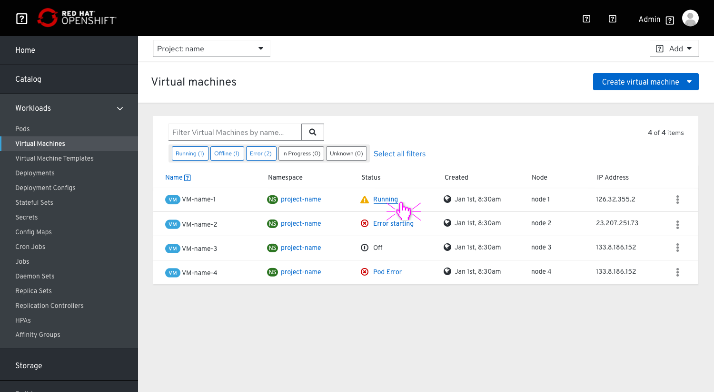

# Windows VMs

The purpose of this PR is to describe the end to end flow of creating a windows VM.

## Use cases

There are 3 main use cases for creating a windows VM:

- A developer who develops software on windows and needs good connection of the VM to other parts of OpenShift (e.g. he can have his database in a pod for example) and quick/responsive RDP connection.

- An End user that works with a software that is installed on a VM (and not on a personal laptop), i.e. due to different time zones.

- An administrator who cares about server virtualization - they install a server + Windows applications and manage them. This user is interested in the flexibility to configure the VM so it will fit his needs and performs as it should.

## Create Windows VM flow  

1. In the General step, when the user chooses a Windows OS from the Operating system drop-down menu, they are notified that the Windows guest tools will be mounted as a disk, which will then show in Advanced > Virtual hardware (maybe we should label this as a CD-ROM?)

2. Storage and Networking steps

In order to allow for the guest agent drivers to be installed,the user must create a NIC which uses the SATA Interface. Once the drivers are installed, the user can switch to the Virtio-scsi interface if they wish.

So at first, since the interface would be pre-populated with SATA, the user will see the SATA interface (because that is the one needed to install Windows).

When a Windows VM is chosen, the disk interface will not be able to be Virtio-scsi because the VM will not have the drivers for it, so we need to advise the user to install the drivers after the VM has been created and then switch the interface from SATA to Virtio-scsi (to do this switch they will need to power off and restart the VM).
The drivers needed for Virtio-scsi are available via the Windows Guest Agent which is available by default.

The user will be notified about the drivers in the Add NIC modal

As well as in the Add disk modal

3. In the list view the user sees that the VM is running but there is a warning icon indicating something is wrong. Clicking it will show a popover.

4. In the status popover they are provided with an explanation they should now switch the interface to Virtio-scsi for better performance and an action link “Switch interface”. 
They will also be notified that the VM must be restarted for the driver update to take effect.

If they choose to switch Interfaces they will be asked when they choose to schedule it

This is another option that allows the user to change the interface without scheduling a specific time, so just a dropdown with the Sata interface (currently selected) by default (the other option in the drop down would be Virtio-scsi interface) and then the user can either Save or Cancel the change

The users would need to be aware that switching the interface for the disk is useful (but not required). It’s important to note that it’s not required because they will not get an error stating there is an issue.

### CD-ROMs

The user will see these guest tools in the VM details, under the overview tab in the ‘CD-ROM(s)’ section, and know that the guest tools are avialable via a CD-ROM in windows. 

This is done by default to ensure the proper drivers are available for the VM.
