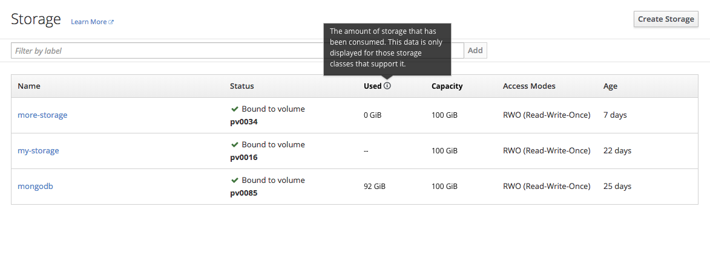
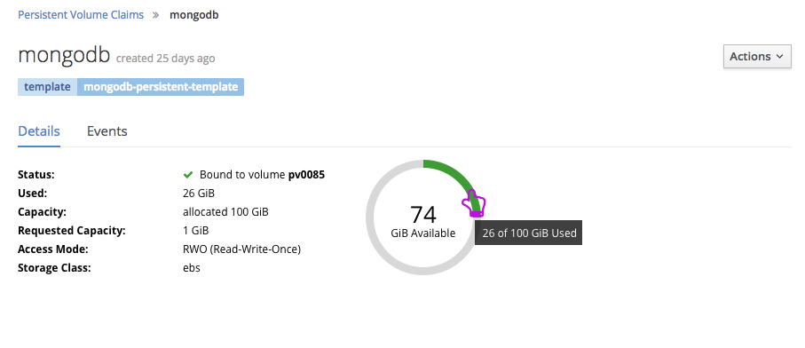
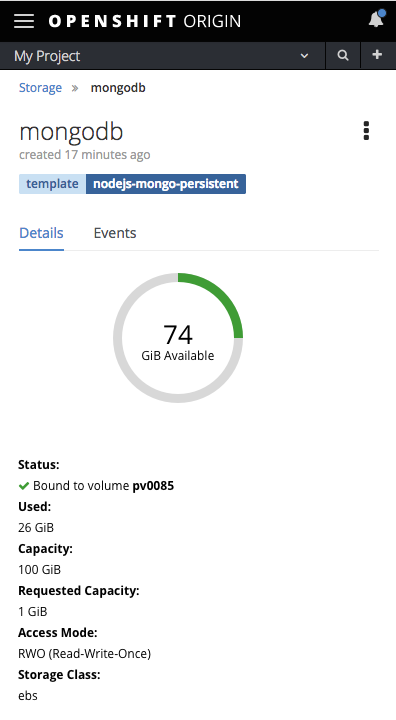

# Storage usage Metrics

## Open Questions
- What should the entry for capacity consumed be called? I'm using "Used" in these mocks, but should it be "Capacity Consumed"? Something else?
- What would we want the thresholds for the donut chart to be? Are the defaults ok?
- Will these storage metrics be tied to any events or warnings so that we can proactively inform users of any storage problems?
- Is `NA` how we want to show that the metric doesn't exist? Should we add a tooltip to that as well?
- Is the order of the fields ok for the PVC details page?

## Storage List Page

- Add a column **Used** between the **Status** and **Capacity** columns.
- The units should match between the **Used** and **Capacity** columns for easy comparison.
- Because it's possible that not all storage classes will have the capacity consumed metric, field-level help should be used in the column header to explain why some rows may not have an entry in that column.
- If that metric is not available for a storage class, `NA` should appear in the **Used** column for that row.

## Storage Details Page

- When the capacity consumed metric is available for a PVC, a utilization donut chart is added to the details page to show the capacity consumed.
- A **Used** entry should appear in the details list and the units should match the units for **Capacity**.
- If the PVC has a storage class, that should be shown on the details page regardless whether metrics are available or not.

#### Storage Donut Chart
- Use [PatternFly Donut Chart](http://www.patternfly.org/pattern-library/data-visualization/donut-chart/#design).
- The chart should be color coded according to thresholds. The default thresholds are:
  - Green (`#3f9c35`) if < 75%
  - Gold (`#ec7a08`) between 75-89%
  - Red (`#cc0000`) >= 90%
- The label in the center of the donut should give the capacity used in the fomat "x of y GiB", with the x value in large type.
- Hovering on either the used or unused sections of the chart should give the amount used or available (as the case may be) in a tooltip.

### Mobile

- The donut should appear above the other details at smaller viewport widths.
- This is similar to the behavior of RC pages.

## Deployment and Pod Pages
### Volume Details

- Volume details appear on the configuration tab for DCs, and the details tab for RCs and Pods.
- When storage metrics are available for a PVC, a **Utilization** entry should be added for that volume in the form "x of y GiB used".
- This affords the user a view of storage utilization from the perspective of the application(s) consuming that storage claim.

### Add Storage

- A column should be added indicating the amount of capacity *available* for each claim, when the storage class supports the metric.
- This may give a user some indication of which PVCs are being consumed by other applications.
- `NA` should appear in that column if the metric is not available.
- If none of the claims listed support the metric, that column should not appear.

## *Future* Warnings and Notifications
- We should be able to proactively warn users when they are nearing their storage capacity.
- We should indicate those situations on the Storage list page as well as on details pages.
- At the deployment level, we should warn users if storage claims their applications are consuming are nearing or at their storage capacity. Warnings should be visible on the Overview, deployments list and deployment details pages.
- Warnings about storage usage should appear inline rather than in the notification drawer so that they are not missed.  
- May be useful to have time-based metrics so that users will be able to predict when they might need to take action on their storage.
